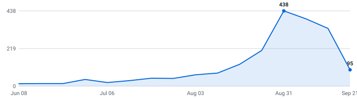

# 🎓 Summer 2027 Tech Internships

**A self-updating engine that tracks tech internships so you don't have to.**

&nbsp;&nbsp;&nbsp;

### 232 open roles (204 listed below) · 69 new this week

4,182 employers tracked · updated Aug 21, 2026 at 21:37 UTC

_139 have a cycle the employer stated · 93 are recent postings whose cycle isn't stated (listed separately, never mixed in)._

**[🖥️ Live dashboard](https://heyinihere.github.io/Automated-List-Of-Summer-2027-and-Fall-2026-MechEng-Internships/)** · **[📡 RSS](https://heyinihere.github.io/Automated-List-Of-Summer-2027-and-Fall-2026-MechEng-Internships/feed.xml)** · **[⚙️ JSON API](https://heyinihere.github.io/Automated-List-Of-Summer-2027-and-Fall-2026-MechEng-Internships/api/jobs.json)** · **[✉️ Email alerts](https://heyinihere.github.io/Automated-List-Of-Summer-2027-and-Fall-2026-MechEng-Internships/#subscribe)**

> [!TIP]
> **⭐ Star this repo** to save it and get updates when new roles are added.

Instead of refreshing a dozen career pages by hand, it reads company hiring feeds directly and keeps one live list, newest roles on top, refreshed automatically throughout the day.

**🔔 New roles in your inbox:** [subscribe by email](https://heyinihere.github.io/Automated-List-Of-Summer-2027-and-Fall-2026-MechEng-Internships/#subscribe) - one email a day, only when new internships actually appeared, unsubscribe from any email in two clicks. (Prefer RSS-to-email? [Feedrabbit works too](https://feedrabbit.com/subscriptions/new?url=https%3A%2F%2Fraw.githubusercontent.com%2FHeyIniHere%2FAutomated-List-Of-Summer-2027-and-Fall-2026-MechEng-Internships%2Fmain%2Fdocs%2Ffeed.xml).)

---

## What this is

This is an engine, not a hand-kept list. It polls company career feeds several times a day, finds the internships, removes duplicates, and rebuilds this page on its own. Every link comes straight from the source, so it's real and current, not a stale list someone forgot to update (speed matters).

## What makes this different

- **📅 [Drop Radar](#drop-radar)** - a forecast of **what's coming**: each marquee company's typical opening window, replaced by the real drop date the moment the engine catches it live. Windows are estimates and labelled as such; only dates the engine observed itself are marked verified.
- **Visa intel, computed** - 🇺🇸 / 🛂 flags detected automatically from every job description, plus ✓ for employers with a real H-1B track record (official USCIS data, FY2022-23 - a history, not a promise). The big lists crowdsource this by hand; here it's code. Most postings say nothing either way, and those are shown as unknown rather than guessed.
- **A date on nearly every role** - taken from the job portal itself where the portal states one, so newest-first actually means newest. The exact coverage figure is printed at the bottom of this page every run.
- **Skill tags + pay, extracted** - every posting's text is scanned for the stack it wants (Python, C++, PyTorch, ...) and the pay it states - searchable on the [dashboard](https://heyinihere.github.io/Automated-List-Of-Summer-2027-and-Fall-2026-MechEng-Internships/), included in the CSV and API.
- **Alerts your way** - [email digests](https://heyinihere.github.io/Automated-List-Of-Summer-2027-and-Fall-2026-MechEng-Internships/#subscribe) or [RSS](https://heyinihere.github.io/Automated-List-Of-Summer-2027-and-Fall-2026-MechEng-Internships/feed.xml) (point any reader, or a Slack/Discord RSS integration, at it) - plus a [live dashboard](https://heyinihere.github.io/Automated-List-Of-Summer-2027-and-Fall-2026-MechEng-Internships/) with search, filters, and a saved-roles list that never leaves your browser.
- **An engine, not a spreadsheet** - 4,285 job-board endpoints (4,182 distinct employers; some run more than one board) polled every hour across 12 ATS platforms, full source and tests in this repo.

## Scope

| | |
|---|---|
| **Roles** | Software Engineering, Data Science & Machine Learning (and closely related technical internships) |
| **Region** | United States |
| **Cycles** | Summer 2027 and Fall 2026 |

## About

I'm an international student studying in the United States, so I built this for the search I'm doing myself. The list is US roles only for now - that's where I'm searching. Use it to spot roles early and apply before they fill up - being first genuinely helps.

## Where this is going

I'm building this in the open and adding to it as it grows. Recently shipped: **email alerts**, the **Drop Radar**, **auto-detected sponsorship flags**, and the **live dashboard**. Next up: personalized alerts (pick your categories), per-company hiring pages, and a ghost-posting detector. If it helps you, a star means a lot and tells me to keep going.

## How to use

<b>Reading the table — flags, dates, and the cycle split</b> (click to expand)

- Roles are grouped by cycle below - **newest posting on top, oldest at the bottom.**
- A cycle section holds only roles whose **employer stated that cycle** - in the title, or in the posting's own text. Postings that name no cycle anywhere are in *Recently posted — cycle not stated* further down, with **no cycle guessed for them**. Same quality bar, different amount of evidence.
- The **Posted** column is the date the company published the role.
- **Flags:** 🇺🇸 = requires U.S. citizenship or a security clearance · 🛂 = the posting says it won't sponsor a work visa · 🏠 = the location says remote · 🆕 = spotted in the last 48 hours. Sponsorship flags are detected automatically from each job description - treat them as a strong hint and confirm on the posting.
- **✓ after a company name** = a real H-1B track record: USCIS approved 10+ petitions for that employer in FY2022–2023 (matched automatically against the official [H-1B Employer Data Hub](https://www.uscis.gov/tools/reports-and-studies/h-1b-employer-data-hub)). No ✓ doesn't mean they won't sponsor - it means we can't prove they have.
- Track your applications with [`data/internships.csv`](data/internships.csv) (opens in Excel / Google Sheets).
- Missing a company? Adding one takes a single line, see [CONTRIBUTING.md](CONTRIBUTING.md).

---

## Summer 2027  (83 employer-stated)

| Company | Role | Category | Location | Posted | Apply |
|---|---|---|---|---|---|
| Airbus ✓ | 2027 Summer Internship - Industrial Engineering - PPE/IE 🆕 | Hardware | Mobile Area, AL | Aug 21, 2026 | [Apply](https://ag.wd3.myworkdayjobs.com/Airbus/job/Mobile-Area-AL/XMLNAME-2027-Summer-Internship---Industrial-Engineering---PPE-IE_JR10435140) |
| Airbus ✓ | 2027 Summer Internship - X-Plant Manufacturing Engineering 🆕 | Hardware | Mobile Area, AL | Aug 21, 2026 | [Apply](https://ag.wd3.myworkdayjobs.com/Airbus/job/Mobile-Area-AL/XMLNAME-2027-Summer-Internship---X-Plant-Manufacturing-Engineering_JR10435143) |
| Elanco | Manufacturing Scientist/Technical Services Intern – Elanco Technology Center (Summer 2027) 🆕 | Hardware | Indianapolis, IN | Aug 21, 2026 | [Apply](https://elanco.wd5.myworkdayjobs.com/External_Career/job/Indianapolis-IN/Manufacturing-Scientist-Technical-Services-Intern---Elanco-Technology-Center--Summer-2027-_R0026897) |
| General Matter | Summer 2027 Internship - Manufacturing Engineering 🆕 | Hardware | Los Angeles, CA | Aug 20, 2026 | [Apply](https://job-boards.greenhouse.io/generalmatter/jobs/5376060008) |
| Elanco | Manufacturing Associate Intern – Elwood, Kansas (Summer 2027) 🆕 | Hardware | Elwood, KS | Aug 20, 2026 | [Apply](https://elanco.wd5.myworkdayjobs.com/External_Career/job/Elwood-KS/Manufacturing-Associate-Intern---Elwood--Kansas--Summer-2027-_R0026899) |
| IMEG ✓ | Mechanical Engineering Intern / Greenwood Village, CO 🆕 | Hardware | Denver Metro, CO | Aug 20, 2026 | [Apply](https://wd1.myworkdaysite.com/recruiting/imeg/Imeg_Careers/job/Denver-Metro-CO/Mechanical-Engineering-Intern---Greenwood-Village--CO_R-16570-1) |
| Philips | Graduate Level Co-op – Data Scientist – Plymouth, MN – Summer 2027 🆕 | Data & ML/AI | Plymouth, Minnesota, United States | Aug 20, 2026 | [Apply](https://philips.wd3.myworkdayjobs.com/jobs-and-careers/job/Plymouth-Minnesota-United-States/Graduate-Level-Co-op---Data-Scientist---Plymouth--MN---Summer-2027_590567) |
| Fannie Mae ✓ | Campus – Data Science Intern (Analytics & Modeling Program) 🛂 🆕 | Data & ML/AI | Washington, DC | Aug 20, 2026 | [Apply](https://fanniemae.wd1.myworkdayjobs.com/FannieMaeCareers/job/Washington-DC/Campus---Data-Science-Intern--Analytics---Modeling-Program-_JR2815) |
| Fifth Third Bank ✓ | Information Security Co-op – Identity & Access Management – Summer 2027 🆕 | Security | Cincinnati, OH | Aug 20, 2026 | [Apply](https://fifththird.wd5.myworkdayjobs.com/53careers/job/Cincinnati-OH/Information-Security-Co-op---Identity---Access-Management---Summer-2027_R71591) |
| AbbVie ✓ | 2027 Business Technology Solutions Intern - Data & Software Engineering (Undergraduate) 🆕 | Data & ML/AI | North Chicago, IL, United States | Aug 20, 2026 | [Apply](https://jobs.smartrecruiters.com/AbbVie/3743990014697918) |
| Fifth Third Bank ✓ | Information Security Co-op - Cyber Threat Interdiction - Summer 2027 🆕 | Security | Cincinnati, OH | Aug 20, 2026 | [Apply](https://fifththird.wd5.myworkdayjobs.com/53careers/job/Cincinnati-OH/Information-Security-Co-op---Cyber-Threat-Interdiction---Summer-2027_R71582) |
| Fifth Third Bank ✓ | Software Engineer Co-Op - Enterprise Finance Applications - Summer 2027 🆕 | Software | Cincinnati, OH | Aug 20, 2026 | [Apply](https://fifththird.wd5.myworkdayjobs.com/53careers/job/Cincinnati-OH/Software-Engineer-Co-Op---Enterprise-Finance-Applications---Summer-2027_R71588) |
| Freeform | Manufacturing Engineering Intern (Summer 2027) 🆕 | Hardware | Los Angeles, CA (On-site) | Aug 19, 2026 | [Apply](https://job-boards.greenhouse.io/freeformfuturecorp/jobs/7895700003) |
| Freeform | Materials Engineering Intern (Summer 2027) 🆕 | Hardware | Los Angeles, CA (On-site) | Aug 19, 2026 | [Apply](https://job-boards.greenhouse.io/freeformfuturecorp/jobs/7907965003) |
| General Matter | Summer 2027 Internship - Software Engineering 🆕 | Software | Los Angeles, CA | Aug 19, 2026 | [Apply](https://job-boards.greenhouse.io/generalmatter/jobs/5377118008) |
| Elanco | Manufacturing Scientist/Technical Services Intern – Clinton, Indiana (Summer 2027) | Hardware | Clinton, IN | Aug 19, 2026 | [Apply](https://elanco.wd5.myworkdayjobs.com/External_Career/job/Clinton-IN/Manufacturing-Scientist-Technical-Services-Intern---Clinton--Indiana--Summer-2027-_R0026869-1) |
| IMEG ✓ | Mechanical Engineering Intern / Naperville, IL | Hardware | Naperville, IL | Aug 19, 2026 | [Apply](https://wd1.myworkdaysite.com/recruiting/imeg/Imeg_Careers/job/Naperville-IL/Mechanical-Engineering-Intern---Naperville--IL_R-16471) |
| IMEG ✓ | Mechanical Engineering Intern / Greenwood Village, CO | Hardware | Denver Metro, CO | Aug 19, 2026 | [Apply](https://wd1.myworkdaysite.com/recruiting/imeg/Imeg_Careers/job/Denver-Metro-CO/Mechanical-Engineering-Intern---Greenwood-Village--CO_R-16558) |
| InfiniteQuant | Quantitative Developer - Internship - Summer 2027 🏠 | Quant | New York +2 more | Aug 19, 2026 | [Apply](https://jobs.smartrecruiters.com/InfiniteQuant/744000144281579) |
| Continental Resources | Data Analyst Intern (Summer 2027) | Data & ML/AI | Oklahoma City, OK | Aug 18, 2026 | [Apply](https://clr.wd5.myworkdayjobs.com/CLR_Careers/job/Oklahoma-City-OK/Data-Analyst-Intern--Summer-2027-_R02591-1) |
| Freeform | Mechanical Engineering Intern (Summer 2027) | Hardware | Los Angeles, CA (On-site) | Aug 18, 2026 | [Apply](https://job-boards.greenhouse.io/freeformfuturecorp/jobs/7894117003) |
| H3X Technologies | Advanced Manufacturing Engineering Intern (Spring) | Hardware | Louisville, Colorado | Aug 18, 2026 | [Apply](https://jobs.ashbyhq.com/h3x-technologies/6af49576-a61d-480c-b155-3e034e2ed5be) |
| PIMCO ✓ | 2027 Summer Intern - Technology Analyst, Software Engineering | Software | Austin, TX USA | Aug 18, 2026 | [Apply](https://pimco.wd1.myworkdayjobs.com/pimco-careers/job/Austin-TX-USA/XMLNAME-2027-Summer-Intern---Technology-Analyst--Software-Engineering_R106745) |
| Conagra Brands ✓ | IT Infrastructure Internship - Summer 2027 | Software | Omaha, Nebraska | Aug 17, 2026 | [Apply](https://conagrabrands.wd1.myworkdayjobs.com/Careers_US/job/Omaha-Nebraska/IT-Infrastructure-Internship---Summer-2027_Req-039788) |
| Conagra Brands ✓ | Software Development Internship - Summer 2027 | Software | Omaha, Nebraska | Aug 17, 2026 | [Apply](https://conagrabrands.wd1.myworkdayjobs.com/Careers_US/job/Omaha-Nebraska/Software-Development-Internship---Summer-2027_Req-039787) |
| Replit | Software Engineering Intern (Summer 2027) | Software | Foster City, CA | Aug 15, 2026 | [Apply](https://jobs.ashbyhq.com/replit/7e0dafe8-3eec-442e-aa76-a4d84d779fb1) |
| Motorola ✓ | Android Platform Software Engineering Intern - Summer 2027 🇺🇸 🆕 | Software | Plantation, FL, More... | Aug 14, 2026 | [Apply](https://motorolasolutions.wd5.myworkdayjobs.com/Careers/job/Plantation-FL/Android-Platform-Software-Engineering-Intern---Summer-2027_R67362-1) |
| The Nuclear Company | Summer 2027 AI Applied Research Internship 🇺🇸 | Data & ML/AI | Washington, DC | Aug 14, 2026 | [Apply](https://job-boards.greenhouse.io/thenuclearcompany/jobs/5391923008) |
| Notion ✓ | Software Engineer Intern (Summer 2027) | Software | San Francisco, California | Aug 14, 2026 | [Apply](https://jobs.ashbyhq.com/notion/3fba1c39-c5cb-47d7-9ad2-1cec4d7e9d0c) |
| GlobalFoundries ✓ | US Advanced Manufacturing Equipment Engineering Intern, Junior (Summer 2027) | Hardware | USA - Vermont - Essex Junction | Aug 14, 2026 | [Apply](https://globalfoundries.wd1.myworkdayjobs.com/External/job/USA---Vermont---Essex-Junction/US-Advanced-Manufacturing-Equipment-Engineering-Intern--Junior--Summer-2027-_JR-2604656) |
| HNTB ✓ | WED - 2027 New Grad Mechanical & Fire Protection Engineer I  (For Current & Recent HNTB Interns Only) 🛂 | Hardware | Oakland, CA | Aug 13, 2026 | [Apply](https://hntb.wd5.myworkdayjobs.com/hntb_university_careers/job/Oakland-CA/WED---2027-New-Grad-Mechanical---Fire-Protection-Engineer-I---For-Current---Recent-HNTB-Interns-Only-_R-31165) |
| Teledyne | NHRC Software Engineering Internship (Summer 2027) 🇺🇸 | Software | US - Huntsville, AL | Aug 13, 2026 | [Apply](https://flir.wd1.myworkdayjobs.com/flircareers/job/US---Huntsville-AL/NHRC-Software-Engineering-Internship--Summer-2027-_REQ36193) |
| Teledyne | NHRC Software Engineering Internship (Summer 2027) 🇺🇸 | Software | US - Huntsville, AL | Aug 13, 2026 | [Apply](https://flir.wd1.myworkdayjobs.com/flircareers/job/US---Huntsville-AL/NHRC-Software-Engineering-Internship--Summer-2027-_REQ36194-2) |
| Western Digital ✓ | Summer 2027 Intern - Software Engineering | Software | San Jose, CA, United States | Aug 12, 2026 | [Apply](https://jobs.smartrecruiters.com/WesternDigital/744000143171017) |
| RTX | Software Engineering Intern (Summer 2027) 🇺🇸 | Software | US-IA-CEDAR RAPIDS-137 ~ 855 35Th St NE… | Aug 12, 2026 | [Apply](https://globalhr.wd5.myworkdayjobs.com/rec_rtx_ext_gateway/job/US-IA-CEDAR-RAPIDS-137--855-35Th-St-NE--BLDG-137/Software-Engineering-Intern--Summer-2027-_01865875) |
| Northrop Grumman | 2027 Intern Software Engineer 🇺🇸 | Software | United States-Florida-Melbourne | Aug 12, 2026 | [Apply](https://ngc.wd1.myworkdayjobs.com/Northrop_Grumman_External_Site/job/United-States-Florida-Melbourne/XMLNAME-2027-Intern-Software-Engineer_R10245255) |
| Chamberlain Group ✓ | Intern, Community Product Management (Summer 2027) | Software | Oak Brook, IL | Aug 10, 2026 | [Apply](https://chamberlain.wd1.myworkdayjobs.com/Chamberlain_Group/job/Oak-Brook-IL/Intern--Community-Product-Management--Summer-2026-_JR31309) |
| DV Trading | Software Engineer Intern - Summer 2027 (DV Commodities) | Software | New York | Aug 10, 2026 | [Apply](https://job-boards.greenhouse.io/dvtrading/jobs/4719119005) |
| ING | Summer 2027 Internship - Tech (Information Security) | Security | New York | Aug 10, 2026 | [Apply](https://ing.wd3.myworkdayjobs.com/icsgblcor/job/New-York/Summer-2027-Internship---Tech--Information-Security-_REQ-10119620) |
| ING | Summer 2027 Internship - Tech (Infrastructure) | Software | New York | Aug 10, 2026 | [Apply](https://ing.wd3.myworkdayjobs.com/icsgblcor/job/New-York/Summer-2027-Internship---Tech--Infrastructure-_REQ-10119621) |
| Axon ✓ | 2027 US Software Engineering Internship | Software | Seattle, Washington, United States | Aug 07, 2026 | [Apply](https://job-boards.greenhouse.io/axontalentcommunity/jobs/7837133003) |
| Northrop Grumman | 2027 Operations Manufacturing Engineering Intern 🇺🇸 | Hardware | United States-California-Palmdale | Aug 07, 2026 | [Apply](https://ngc.wd1.myworkdayjobs.com/Northrop_Grumman_External_Site/job/United-States-California-Palmdale/XMLNAME-2027-Operations-Manufacturing-Engineering-Intern_R10244597) |
| The Nuclear Company | Summer 2027 AI/ML Engineering Intern 🇺🇸 | Data & ML/AI | Washington, DC | Aug 07, 2026 | [Apply](https://job-boards.greenhouse.io/thenuclearcompany/jobs/5383231008) |
| The Nuclear Company | Summer 2027 Software Engineering Intern 🇺🇸 | Software | Washington, DC | Aug 07, 2026 | [Apply](https://job-boards.greenhouse.io/thenuclearcompany/jobs/5383236008) |
| Northrop Grumman | 2027 Intern Software Engineer 🇺🇸 | Software | United States-Florida-Melbourne | Aug 06, 2026 | [Apply](https://ngc.wd1.myworkdayjobs.com/Northrop_Grumman_External_Site/job/United-States-Florida-Melbourne/XMLNAME-2027-Intern-Software-Engineer_R10242395) |
| Roblox ✓ | [Summer 2027] Software Engineer Intern | Software | San Mateo, CA, United States | Aug 05, 2026 | [Apply](https://careers.roblox.com/jobs/8072713?gh_jid=8072713) |
| Belvedere Trading | Software Engineer Intern - Summer 2027 | Software | Chicago, Illinois | Aug 04, 2026 | [Apply](https://jobs.lever.co/belvederetrading/10746b3d-1760-4573-9b63-b93f5a5e4fc0) |
| Pentair | IT & Cybersecurity Leadership Development Internship Program -  Summer 2027 🛂 | Security | Golden Valley, MN | Aug 04, 2026 | [Apply](https://pentair.wd5.myworkdayjobs.com/pentair_careers/job/Golden-Valley-MN/IT---Cybersecurity-Leadership-Development-Internship-Program----Summer-2027_R23700) |
| Kraft Heinz ✓ | 2027 US Manufacturing Internship Program – Manufacturing Facility Garland, Texas | Hardware | Garland, TX | Aug 03, 2026 | [Apply](https://heinz.wd1.myworkdayjobs.com/KraftHeinz_Careers_UR/job/Garland-TX/XMLNAME-2027-US-Manufacturing-Internship-Program---Manufacturing-Facility-Garland--Texas_R-105352) |
| Chicago Trading Company | Software Engineering Internship - Summer 2027 | Software | Chicago, Illinois, United States | Aug 03, 2026 | [Apply](https://job-boards.greenhouse.io/chicagotradingcampus/jobs/4716932005) |
| HPR (Hyannis Port Research) | Software Engineering Intern - Summer 2027 | Software | Needham, MA | Aug 01, 2026 | [Apply](https://job-boards.greenhouse.io/hyannisportresearch/jobs/7822989003) |
| Heliux | Software Engineer (Internship, Summer 2027) 🇺🇸 | Software | HQ (San Francisco, CA) | Jul 31, 2026 | [Apply](https://jobs.ashbyhq.com/heliux/ff2b6f4b-00d0-4afe-b4f5-2dbf443409ef) |
| Melius | Software Engineering Intern [Spring/Summer 2027] | Software | New York City | Jul 31, 2026 | [Apply](https://jobs.ashbyhq.com/melius/b61f063a-4f94-4e50-a4ef-05aaab552280) |
| Kraft Heinz ✓ | 2027 US Manufacturing Internship Program – Manufacturing Facility Fremont, Ohio | Hardware | Fremont, OH | Jul 31, 2026 | [Apply](https://heinz.wd1.myworkdayjobs.com/KraftHeinz_Careers_UR/job/Fremont-OH/XMLNAME-2027-US-Manufacturing-Internship-Program---Manufacturing-Facility-Fremont--Ohio_R-105282) |
| Kraft Heinz ✓ | 2027 US Manufacturing Internship Program – Manufacturing Facility Kirksville, Missouri | Hardware | Kirksville, MO | Jul 31, 2026 | [Apply](https://heinz.wd1.myworkdayjobs.com/KraftHeinz_Careers_UR/job/Kirksville-MO/XMLNAME-2027-US-Manufacturing-Internship-Program---Manufacturing-Facility-Kirksville--Missouri_R-105273) |
| Virtu Financial ✓ | 2027 Internship - Frontend Engineer (UI) | Software | New York | Jul 29, 2026 | [Apply](https://job-boards.greenhouse.io/virtu/jobs/8657500002) |
| Appian ✓ | Information Security Engineer Intern 🛂 | Security | McLean, Virginia | Jul 27, 2026 | [Apply](https://job-boards.greenhouse.io/appian/jobs/8088496) |
| PDT Partners | Summer 2027 Software Engineering Intern | Software | New York, NY | Jul 24, 2026 | [Apply](https://job-boards.greenhouse.io/pdtpartners/jobs/8077685) |
| Quadrillion | Software Engineering Intern (Summer 2027) | Software | New York City | Jul 24, 2026 | [Apply](https://jobs.ashbyhq.com/quadrillion-labs/a4acc44c-31ce-41a0-ab44-2500487b4d05) |
| Kairos Power | Mechanical and Manufacturing Engineering Internship - Summer 2027 | Hardware | Alameda +5 more | Jul 23, 2026 | [Apply](https://job-boards.greenhouse.io/kairospower/jobs/6123676004) |
| Anthelion Capital | Quant Developer / Quant Research Intern - 2026/2027 | Quant | New York City | Jul 23, 2026 | [Apply](https://jobs.ashbyhq.com/anthelioncap/5e2ea37b-2369-474e-b717-c24c60976e96) |
| Appian ✓ | Software Engineering Intern 🛂 | Software | McLean, Virginia | Jul 23, 2026 | [Apply](https://job-boards.greenhouse.io/appian/jobs/8041237) |
| Mosaic | Structural Engineer Co-Op/Intern - Summer 2027 | Hardware | US - Tampa, FL (Lithia area) | Jul 22, 2026 | [Apply](https://mosaic.wd5.myworkdayjobs.com/mosaic/job/US---Tampa-FL-Lithia-area/Structural-Engineer-Co-Op-Intern---Summer-2027_64448) |
| Virtu Financial ✓ | 2027 Internship - Software Engineer | Software | Austin, TX; New York | Jul 21, 2026 | [Apply](https://job-boards.greenhouse.io/virtu/jobs/8624410002) |
| Chicago Trading Company | Software Engineering Internship - Summer 2027 | Software | Chicago, Illinois, United States | Jul 20, 2026 | [Apply](https://job-boards.greenhouse.io/ctccampusboard/jobs/4708230005) |
| Deepgram | Software Engineering- Internship (Fall 2026/Summer 2027) 🏠 _(also open for Fall 2026)_ | Software | USA / Remote | Jul 17, 2026 | [Apply](https://jobs.ashbyhq.com/deepgram/dc8693b5-72ce-4ca3-ab15-9c8434d35da1) |
| Chevron Corporation ✓ | 2026-2027 Information Technology - Software Engineer - Intern 🛂 | Software | Houston, Texas, United States of America | Jul 16, 2026 | [Apply](https://chevron.wd5.myworkdayjobs.com/University/job/Houston-Texas-United-States-of-America/XMLNAME-2026-2027-Information-Technology---Software-Engineer---Intern_R000072398-1) |
| The Trade Desk ✓ | 2027 North America Software Engineering Internship | Software | Bellevue +5 more | Jul 15, 2026 | [Apply](https://job-boards.greenhouse.io/thetradedesk/jobs/5187605007) |
| Five Rings | Summer Intern 2027 - Software Developer | Software | New York | Jul 14, 2026 | [Apply](https://job-boards.greenhouse.io/fiveringsllc/jobs/5349707008) |
| Akuna Capital ✓ | Software Engineer Intern - C++, Summer 2027 | Software | Chicago, IL | Jul 13, 2026 | [Apply](https://www.akunacapital.com/careers/job/8018847/?gh_jid=8018847) |
| Akuna Capital ✓ | Software Engineer Intern - Python, Summer 2027 | Software | Chicago, IL | Jul 13, 2026 | [Apply](https://www.akunacapital.com/careers/job/8018853/?gh_jid=8018853) |
| Akuna Capital ✓ | Platform Engineer Intern, Summer 2027 | Software | Chicago, IL | Jul 13, 2026 | [Apply](https://www.akunacapital.com/careers/job/8018856/?gh_jid=8018856) |
| Hudson River Trading ✓ | Software Engineering Internship (C++ or Python) – Summer 2027 | Software | Austin +11 more | Jul 13, 2026 | [Apply](https://www.hudsonrivertrading.com/careers/job/?gh_jid=8052083) |
| Tower Research Capital ✓ | Quantitative Developer Intern - Summer 2027 | Quant | New York, Chicago | Jul 05, 2026 | [Apply](https://www.tower-research.com/open-positions/?gh_jid=8044334) |
| IMC Trading | Software Engineer Intern - Summer 2027 | Software | Chicago, United States | Jul 01, 2026 | [Apply](https://job-boards.eu.greenhouse.io/imc/jobs/4823924101) |
| IMC Trading | Machine Learning Research Intern - Summer 2027 - Chicago | Data & ML/AI | Chicago, United States | Jul 01, 2026 | [Apply](https://job-boards.eu.greenhouse.io/imc/jobs/4907430101) |
| Anduril | 2027 Mechanical Engineer Intern 🇺🇸 | Hardware | Atlanta +26 more | Jun 11, 2026 | [Apply](https://boards.greenhouse.io/andurilindustries/jobs/5153187007?gh_jid=5153187007) |
| Anduril | 2027 Manufacturing Engineer Intern 🇺🇸 | Hardware | Atlanta +23 more | Jun 11, 2026 | [Apply](https://boards.greenhouse.io/andurilindustries/jobs/5153218007?gh_jid=5153218007) |
| Voloridge | Quantitative Developer Intern 2027 | Quant | Jupiter, FL | Jun 11, 2026 | [Apply](https://job-boards.greenhouse.io/voloridgeinvestmentmanagement/jobs/4224862009) |
| Anduril | 2027 Software Engineer Intern 🇺🇸 | Software | Atlanta +26 more | Jun 10, 2026 | [Apply](https://boards.greenhouse.io/andurilindustries/jobs/5148079007?gh_jid=5148079007) |
| Walleye Capital | Quantic – Quantitative Developer Intern (Summer 2027) | Quant | Boston, MA | Jun 01, 2026 | [Apply](https://job-boards.greenhouse.io/walleyecapital-external-students/jobs/4679168006) |
| Ellipsis Labs | Software Engineer - 2027 Interns | Software | New York, New York | Mar 26, 2026 | [Apply](https://jobs.ashbyhq.com/ellipsislabs/02136b22-35b1-4b3d-8bef-567c3380a849) |
| Databricks ✓ | Product Management Intern (Summer 2027) | Software | Bellevue +5 more | Aug 17, 2023 | [Apply](https://databricks.com/company/careers/open-positions/job?gh_jid=6883068002) |

## Fall 2026  (38 employer-stated)

| Company | Role | Category | Location | Posted | Apply |
|---|---|---|---|---|---|
| Toshiba Global Commerce ✓ | AI Software Engineering Intern 🛂 🆕 | Data & ML/AI | Durham, NC | Aug 20, 2026 | [Apply](https://job-boards.greenhouse.io/toshibaglobalcommercesolutions/jobs/5214224007) |
| Moog | Intern, IT Computer Science | Software | Buffalo, NY | Aug 19, 2026 | [Apply](https://moog.wd5.myworkdayjobs.com/moog_external_career_site/job/Buffalo-NY/Intern--IT-Computer-Science_R-26-19378) |
| ABB ✓ | Manufacturing Engineering/Documentation Intern - Fall 2026 🛂 | Hardware | USA, AR, Jonesboro | Aug 19, 2026 | [Apply](https://abb.wd3.myworkdayjobs.com/external_career_page/job/USA-AR-Jonesboro/Manufacturing-Engineering-Documentation-Intern---Fall-2026_JR00042298) |
| Conagra Brands ✓ | Manufacturing Co-Op | Hardware | Waterloo, Iowa | Aug 18, 2026 | [Apply](https://conagrabrands.wd1.myworkdayjobs.com/Careers_US/job/Waterloo-Iowa/Manufacturing-Co-Op_Req-039806) |
| Flextronics International ✓ | Mechanical Engineering Co-op - Fall 2026 | Hardware | USA, SC, Orangeburg | Aug 07, 2026 | [Apply](https://flextronics.wd1.myworkdayjobs.com/Careers/job/USA-SC-Orangeburg/Mechanical-Engineering-Co-op---Fall-2026_WD227049) |
| The Nuclear Company | Fall 2026 AI/ML Engineering Intern 🇺🇸 | Data & ML/AI | Washington, DC | Aug 07, 2026 | [Apply](https://job-boards.greenhouse.io/thenuclearcompany/jobs/5383163008) |
| The Nuclear Company | Fall 2026 AI Software Engineering Intern 🇺🇸 | Data & ML/AI | Washington, DC | Aug 07, 2026 | [Apply](https://job-boards.greenhouse.io/thenuclearcompany/jobs/5383113008) |
| Johnson & Johnson | Software Engineer Coop | Software | Cincinnati +2 more | Aug 07, 2026 | [Apply](https://jj.wd5.myworkdayjobs.com/JJ/job/Cincinnati-Ohio-United-States-of-America/Software-Engineer-Coop_R-092820) |
| NVIDIA ✓ | Software Engineering Intern, Dynamo - Fall 2026 | Software | US, CA, Santa Clara | Aug 05, 2026 | [Apply](https://nvidia.wd5.myworkdayjobs.com/NVIDIAExternalCareerSite/job/US-CA-Santa-Clara/Software-Engineering-Intern--Dynamo---Fall-2026_JR2022295) |
| Phoenix Contact | Manufacturing Co-Op - High School Students | Hardware | Middletown, Pennsylvania | Aug 04, 2026 | [Apply](https://job-boards.greenhouse.io/phoenixcontact/jobs/7817228003) |
| Merck | 2026 Future Talent Program – Manufacturing and Reliability Engineering Co-Op | Hardware | USA - Pennsylvania - West Point | Aug 04, 2026 | [Apply](https://msd.wd5.myworkdayjobs.com/searchjobs/job/USA---Pennsylvania---West-Point/XMLNAME-2026-Future-Talent-Program---Manufacturing-and-Reliability-Engineering-Co-Op_R395901) |
| Merck | 2026 Future Talent Program - Vaccine Manufacturing Co-op | Hardware | USA - Pennsylvania - West Point | Aug 04, 2026 | [Apply](https://msd.wd5.myworkdayjobs.com/searchjobs/job/USA---Pennsylvania---West-Point/XMLNAME-2026-Future-Talent-Program---Vaccine-Manufacturing-Co-op_R395900) |
| Northrop Grumman | 2026 Fall Co-op Manufacturing Engineering - Baltimore MD 🇺🇸 | Hardware | United States-Maryland-Linthicum | Aug 03, 2026 | [Apply](https://ngc.wd1.myworkdayjobs.com/Northrop_Grumman_External_Site/job/United-States-Maryland-Linthicum/XMLNAME-2026-Fall-Co-op-Manufacturing-Engineering---Baltimore-MD_R10243390-1) |
| Melius | Software Engineering Intern [Fall/Winter 2026] | Software | New York City | Jul 30, 2026 | [Apply](https://jobs.ashbyhq.com/melius/6a944911-dbbf-44c7-ba52-7866f7b433cf) |
| Flextronics International ✓ | Industrial Engineering Co-Op - Fall 2026 | Hardware | USA, SC, Orangeburg | Jul 30, 2026 | [Apply](https://flextronics.wd1.myworkdayjobs.com/Careers/job/USA-SC-Orangeburg/Industrial-Engineering-Co-Op---Fall-2026_WD226357) |
| Rendezvous Robotics | Manufacturing and Test Engineering Intern (Fall 2026) 🇺🇸 | Hardware | Golden, CO | Jul 27, 2026 | [Apply](https://job-boards.greenhouse.io/rendezvousrobotics/jobs/4332076009) |
| Astranis | Software Engineer Intern - Enterprise Systems (Fall 2026) 🇺🇸 | Software | San Francisco, CA | Jul 23, 2026 | [Apply](https://job-boards.greenhouse.io/astranis/jobs/4699071006) |
| Rendezvous Robotics | Mechanical Engineering Intern (Fall 2026) 🇺🇸 | Hardware | Golden, CO | Jul 22, 2026 | [Apply](https://job-boards.greenhouse.io/rendezvousrobotics/jobs/4329113009) |
| Rendezvous Robotics | Software Engineering Intern (Fall 2026) 🇺🇸 | Software | Golden, CO | Jul 22, 2026 | [Apply](https://job-boards.greenhouse.io/rendezvousrobotics/jobs/4328555009) |
| Deepgram | Software Engineering- Internship (Fall 2026/Summer 2027) 🏠 _(also open for Summer 2027)_ | Software | USA / Remote | Jul 17, 2026 | [Apply](https://jobs.ashbyhq.com/deepgram/dc8693b5-72ce-4ca3-ab15-9c8434d35da1) |
| Moog | Intern, IT Computer Science - Data Analytics | Data & ML/AI | Buffalo, NY | Jul 16, 2026 | [Apply](https://moog.wd5.myworkdayjobs.com/moog_external_career_site/job/Buffalo-NY/Intern--IT-Computer-Science---Data-Analytics_R-26-17145) |
| SharkNinja ✓ | Fall 2026: Code/Sharks DTC Commerce Product Management Co-op (August through December 2026) | Software | Needham, MA, United States | Jul 08, 2026 | [Apply](https://job-boards.greenhouse.io/sharkninjaoperatingllc/jobs/4695627006) |
| Sunday Robotics | Manufacturing Engineering Intern (Fall 2026) | Hardware | Redwood City, CA | Jul 07, 2026 | [Apply](https://jobs.ashbyhq.com/sunday/08feb65a-08b0-462d-aebf-4f0239a16ed8) |
| NVIDIA ✓ | Applied Research Intern, NLP - Fall 2026 | Data & ML/AI | US, CA, Santa Clara | Jul 01, 2026 | [Apply](https://nvidia.wd5.myworkdayjobs.com/NVIDIAExternalCareerSite/job/US-CA-Santa-Clara/Applied-Research-Intern--NLP---Fall-2026_JR2010488) |
| Junior | Software Engineering Intern — Fall 2026 🇺🇸 | Software | New York City | Jun 30, 2026 | [Apply](https://jobs.ashbyhq.com/junior/23ee686b-d305-4ac9-860d-16c99ddb4891) |
| Figure | Firmware Intern [Fall 2026] | Hardware | San Jose, CA | Jun 22, 2026 | [Apply](https://job-boards.greenhouse.io/figureai/jobs/4691070006) |
| SoloPulse | Software Engineer Intern/Co-Op - Fall 2026 | Software | Peachtree Corners, GA | Jun 16, 2026 | [Apply](https://jobs.lever.co/solopulseco/00fbde18-a387-4c9f-97d4-77059aec7b56) |
| Beacon Software | Software Engineering Intern | Software | San Francisco, CA | Jun 02, 2026 | [Apply](https://jobs.ashbyhq.com/beaconsoftware/2452d342-a069-4eda-adbe-9df296808ca1) |
| Amazon ✓ | Software Development Engineer Intern, AWS Data Services - Fall 2026 (US) | Data & ML/AI | Seattle, Washington, USA | May 06, 2026 | [Apply](https://www.amazon.jobs/en/jobs/10412530/software-development-engineer-intern-aws-data-services-fall-2026-us) |
| Westlake | 2026 Intern - Mechanical Engineer 🛂 | Hardware | US - Houston, TX | Apr 22, 2026 | [Apply](https://westlake.wd1.myworkdayjobs.com/westlake/job/US---Houston-TX/XMLNAME-2026-Intern---Mechanical-Engineer_R30240) |
| Applied Materials ✓ | 2026 Fall Materials Engineering Co-op (TCAD Modeling) - Doctorate (Gloucester, MA) | Hardware | Gloucester,MA | Apr 01, 2026 | [Apply](https://amat.wd1.myworkdayjobs.com/External/job/GloucesterMA/XMLNAME-2026-Fall-Materials-Engineering-Co-op---Doctorate--Gloucester--MA-_R2611503) |
| Hermeus | Software Engineering Intern (Command & Control) - Fall 2026 🇺🇸 | Software | Atlanta, GA | Apr 01, 2026 | [Apply](https://jobs.lever.co/hermeus/a3a1f0ea-6a4f-42e5-81c8-3b34dac22a67) |
| Alloy Enterprises | Co-Op, Thermal Test Engineer, Fall 2026 (July-December) 🇺🇸 | Hardware | Burlington, MA | Mar 25, 2026 | [Apply](https://jobs.ashbyhq.com/alloyenterprises/946e7ae1-d2ac-4889-a72a-268b0aeda9bd) |
| Hermeus | Mechanical Engineering Intern  - Fall 2026 🇺🇸 | Hardware | Los Angeles, CA | Mar 09, 2026 | [Apply](https://jobs.lever.co/hermeus/6b6afa4a-b37d-4033-ac3b-e6501a951b98) |
| Hermeus | Flight Software Engineering Intern - Fall 2026 🇺🇸 | Software | Atlanta, GA | Mar 04, 2026 | [Apply](https://jobs.lever.co/hermeus/51378fa0-0327-45fd-9420-b6e7d8b56440) |
| Field AI | Robotics Research Internship-Locomotion & Planning (Fall 2026) | Hardware | Irvine, CA | Feb 17, 2026 | [Apply](https://jobs.lever.co/field-ai/ce04c5b3-17c3-49aa-b833-a6bebbf9d23f) |
| Amazon ✓ | Robotics - Hardware Development Engineer Intern/Co-op - 2026 (Robotics, Mechanical, Electrical, Hardware Test, Reliability, Failure Analysis, Operations, and more) | Hardware | Westboro, Massachusetts, USA | Dec 17, 2025 | [Apply](https://www.amazon.jobs/en/jobs/3145033/robotics-hardware-development-engineer-intern-co-op-2026-robotics-mechanical-electrical-hardware-test-reliability-failure-analysis-operations-and-more) |
| Amazon ✓ | Robotics - Software Development Engineer Intern/Co-op - 2026 | Hardware | Westboro, Massachusetts, USA | Dec 03, 2025 | [Apply](https://www.amazon.jobs/en/jobs/3136266/robotics-software-development-engineer-intern-co-op-2026) |

## Recently posted — cycle not stated  (84 roles)

These postings never name a cycle — not in the title, not in the posting text — so neither do we. They're recent tech internships (posted within the last few weeks), often exactly the early drops worth applying to first; we just can't tell you which cycle they're for, and we'd rather say so than guess. The moment a posting's own text states a cycle, the role moves up into that section automatically.

| Company | Role | Category | Location | Posted | Apply |
|---|---|---|---|---|---|
| Availity | Software Engineering Intern 🏠 🆕 | Software | Remote - United States | Aug 21, 2026 | [Apply](https://availity.wd1.myworkdayjobs.com/availity_careers_us/job/Remote---United-States/Software-Engineering-Intern_R0008436) |
| Hewlett Packard (HP) | Software Internship Roles - HP Solutions (HPS) 🆕 | Software | Spring, Texas, United States of America | Aug 21, 2026 | [Apply](https://hp.wd5.myworkdayjobs.com/ExternalCareerSite/job/Spring-Texas-United-States-of-America/Software-Internship-Roles---HP-Solutions--HPS-_3167906-1) |
| H3X Technologies | Embedded Controls Intern (Spring) 🆕 | Software | Louisville, Colorado | Aug 21, 2026 | [Apply](https://jobs.ashbyhq.com/h3x-technologies/d406e4b4-9b48-438c-a2af-b7feb8563a40) |
| Brunswick ✓ | Software Engineering Intern 🛂 🆕 | Software | Tulsa, OK | Aug 21, 2026 | [Apply](https://brunswick.wd1.myworkdayjobs.com/search/job/Tulsa-OK/Software-Engineering-Intern_JR-051321) |
| Heidelberg Materials | Mechanical Engineering Intern 🆕 | Hardware | Nazareth, PA | Aug 21, 2026 | [Apply](https://heidelbergmaterials.wd3.myworkdayjobs.com/global_hm_career_site/job/Nazareth-PA/Mechanical-Engineering-Intern_JR10018120) |
| Re:Build Manufacturing | Mechanical Engineering Intern 🆕 | Hardware | Merrimack, NH | Aug 21, 2026 | [Apply](https://job-boards.greenhouse.io/rebuildmanufacturing/jobs/4554542005) |
| Magna International | Intern - Engineering Mechanical Optics 🆕 | Hardware | Auburn Hills, Michigan, US | Aug 21, 2026 | [Apply](https://magna.wd3.myworkdayjobs.com/Magna/job/Auburn-Hills-Michigan-US/Student---Engineering-Mechanical-Optics_R00256153) |
| Phoebe | Software Engineering Intern 🆕 | Software | New York City | Aug 20, 2026 | [Apply](https://jobs.ashbyhq.com/phoebe-work/1ffe3e63-2163-447e-a8b0-1fff8b87e0ca) |
| State of Nebraska | Geotechnical & Materials Engineering Intern 🆕 | Hardware | Lincoln, NE | Aug 20, 2026 | [Apply](https://son.wd108.myworkdayjobs.com/NebraskaStateCareers/job/Lincoln-NE/Geotechnical---Materials-Engineering-Intern_JR2026-00028824) |
| Scotts Miracle-Gro | EHS Manufacturing Intern 🆕 | Hardware | Marysville, OH | Aug 20, 2026 | [Apply](https://scottsmiraclegro.wd5.myworkdayjobs.com/smgexternal/job/Marysville-OH/EHS-Manufacturing-Intern_R26379-1) |
| Microchip Technology ✓ | Intern - Engineering (Device Software and Test) 🆕 | Software | AZ - Chandler | Aug 20, 2026 | [Apply](https://microchiphr.wd5.myworkdayjobs.com/external/job/AZ---Chandler/Intern---Engineering--Device-Software-and-Test-_R3573-26) |
| Leidos ✓ | Robotics Engineer Intern 🇺🇸 🆕 | Hardware | Huntsville, AL | Aug 20, 2026 | [Apply](https://leidos.wd5.myworkdayjobs.com/External/job/Huntsville-AL/Robotics-Engineer-Intern_R-00190159) |
| Sony | Intern, Information Security Risk and Compliance 🆕 | Security | New York | Aug 20, 2026 | [Apply](https://sonyglobal.wd1.myworkdayjobs.com/SonyGlobalCareers/job/New-York/Intern--Information-Security-Risk-and-Compliance_JR-119512) |
| E-Space | Embedded Software Engineering Intern 🆕 | Software | Arlington, TX | Aug 20, 2026 | [Apply](https://jobs.lever.co/espace/1e189295-a315-414d-8c0b-686f204e3cb3) |
| Western Magnetics | Software Engineering Intern 🆕 | Software | South San Francisco +2 more | Aug 20, 2026 | [Apply](https://apply.workable.com/western-magnetics/j/E366930F3F/) |
| Fooji | Software Engineering Intern 🆕 | Software | Lexington, Kentucky, United States | Aug 19, 2026 | [Apply](https://apply.workable.com/fooji/j/6563DA99B5/) |
| Copart ✓ | Site Reliability Engineer Intern 🆕 | Software | Dallas, TX - Headquarters | Aug 19, 2026 | [Apply](https://copart.wd12.myworkdayjobs.com/copart/job/Dallas-TX---Headquarters/Site-Reliability-Engineer-Intern_JR110631) |
| N1 | Software Engineer Intern (Backend, Rust) | Software | New York City | Aug 19, 2026 | [Apply](https://jobs.ashbyhq.com/n1/afe7deb5-9cfd-4926-bcb4-058d418592a6) |
| North Wind Group | Structural Engineering Intern 04206 LBYD | Hardware | HUNTSVILLE, AL | Aug 19, 2026 | [Apply](https://north-wind-group.breezy.hr/p/206627bdd565-structural-engineering-intern-04206-lbyd) |
| Johnson & Johnson | Automation & Robotics Engineering Spring Co-op | Hardware | Santa Clara +2 more | Aug 19, 2026 | [Apply](https://jj.wd5.myworkdayjobs.com/JJ/job/Santa-Clara-California-United-States-of-America/Automation---Robotics-Engineering-Spring-Co-op_R-093526) |
| Garda Capital Partners | Software Engineer Intern | Software | New York, New York, United States | Aug 18, 2026 | [Apply](https://job-boards.greenhouse.io/gardacp/jobs/6146213004) |
| H3X Technologies | Mechanical Design Engineer Intern (Spring) | Hardware | Louisville, Colorado | Aug 18, 2026 | [Apply](https://jobs.ashbyhq.com/h3x-technologies/7add5fe2-8e3e-4817-b88a-34d803ba86f9) |
| Amcor | Intern - AI Innovation Engineer | Data & ML/AI | ASC Atlanta HQ GA | Aug 18, 2026 | [Apply](https://amcor.wd5.myworkdayjobs.com/amcor_external_career_site/job/ASC-Atlanta-HQ-GA/AI-Innovation-Engineer_REQ_93190) |
| American Fidelity | Cyber Security Intern (OKC Local Only) | Security | Oklahoma City, Oklahoma | Aug 17, 2026 | [Apply](https://americanfidelity.wd5.myworkdayjobs.com/External/job/Oklahoma-City-Oklahoma/Cyber-Security-Intern--OKC-Local-Only-_JR1023) |
| Intel ✓ | Software Development Graduate Intern | Software | US, California, Folsom | Aug 17, 2026 | [Apply](https://intel.wd1.myworkdayjobs.com/external/job/US-California-Folsom/Software-Development-Graduate-Intern_JR0285451-1) |
| ACDS | Align AI Software Development Intern | Data & ML/AI | Bentonville, AR | Aug 17, 2026 | [Apply](https://jobs.lever.co/acds/5a872bb7-8d9f-46e3-9e72-f5c69445e787) |
| Toyota Research Institute ✓ | Robotics Research Intern - Post-Training | Hardware | Los Altos, CA | Aug 17, 2026 | [Apply](https://jobs.lever.co/tri/186808f9-464c-4f22-9d7d-4372ef272ff0) |
| Datadog ✓ | Product Management Intern | Software | New York, New York, USA | Aug 17, 2026 | [Apply](https://careers.datadoghq.com/detail/8108241/?gh_jid=8108241) |
| Crowe ✓ | Data Analytics Developer Intern | Data & ML/AI | Chicago IL USA | Aug 14, 2026 | [Apply](https://crowe.wd12.myworkdayjobs.com/external_careers/job/Chicago-IL-USA/Data-Analytics-Developer-Intern_R-71041) |
| Crowe ✓ | AI Project Coordinator Intern | Data & ML/AI | Chicago IL USA | Aug 14, 2026 | [Apply](https://crowe.wd12.myworkdayjobs.com/external_careers/job/Chicago-IL-USA/AI-Project-Coordinator-Intern_R-71007) |
| Generac ✓ | Intern Firmware Engineering | Hardware | Reno, NV - USA | Aug 14, 2026 | [Apply](https://generac.wd5.myworkdayjobs.com/external/job/Reno-NV---USA/Intern-Firmware-Engineering_JR16149) |
| TransMarket Group | Software Engineering Intern | Software | Chicago, Illinois, United States | Aug 14, 2026 | [Apply](https://job-boards.greenhouse.io/transmarketgroup/jobs/5212335007?gh_jid=5212335007) |
| Interco | Paid Internship -- Software Development -- React 🛂 | Software | St. Louis, MO, United States | Aug 13, 2026 | [Apply](https://jobs.smartrecruiters.com/Interco/744000143346169) |
| Crowe ✓ | AI Engineering Intern | Data & ML/AI | Chicago IL USA | Aug 13, 2026 | [Apply](https://crowe.wd12.myworkdayjobs.com/external_careers/job/Chicago-IL-USA/AI-Engineering-Intern_R-51782) |
| Powell | College Co-Op, Manufacturing Engineering | Hardware | North Canton, OH, United States | Aug 13, 2026 | [Apply](https://ekcf.fa.us6.oraclecloud.com/hcmUI/CandidateExperience/en/sites/CX_1/job/7604) |
| Exa Labs | Software Engineer, Intern | Software | San Francisco, California | Aug 13, 2026 | [Apply](https://jobs.ashbyhq.com/exa/a9e01521-66f1-481b-89da-ec01d4620f16) |
| ConnectPrep | Data Analyst Internship 🇺🇸 🏠 | Data & ML/AI | Washington +2 more | Aug 13, 2026 | [Apply](https://apply.workable.com/connectprep/j/D1C67258C0/) |
| Securityriskadvisors | DevOps Engineering Generalist Co-op | Software | Rochester, New York, United States | Aug 12, 2026 | [Apply](https://apply.workable.com/securityriskadvisors/j/3B23FB7BEB/) |
| American Fidelity | Software Dev Internship (OKC local only) | Software | Oklahoma City, Oklahoma | Aug 12, 2026 | [Apply](https://americanfidelity.wd5.myworkdayjobs.com/External/job/Oklahoma-City-Oklahoma/Software-Dev-Internship_JR1005) |
| Booz Allen ✓ | AI RAN Telecommunications Engineer Intern 🇺🇸 | Data & ML/AI | McLean, VA | Aug 11, 2026 | [Apply](https://bah.wd1.myworkdayjobs.com/bah_jobs/job/McLean-VA/AI-RAN-Telecommunications-Engineer-Intern_R0246415) |
| Hewlett Packard (HP) | Enterprise Operations Software Internship | Software | Spring, Texas, United States of America | Aug 11, 2026 | [Apply](https://hp.wd5.myworkdayjobs.com/ExternalCareerSite/job/Spring-Texas-United-States-of-America/Enterprise-Operations-Software-Internship_3167271-2) |
| Odys Aviation | Mechanical Engineering Intern/Co-Op [Propulsion] | Hardware | Long Beach CA | Aug 11, 2026 | [Apply](https://jobs.ashbyhq.com/odys-aviation/8f5e460a-98a4-4fd8-b880-d22071faa29f) |
| Ameren ✓ | Mechanical Engineering Fall Co-Op | Hardware | St. Louis, MO | Aug 11, 2026 | [Apply](https://ameren.wd1.myworkdayjobs.com/External/job/St-Louis-MO/Mechanical-Engineering-Fall-Co-Op_034018-1) |
| Ameren ✓ | Mechanical Engineering Spring Co-Op | Hardware | St. Louis, MO | Aug 11, 2026 | [Apply](https://ameren.wd1.myworkdayjobs.com/External/job/St-Louis-MO/Mechanical-Engineering-Spring-Co-Op_034022-1) |
| Bosch | Powertrain Controls Software Engineering Intern (6-Months, Full-Time) | Software | Farmington Hills, MI, United States | Aug 11, 2026 | [Apply](https://jobs.smartrecruiters.com/BoschGroup/744000142898574) |
| 1X | Internship - Manufacturing Engineering (Fall) | Hardware | San Carlos, CA | Aug 10, 2026 | [Apply](https://jobs.ashbyhq.com/1x/7d93444c-01f5-485c-89ef-24164f30441d) |
| Canadian Solar | Intern, IT Infrastructure Support | Software | Walnut Creek, CA | Aug 10, 2026 | [Apply](https://canadiansolar.wd5.myworkdayjobs.com/CanadianSolar/job/Walnut-Creek-CA/Intern--IT-Infrastructure-Support_10001383) |
| Teledyne | Mechanical Engineering Intern 🇺🇸 | Hardware | US - Miamisburg, OH | Aug 10, 2026 | [Apply](https://flir.wd1.myworkdayjobs.com/flircareers/job/US---Miamisburg-OH/Mechanical-Engineering-Intern_REQ35562) |
| Field AI | Mechanical Engineer, Robotics Hardware - Part-Time Internship | Hardware | Irvine, CA | Aug 10, 2026 | [Apply](https://jobs.lever.co/field-ai/88f05d6e-ee93-4fc5-80cd-efe6854e22bc) |
| Copart ✓ | Software Engineering Intern | Software | Dallas, TX - Headquarters | Aug 07, 2026 | [Apply](https://copart.wd12.myworkdayjobs.com/copart/job/Dallas-TX---Headquarters/Software-Engineering-Intern_JR101510) |
| Bosch | Internship Vehicle Thermal Systems Engineering | Hardware | Farmington Hills, MI, United States | Aug 07, 2026 | [Apply](https://jobs.smartrecruiters.com/BoschGroup/744000142173185) |
| Moog | Intern, Industrial Engineering | Hardware | Buffalo, NY | Aug 07, 2026 | [Apply](https://moog.wd5.myworkdayjobs.com/moog_external_career_site/job/Buffalo-NY/Intern--Industrial-Engineering_R-26-19319) |
| Centerfield ✓ | Frontend Engineer Intern (6 month internship) | Software | Los Angeles, California | Aug 06, 2026 | [Apply](https://jobs.ashbyhq.com/centerfield/1d7eacc1-37f7-478c-9b0a-fa7974f1a9e4) |
| Solid Power | Materials Engineering Intern 🛂 | Hardware | 486 S. Pierce Ave +3 more | Aug 06, 2026 | [Apply](https://job-boards.greenhouse.io/solidpower/jobs/6138210004) |
| Rainmaker | Mechanical Engineering Intern - Fall | Hardware | El Segundo, CA | Aug 06, 2026 | [Apply](https://jobs.lever.co/make-rain/87613e64-cc8f-47ab-a053-0b2c3ee93ebd) |
| Nokia ✓ | AI R&D Engineering Co-op | Data & ML/AI | United States | Aug 06, 2026 | [Apply](https://fa-evmr-saasfaprod1.fa.ocs.oraclecloud.com/hcmUI/CandidateExperience/en/sites/CX_1/job/39288) |
| Draper | Embedded Quality & Fielded Systems Intern | Software | Cambridge, MA | Aug 05, 2026 | [Apply](https://draper.wd5.myworkdayjobs.com/Draper_Careers/job/Cambridge-MA/Embedded-Quality---Fielded-Systems-Intern_JR002718) |
| Diversified Automation | Software Engineering Co-op | Software | Louisville, KY | Aug 04, 2026 | [Apply](https://jobs.lever.co/diversified-automation/827a092d-b8a3-4ca9-a84a-e8c236d1aabc) |
| PlusAI ✓ | Deep Learning Research Intern — Multimodal BEV Perception | Data & ML/AI | Santa Clara, CA | Aug 04, 2026 | [Apply](https://jobs.lever.co/plus-2/2ee24f85-bfa1-47fc-bfe3-fd07521a7b62) |
| Thales | AppSec Product Support Intern | Security | Texas | Aug 04, 2026 | [Apply](https://thales.wd3.myworkdayjobs.com/careers/job/Texas/AppSec-Product-Support-Intern_R0328978-1) |
| TSC | Robotics Intern 🇺🇸 | Hardware | Washington +1 more | Aug 04, 2026 | [Apply](https://tsc.wd12.myworkdayjobs.com/TSC-Careers/job/Washington-DC---Naval-Research-Laboratory/Robotics-Intern_JR2713) |
| IDEXX ✓ | Security Operations (Cybersecurity) internship | Security | Westbrook, ME | Aug 03, 2026 | [Apply](https://idexx.wd1.myworkdayjobs.com/IDEXX/job/Westbrook-ME/Security-Operations--Cybersecurity--internship_J-053268) |
| Bosch | AI and SW Development Engineering Intern | Data & ML/AI | Plymouth, MI, United States | Aug 03, 2026 | [Apply](https://jobs.smartrecruiters.com/BoschGroup/744000141302469) |
| IMEG ✓ | Structural Engineering Intern / Raleigh, NC | Hardware | Raleigh, NC | Aug 03, 2026 | [Apply](https://wd1.myworkdaysite.com/recruiting/imeg/Imeg_Careers/job/Raleigh-NC/Structural-Engineering-Intern---Raleigh--NC_R-16319-1) |
| Yotta Labs | Research Engineer Intern - AI Systems | Data & ML/AI | United States | Aug 02, 2026 | [Apply](https://jobs.ashbyhq.com/yotta/09821a51-fbe6-42a7-a566-0d2b5d40fae3) |
| Skydio ✓ | Hardware Product Management Intern | Hardware | San Mateo, California, United States | Jul 31, 2026 | [Apply](https://jobs.ashbyhq.com/skydio/1ec2fe3c-3fb2-4485-870d-764a3e5f5baf) |
| Copart ✓ | Software Engineering Intern | Software | Dallas, TX - Headquarters | Jul 30, 2026 | [Apply](https://copart.wd12.myworkdayjobs.com/copart/job/Dallas-TX---Headquarters/Software-Engineering-Intern_JR109964) |
| Modal | ML Research Intern | Data & ML/AI | New York | Jul 28, 2026 | [Apply](https://jobs.ashbyhq.com/modal/38888294-6bc7-4dab-b072-6d0f0c2ed79a) |
| Nelnet ✓ | Intern Program - Agentic AI | Data & ML/AI | Lincoln, NE | Jul 27, 2026 | [Apply](https://nelnet.wd1.myworkdayjobs.com/MyNelnet/job/Lincoln-NE/Intern-Program---Agentic-AI_R22904) |
| Core & Main | Intern - AI/ML Data Engineering  -  Onsite - St. Louis | Data & ML/AI | Saint Louis, MO 63146 | Jul 24, 2026 | [Apply](https://coreandmain.wd1.myworkdayjobs.com/coreandmain/job/Saint-Louis-MO-63146/Intern---Data-Engineering----Corp_45804) |
| Magna International | R&D- Computer Vision Engineering Intern | Data & ML/AI | Troy, Michigan, US | Jul 24, 2026 | [Apply](https://magna.wd3.myworkdayjobs.com/Magna/job/Troy-Michigan-US/R-D--Computer-Vision-Engineering-Intern_R00253444-1) |
| Tenstorrent ✓ | Software Engineering Intern, Power Modeling & AI Tools | Data & ML/AI | Santa Clara, California, United States | Jul 23, 2026 | [Apply](https://job-boards.greenhouse.io/tenstorrentuniversity/jobs/5186916007) |
| Pony.ai ✓ | Research Intern - Deep Learning | Data & ML/AI | Fremont, California, United States | Jul 22, 2026 | [Apply](https://apply.workable.com/pony-dot-ai/j/4C1F53EF5D/) |
| Pony.ai ✓ | Software Engineer Intern - Generalist | Software | Fremont, California, United States | Jul 22, 2026 | [Apply](https://apply.workable.com/pony-dot-ai/j/BA5FFDBC71/) |
| Moog | Intern, Software Engineering | Software | Buffalo, NY | Jul 22, 2026 | [Apply](https://moog.wd5.myworkdayjobs.com/moog_external_career_site/job/Buffalo-NY/Intern--Software-Engineering_R-26-18885-1) |
| ACDS | AI Operations Intern-Caddell Reynolds | Data & ML/AI | Fort Smith, AR | Jul 20, 2026 | [Apply](https://jobs.lever.co/acds/01fdf41b-a835-4e00-8d01-0275677a8f08) |
| Neuralink | R&D Materials Engineer Intern | Hardware | South San Francisco +2 more | Jul 17, 2026 | [Apply](https://boards.greenhouse.io/neuralink/jobs/7808233003?gh_jid=7808233003) |
| Intel ✓ | AI Software Engineering Intern | Data & ML/AI | US, Arizona, Phoenix | Jul 17, 2026 | [Apply](https://intel.wd1.myworkdayjobs.com/external/job/US-Arizona-Phoenix/AI-Software-Engineering-Intern_JR0282641) |
| Tencent ✓ | Research Intern – Video World Models (Research & ML Systems) | Data & ML/AI | US-California-Palo Alto | Jul 15, 2026 | [Apply](https://tencent.wd1.myworkdayjobs.com/Tencent_Careers/job/US-California-Palo-Alto/Research-Intern---Video-World-Models--Research---ML-Systems-_R107752-1) |
| Xsolla | AI-First Engineering Intern | Data & ML/AI | Raleigh, United States | Jul 10, 2026 | [Apply](https://jobs.lever.co/xsolla/5d5fd6b3-d82f-437a-b251-abf4674ac874) |
| Xsolla | AI-First Engineering Intern | Data & ML/AI | Los Angeles, United States | Jul 10, 2026 | [Apply](https://jobs.lever.co/xsolla/1c0e5375-2352-4a2c-a816-48ddebbdd3d6) |
| Jump Trading | Campus AI Research Engineer (Intern) | Data & ML/AI | Chicago; New York | Jul 08, 2026 | [Apply](https://www.jumptrading.com/hr/job?gh_jid=8052281) |
| Jump Trading | Campus AI Research Engineer - Deep Learning (Intern) | Data & ML/AI | Chicago; New York | Jul 08, 2026 | [Apply](https://www.jumptrading.com/hr/job?gh_jid=8052338) |
| Jump Trading | Campus AI Research Engineer – Research Automation (Intern) | Data & ML/AI | Chicago; New York | Jul 08, 2026 | [Apply](https://www.jumptrading.com/hr/job?gh_jid=8052351) |

## 📅 Drop Radar — when companies usually post for Summer 2027

Stop refreshing career pages. 🎯 = the employer's **own posted date**, read from their careers API. (We may have discovered the role after it went live — the date is the employer's, not our discovery time.) The rest are typical opening **months**, hand-checked against each company's careers page and public recruiting guides. ✅ = already live in the list above.

> **Heads up:** companies trend *earlier* every cycle, and "~Aug" is a month, not a day. Treat "expected" as when to **start watching**, and "rolling" companies as worth checking year-round.

| Company | Typical opening | Expected this cycle | Status |
|---|---|---|---|
| Citadel | ~Aug | ~Aug · any day now | ⏳ waiting |
| Citadel Securities | ~Aug | ~Aug · any day now | ⏳ waiting |
| DoorDash | ~Aug | ~Aug · any day now | ⏳ waiting |
| DRW | ~Aug | ~Aug · any day now | ⏳ waiting |
| Google | ~Aug | ~Aug · any day now | ⏳ waiting |
| Jane Street | ~Aug | ~Aug · any day now | ⏳ waiting |
| Meta | ~Aug | ~Aug · any day now | ⏳ waiting |
| Optiver | ~Aug | ~Aug · any day now | ⏳ waiting |
| Pinterest | ~Aug | ~Aug · any day now | ⏳ waiting |
| Salesforce | ~Aug | ~Aug · any day now | ⏳ waiting |
| SIG | ~Aug | ~Aug · any day now | ⏳ waiting |
| Snowflake | ~Aug | ~Aug · any day now | ⏳ waiting |
| Uber | ~Aug | ~Aug · any day now | ⏳ waiting |
| Adobe | ~Sep | ~Sep · in ~11d | ⏳ waiting |
| Airbnb | ~Sep | ~Sep · in ~11d | ⏳ waiting |
| Bloomberg | ~Sep | ~Sep · in ~11d | ⏳ waiting |
| Dropbox | ~Sep | ~Sep · in ~11d | ⏳ waiting |
| Plaid | ~Sep | ~Sep · in ~11d | ⏳ waiting |
| Point72 | ~Sep | ~Sep · in ~11d | ⏳ waiting |
| Robinhood | ~Sep | ~Sep · in ~11d | ⏳ waiting |
| Stripe | ~Sep | ~Sep · in ~11d | ⏳ waiting |
| D.E. Shaw | ~Oct | ~Oct · in ~41d | ⏳ waiting |
| Coinbase | ~Dec | ~Dec | ⏳ waiting |
| Ramp | ~Dec | ~Dec | ⏳ waiting |
| Two Sigma | ~Dec | ~Dec | ⏳ waiting |
| Apple | rolling | year-round | ⏳ waiting |
| Datadog | rolling | year-round | ⏳ waiting |
| Jump Trading | rolling | year-round | ⏳ waiting |
| Microsoft | rolling | year-round | ⏳ waiting |
| Millennium | rolling | year-round | ⏳ waiting |

_106 companies on the [full radar](https://heyinihere.github.io/Automated-List-Of-Summer-2027-and-Fall-2026-MechEng-Internships/#radar). **73** dated from our own live observations 🎯 (this grows every cycle). "~Aug" = hand-verified typical month, not a promise of the day; "rolling" = posts year-round; "waiting" = not seen in our tracked feeds yet, not a guarantee it isn't out somewhere else._

<strong>Recently closed</strong> — 40 roles that left the list in the last 14 days

_Why each one left is in the last column, because the two reasons carry different evidence. **Gone from feed** = two consecutive complete reads of the employer's board no longer returned it (strong, but not the employer telling us directly). **Out of scope** = still posted, but it no longer passes our filters — our call, not theirs. **Not recorded** = closed before we started tracking the reason._

| Company | Role | Cycle | Closed | Why |
|---|---|---|---|---|
| WSP | Mechanical Engineering (Substation) Intern - Summer 2027 | Summer 2027 | 2026-08-21 | gone from feed |
| IMEG | Structural Engineering Intern / Fort Worth, TX | Summer 2027 | 2026-08-21 | gone from feed |
| JPMorganChase | 2027 Data & AI Program - Summer Internship - Analyst - United States | Summer 2027 | 2026-08-21 | gone from feed |
| Warner Bros. | Bleacher Report Social Programming Intern: LA - Fall 2026 | Fall 2026 | 2026-08-21 | gone from feed |
| Astranis | Software Engineer- Backend Intern (Fall 2026) | Fall 2026 | 2026-08-21 | gone from feed |
| General Dynamics Information Technology | Summer 2027 Software Development Internship | Summer 2027 | 2026-08-20 | gone from feed |
| onsemi | Fall 2026 - Tax AI and Automation Intern | Fall 2026 | 2026-08-20 | gone from feed |
| Airbus | Short-term Internship (Fall 2026) - Industrial and Manufacturing Engineering | Fall 2026 | 2026-08-20 | gone from feed |
| Axon | RenderATL 2027 US Software Engineering Internship | Summer 2027 | 2026-08-20 | gone from feed |
| Axon | RenderATL 2026 US Firmware Engineering Internship | Fall 2026 | 2026-08-20 | gone from feed |
| WSP | Structural Engineering Co-Op - Fall 2026 | Fall 2026 | 2026-08-20 | gone from feed |
| KeyBank | 2027 Summer Key Technology & Services: Cyber/Information Security Track Internship- Cleveland | Summer 2027 | 2026-08-20 | gone from feed |
| Redwood Materials | Embedded Software Engineer Intern - Fall 2026 | Fall 2026 | 2026-08-20 | gone from feed |
| IMEG | Mechanical Engineering Intern / Rock Island, IL | Summer 2027 | 2026-08-20 | gone from feed |
| American Express | Campus Undergraduate Summer Internship Program - 2027 Software Engineer, Enterprise Technology Services- Sunrise, FL | Summer 2027 | 2026-08-20 | gone from feed |
| IMEG | Mechanical Engineering Intern / Rock Island, IL | Summer 2027 | 2026-08-19 | gone from feed |
| Sierra Space | Fall 2026 Mechanical Engineering Intern | Fall 2026 | 2026-08-19 | gone from feed |
| InfiniteQuant | Quantitative Developer - Internship - Summer 2027 | Summer 2027 | 2026-08-19 | gone from feed |
| American Express | Campus Undergraduate Summer Internship Program - 2027 Software Engineer, Technology - New York, NY | Summer 2027 | 2026-08-19 | gone from feed |
| American Express | Campus Graduate Masters Summer Internship Program - 2027 Software Engineer, Enterprise Technology Services- Sunrise, FL | Summer 2027 | 2026-08-19 | gone from feed |
| American Express | Campus Undergraduate Summer Internship Program - 2027 Software Engineer, Enterprise Technology Services- Charlotte, NC | Summer 2027 | 2026-08-19 | gone from feed |
| American Express | Campus Graduate Masters Summer Internship Program - 2027 Software Engineer, Enterprise Technology Services- New York, NY | Summer 2027 | 2026-08-19 | gone from feed |
| American Express | Campus Undergraduate Summer Internship Program - 2027 AI Engineer, Enterprise Technology Services- Sunrise, FL | Summer 2027 | 2026-08-19 | gone from feed |
| American Express | Campus Undergraduate Summer Internship Program - 2027 Software Engineer I, Enterprise Technology Services- Phoenix, AZ | Summer 2027 | 2026-08-19 | gone from feed |
| American Express | Campus Graduate Masters Summer Internship Program - 2027 Software Engineer I, Enterprise Technology Services- Phoenix, AZ | Summer 2027 | 2026-08-19 | gone from feed |
| American Express | Campus Graduate Masters Summer Internship Program - 2027 Software Engineer, Enterprise Technology Services- Charlotte, NC | Summer 2027 | 2026-08-19 | gone from feed |
| Rocket Lab | Manufacturing Engineering Intern Fall 2026 | Fall 2026 | 2026-08-18 | gone from feed |
| American Express | Campus Undergraduate Summer Internship Program - 2027 AI Engineer, Enterprise Technology Services- Atlanta, GA | Summer 2027 | 2026-08-18 | gone from feed |
| American Express | Campus Undergraduate Summer Internship Program - 2027 AI Engineer, Enterprise Technology Services- New York, NY | Summer 2027 | 2026-08-18 | gone from feed |
| American Express | Campus Graduate Masters Summer Internship Program - 2027 AI Engineer, Enterprise Technology Services- Sunrise, FL | Summer 2027 | 2026-08-18 | gone from feed |
| American Express | Campus Graduate Masters Summer Internship Program - 2027 AI Engineer, Enterprise Technology Services- Atlanta, GA | Summer 2027 | 2026-08-18 | gone from feed |
| American Express | Campus Graduate Masters Summer Internship Program - 2027 AI Engineer, Enterprise Technology Services- New York, NY | Summer 2027 | 2026-08-18 | gone from feed |
| American Express | Campus Undergraduate Summer Internship Program - 2027 AI Engineer I, Enterprise Technology Services- Phoenix, AZ | Summer 2027 | 2026-08-18 | gone from feed |
| Hilton Worldwide | 2027 Corporate Summer Internship - Technology (Software Engineering and Cyber) | Summer 2027 | 2026-08-18 | gone from feed |
| American Express | Campus Graduate Masters Summer Internship Program - 2027 AI Engineer I, Enterprise Technology Services- Phoenix, AZ | Summer 2027 | 2026-08-18 | gone from feed |
| American Express | Campus Undergraduate Summer Internship Program - 2027 Cybersecurity Analyst, Enterprise Technology Services- New York, NY | Summer 2027 | 2026-08-18 | gone from feed |
| American Express | Campus Undergraduate Summer Internship Program - 2027 Cybersecurity Analyst, Enterprise Technology Services- Atlanta, GA | Summer 2027 | 2026-08-18 | gone from feed |
| American Express | Campus Undergraduate Summer Internship Program - 2027 Cybersecurity Analyst, Enterprise Technology Services- Sunrise, FL | Summer 2027 | 2026-08-18 | gone from feed |
| American Express | Campus Undergraduate Summer Internship Program - 2027 Cybersecurity Analyst, Enterprise Technology Services- Phoenix, AZ | Summer 2027 | 2026-08-18 | gone from feed |
| American Express | Campus Graduate Masters Summer Internship Program - 2027 Cybersecurity Analyst, Enterprise Technology Services- Atlanta, GA | Summer 2027 | 2026-08-18 | gone from feed |

---

## Hiring timeline

Internships posted per week, from each role's real published date - redrawn automatically on every run. When this line takes off, recruiting season is open:

<picture>
  <source media="(prefers-color-scheme: dark)" srcset="docs/trends-dark.svg">
  
</picture>

## How it stays current

A small Python engine reads public company hiring feeds directly, keeps the roles that match the scope above, de-duplicates across sources, records each role's published date once (so it never shifts), and regenerates this page through GitHub Actions. It polls every company concurrently (async) with retry/backoff and per-host rate limits. The full source is in this repo.

_Engine (last run): 3,984 of 4,285 registered boards returned successfully across 12 ATS platforms (98% of boards attempted, 93% of the full registry) · completed in 446.6s · 109 board(s) returned a capped result set, so their roles were not eligible to be closed this run · employer or source-derived date on 100% of open roles._

## How this list is built

[METHODOLOGY.md](METHODOLOGY.md) documents exactly what every label claims — what separates a stated cycle from an inferred one, what the ✓ H-1B badge does and doesn't mean, how a role gets closed, and which limitations are known. Anything on this page that doesn't match the code is a bug worth reporting.

## Contributing

Adding a company takes one line, see [CONTRIBUTING.md](CONTRIBUTING.md), or just [open a request](../../issues/new?template=add-company.yml) with the board URL. **Spotted something wrong?** [Report the exact field](../../issues/new?template=wrong-data.yml) — wrong country, wrong cycle, closed role, bad sponsorship flag. Those reports usually fix a rule, which fixes every other role too.

Also here: [PRIVACY.md](PRIVACY.md) (what the email list stores — an address and nothing else) · [SECURITY.md](SECURITY.md) · [ARCHITECTURE.md](ARCHITECTURE.md) · [MIT licensed](LICENSE).

Built by one student with AI assistance, in the open. The part that matters isn't who typed it — it's that the rules, the tests, and every run's output are all public and checkable.

## Note on dates

The **Posted** column shows when a role was published, with the newest at the top. I pull the posting date straight from each job portal, but a lot of them don't expose one publicly, so those rows show a dash (—) for now instead of a guessed date. The ones that do publish a date are dated. Know the real date for a dashed role? Open a PR and I'll merge it.

Roles can close at any time, so always confirm on the company's own site before applying.
