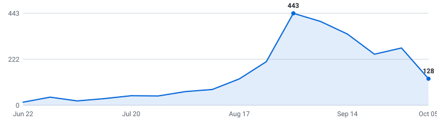

# 🎓 Summer 2027 Tech Internships

**A self-updating engine that tracks tech internships so you don't have to.**

&nbsp;&nbsp;&nbsp;

### 1322 open roles (661 listed below) · 251 new this week

4,594 employers tracked · updated Oct 03, 2026 at 23:48 UTC

_839 have a cycle the employer stated · 483 are recent postings whose cycle isn't stated (listed separately, never mixed in)._

**[🖥️ Live dashboard](https://heyinihere.github.io/Automated-List-Of-Summer-2027-and-Fall-2026-MechEng-Internships/)** · **[📡 RSS](https://heyinihere.github.io/Automated-List-Of-Summer-2027-and-Fall-2026-MechEng-Internships/feed.xml)** · **[⚙️ JSON API](https://heyinihere.github.io/Automated-List-Of-Summer-2027-and-Fall-2026-MechEng-Internships/api/jobs.json)** · **[✉️ Email alerts](https://heyinihere.github.io/Automated-List-Of-Summer-2027-and-Fall-2026-MechEng-Internships/#subscribe)**

> [!TIP]
> **⭐ Star this repo** to save it and get updates when new roles are added.

Instead of refreshing a dozen career pages by hand, it reads company hiring feeds directly and keeps one live list, newest roles on top, refreshed automatically throughout the day.

**🔔 New roles in your inbox:** [subscribe by email](https://heyinihere.github.io/Automated-List-Of-Summer-2027-and-Fall-2026-MechEng-Internships/#subscribe) - one email a day, only when new internships actually appeared, unsubscribe from any email in two clicks. (Prefer RSS-to-email? [Feedrabbit works too](https://feedrabbit.com/subscriptions/new?url=https%3A%2F%2Fraw.githubusercontent.com%2FHeyIniHere%2FAutomated-List-Of-Summer-2027-and-Fall-2026-MechEng-Internships%2Fmain%2Fdocs%2Ffeed.xml).)

---

## What this is

This is an engine, not a hand-kept list. It polls company career feeds several times a day, finds the internships, removes duplicates, and rebuilds this page on its own. Every link comes straight from the source, so it's real and current, not a stale list someone forgot to update (speed matters).

## What makes this different

- **📅 [Drop Radar](#drop-radar)** - a forecast of **what's coming**: each marquee company's typical opening window, replaced by the real drop date the moment the engine catches it live. Windows are estimates and labelled as such; only dates the engine observed itself are marked verified.
- **Visa intel, computed** - 🇺🇸 / 🛂 flags detected automatically from every job description, plus ✓ for employers with a real H-1B track record (official USCIS data, FY2022-23 - a history, not a promise). The big lists crowdsource this by hand; here it's code. Most postings say nothing either way, and those are shown as unknown rather than guessed.
- **A date on nearly every role** - taken from the job portal itself where the portal states one, so newest-first actually means newest. The exact coverage figure is printed at the bottom of this page every run.
- **Skill tags + pay, extracted** - every posting's text is scanned for the stack it wants (Python, C++, PyTorch, ...) and the pay it states - searchable on the [dashboard](https://heyinihere.github.io/Automated-List-Of-Summer-2027-and-Fall-2026-MechEng-Internships/), included in the CSV and API.
- **Alerts your way** - [email digests](https://heyinihere.github.io/Automated-List-Of-Summer-2027-and-Fall-2026-MechEng-Internships/#subscribe) or [RSS](https://heyinihere.github.io/Automated-List-Of-Summer-2027-and-Fall-2026-MechEng-Internships/feed.xml) (point any reader, or a Slack/Discord RSS integration, at it) - plus a [live dashboard](https://heyinihere.github.io/Automated-List-Of-Summer-2027-and-Fall-2026-MechEng-Internships/) with search, filters, and a saved-roles list that never leaves your browser.
- **An engine, not a spreadsheet** - 4,716 job-board endpoints (4,594 distinct employers; some run more than one board) polled every hour across 12 ATS platforms, full source and tests in this repo.

## Scope

| | |
|---|---|
| **Roles** | Software Engineering, Data Science & Machine Learning (and closely related technical internships) |
| **Region** | United States |
| **Cycles** | Summer 2027 and Fall 2026 |

## About

I'm an international student studying in the United States, so I built this for the search I'm doing myself. The list is US roles only for now - that's where I'm searching. Use it to spot roles early and apply before they fill up - being first genuinely helps.

## Where this is going

I'm building this in the open and adding to it as it grows. Recently shipped: **email alerts**, the **Drop Radar**, **auto-detected sponsorship flags**, and the **live dashboard**. Next up: personalized alerts (pick your categories), per-company hiring pages, and a ghost-posting detector. If it helps you, a star means a lot and tells me to keep going.

## How to use

<b>Reading the table — flags, dates, and the cycle split</b> (click to expand)

- Roles are grouped by cycle below - **newest posting on top, oldest at the bottom.**
- A cycle section holds only roles whose **employer stated that cycle** - in the title, or in the posting's own text. Postings that name no cycle anywhere are in *Recently posted — cycle not stated* further down, with **no cycle guessed for them**. Same quality bar, different amount of evidence.
- The **Posted** column is the date the company published the role.
- **Flags:** 🇺🇸 = requires U.S. citizenship or a security clearance · 🛂 = the posting says it won't sponsor a work visa · 🏠 = the location says remote · 🆕 = spotted in the last 48 hours. Sponsorship flags are detected automatically from each job description - treat them as a strong hint and confirm on the posting.
- **✓ after a company name** = a real H-1B track record: USCIS approved 10+ petitions for that employer in FY2022–2023 (matched automatically against the official [H-1B Employer Data Hub](https://www.uscis.gov/tools/reports-and-studies/h-1b-employer-data-hub)). No ✓ doesn't mean they won't sponsor - it means we can't prove they have.
- Track your applications with [`data/internships.csv`](data/internships.csv) (opens in Excel / Google Sheets).
- Missing a company? Adding one takes a single line, see [CONTRIBUTING.md](CONTRIBUTING.md).

---

## Summer 2027  (300 employer-stated)

| Company | Role | Category | Location | Posted | Apply |
|---|---|---|---|---|---|
| Amazon ✓ | Software Development Engineer Intern (Embedded Systems) - Summer 2027 (USA) 🆕 | Software | Seattle, Washington, USA | Oct 02, 2026 | [Apply](https://www.amazon.jobs/en/jobs/10567914/software-development-engineer-intern-embedded-systems-summer-2027-usa) |
| Anduril | 2027 Industrial Engineer Intern 🆕 | Hardware | Ashville +5 more | Oct 02, 2026 | [Apply](https://boards.greenhouse.io/andurilindustries/jobs/5255593007?gh_jid=5255593007) |
| Affirm ✓ | Software Engineer (Machine Learning) Intern (Summer 2027) 🆕 | Data & ML/AI | San Francisco, California, United States | Oct 02, 2026 | [Apply](https://job-boards.greenhouse.io/affirm/jobs/8008645003) |
| Affirm ✓ | Software Engineer Intern (Summer 2027) 🆕 | Software | San Francisco, California, United States | Oct 02, 2026 | [Apply](https://job-boards.greenhouse.io/affirm/jobs/8011590003) |
| Harvey ✓ | Software Engineering Intern (Summer 2027) 🆕 | Software | New York | Oct 02, 2026 | [Apply](https://jobs.ashbyhq.com/harvey/06d64648-b84b-48ae-94a2-d9c06dfdcb5d) |
| Arc | Software Engineering Intern 🆕 | Software | Torrance, CA | Oct 02, 2026 | [Apply](https://job-boards.greenhouse.io/arcboatcompany/jobs/5442881008) |
| Muon Space | Industrial Engineering Intern (Summer 2027) 🇺🇸 🆕 | Hardware | San Jose, CA | Oct 02, 2026 | [Apply](https://job-boards.greenhouse.io/muonspace/jobs/5256284007) |
| Bedrock Robotics | 2027 Internship Behavior ML Engineer, Learned Manipulation Policies 🆕 | Data & ML/AI | San Francisco, CA | Oct 02, 2026 | [Apply](https://jobs.ashbyhq.com/bedrock-robotics/96a6423e-7439-4cb4-9109-117b14e47f7c) |
| xAI | Summer 2027 Software Engineering Internship/Co-op 🆕 | Software | Palo Alto, CA | Oct 02, 2026 | [Apply](https://job-boards.greenhouse.io/xai/jobs/5255111007) |
| Stantec ✓ | Structural Engineering Intern/Co-op – Transportation (Summer 2027) 🆕 | Hardware | New York, NY, United States | Oct 02, 2026 | [Apply](https://hdhl.fa.us6.oraclecloud.com/hcmUI/CandidateExperience/en/sites/CX_1/job/1008131) |
| Charter Manufacturing | Smart Manufacturing Engineer Intern (Summer 2027) 🆕 | Hardware | Charter Steel - Saukville, WI | Oct 02, 2026 | [Apply](https://chartermfg.wd5.myworkdayjobs.com/Charter_Careers/job/Charter-Steel---Saukville-WI/Smart-Manufacturing-Engineer-Intern--Summer-2027-_R08133) |
| Leidos ✓ | Software Developer Intern 🇺🇸 🆕 | Software | Annapolis Junction, MD | Oct 02, 2026 | [Apply](https://leidos.wd5.myworkdayjobs.com/External/job/Annapolis-Junction-MD/Software-Developer-Intern_R-00193804) |
| Nelnet ✓ | Intern - IT Software Engineer .NET (Summer 2027) 🆕 | Software | Lincoln, NE | Oct 02, 2026 | [Apply](https://nelnet.wd1.myworkdayjobs.com/MyNelnet/job/Lincoln-NE/Intern---IT-Software-Engineer-NET--Summer-2027-_R23198) |
| Major League Baseball | Intern, Data Science 🆕 | Data & ML/AI | Citi Field – Queens, New York | Oct 02, 2026 | [Apply](https://sterlingmets.wd5.myworkdayjobs.com/Mets/job/Citi-Field--Queens-New-York/Intern--Data-Science_R1508) |
| Northrop Grumman | 2027 Manufacturing Operations and Planning Intern - Huntsville AL 🇺🇸 🆕 | Hardware | United States-Alabama-Huntsville | Oct 02, 2026 | [Apply](https://ngc.wd1.myworkdayjobs.com/Northrop_Grumman_External_Site/job/United-States-Alabama-Huntsville/XMLNAME-2027-Manufacturing-Operations-and-Planning-Intern---Huntsville-AL_R10253263) |
| Pinterest ✓ | Software Engineer Intern 2027 (USA) 🏠 | Software | San Francisco, CA, US; Remote, US | Oct 01, 2026 | [Apply](https://www.pinterestcareers.com/jobs/?gh_jid=7838577) |
| Pinterest ✓ | Software Engineering Intern 2027 (Toronto) | Software | Toronto, ON, CA | Oct 01, 2026 | [Apply](https://www.pinterestcareers.com/jobs/?gh_jid=8138039) |
| Pinterest ✓ | Machine Learning Intern 2027 (Toronto) | Data & ML/AI | Toronto, ON, CA | Oct 01, 2026 | [Apply](https://www.pinterestcareers.com/jobs/?gh_jid=8138080) |
| General Motors ✓ | 2027 Summer Intern - Software Engineer, Autonomous Vehicle: Simulation 🆕 | Software | Sunnyvale +2 more | Oct 01, 2026 | [Apply](https://generalmotors.wd5.myworkdayjobs.com/Careers_GM/job/Sunnyvale-California-United-States-of-America/XMLNAME-2027-Summer-Intern---Software-Engineer--Autonomous-Vehicle--Simulation_JR-202621503) |
| The Federal Reserve System | Summer 2027 Intern-Computer Science and Software Engineering 🛂 🆕 | Software | Chicago, IL | Oct 01, 2026 | [Apply](https://rb.wd5.myworkdayjobs.com/FRS/job/Chicago-IL/Summer-2027-Intern-Computer-Science-and-Software-Engineering_R-0000033637) |
| Walleye Capital | Special Projects Developer Intern (Summer 2027) 🆕 | Software | New York, New York | Oct 01, 2026 | [Apply](https://job-boards.greenhouse.io/walleyecapital-external-students/jobs/4716166006) |
| Datacor | Data Science Summer 2027 Internship Program 🏠 | Data & ML/AI | Remote, US | Oct 01, 2026 | [Apply](https://job-boards.greenhouse.io/datacor/jobs/5242412007) |
| BNY | 2027 BNY Summer Internship Program - Product Management (Lake Mary, FL) | Software | Lake Mary, FL, United States | Oct 01, 2026 | [Apply](https://eofe.fa.us2.oraclecloud.com/hcmUI/CandidateExperience/en/sites/CX_1/job/82784) |
| Stantec ✓ | Transportation Engineering Intern - Infrastructure (Summer 2027) | Software | Atlanta, GA, United States | Oct 01, 2026 | [Apply](https://hdhl.fa.us6.oraclecloud.com/hcmUI/CandidateExperience/en/sites/CX_1/job/1008089) |
| Stantec ✓ | Mechanical Engineering Intern - Water (Summer 2027) | Hardware | Nashville, TN, United States | Oct 01, 2026 | [Apply](https://hdhl.fa.us6.oraclecloud.com/hcmUI/CandidateExperience/en/sites/CX_1/job/1008121) |
| ATC | Intern - Cyber Security Summer 2027 | Security | Pewaukee, WI | Oct 01, 2026 | [Apply](https://atcllc.wd5.myworkdayjobs.com/atcllc/job/Pewaukee-WI/Intern---Cyber-Security-Summer-2027_R0003307) |
| CoStar Group | Embedded Software Engineering Intern 🛂 | Software | Sunnyvale (US) | Oct 01, 2026 | [Apply](https://costar.wd1.myworkdayjobs.com/Costar_Campus/job/Sunnyvale-US/Embedded-Software-Engineering-Intern_R39950) |
| CoStar Group | Mechanical Engineering Intern 🛂 | Hardware | Sunnyvale (US) | Oct 01, 2026 | [Apply](https://costar.wd1.myworkdayjobs.com/Costar_Campus/job/Sunnyvale-US/Mechanical-Engineering-Intern_R39952) |
| RTX | Flight Control Software Engineering Intern (Summer 2027) (Open) 🇺🇸 | Software | US-IA-CEDAR RAPIDS-193 ~ 1120 Collins R… | Oct 01, 2026 | [Apply](https://globalhr.wd5.myworkdayjobs.com/rec_rtx_ext_gateway/job/US-IA-CEDAR-RAPIDS-193--1120-Collins-Rd-NE--BLDG193/Flight-Control-Software-Engineering-Intern--Summer-2027---Open-_01870974) |
| HMH | AI & Automation Development Intern | Data & ML/AI | Houston, TX | Oct 01, 2026 | [Apply](https://hmhw.wd12.myworkdayjobs.com/hmh_careers/job/Houston-TX/AI---Automation-Development-Intern_JR102458) |
| Marvell ✓ | Firmware Engineer Intern, MS - Summer 2027 | Hardware | Santa Clara, CA | Oct 01, 2026 | [Apply](https://marvell.wd1.myworkdayjobs.com/marvellcareers2/job/Santa-Clara-CA/Firmware-Engineer-Intern--MS---Summer-2027_2604513-1) |
| The Federal Reserve System | TS - Application Security Intern - 2027 🇺🇸 | Security | Cleveland, OH | Oct 01, 2026 | [Apply](https://rb.wd5.myworkdayjobs.com/FRS/job/Cleveland-OH/TS---Application-Security-Intern---2027_R-0000033625) |
| Zekelman Industries | Intern, Manufacturing Engineer | Hardware | Niles, OH | Oct 01, 2026 | [Apply](https://zekelman.wd12.myworkdayjobs.com/Careers/job/Niles-OH/Intern--Manufacturing-Engineer_JR002843) |
| Riot Games ✓ | Software Engineering Intern - Summer 2027 (Remote) 🛂 🏠 | Software | Los Angeles, USA | Oct 01, 2026 | [Apply](https://job-boards.greenhouse.io/riotgamesup/jobs/8222015) |
| AECOM ✓ | Structural Engineering Intern – Hiring Event with AECOM – Atlanta, GA | Hardware | Atlanta, GA, United States | Oct 01, 2026 | [Apply](https://jobs.smartrecruiters.com/AECOM2/744000152952229) |
| Allison Transmission ✓ | Manufacturing Engineering Intern - Summer 2027 | Hardware | Indianapolis, IN | Oct 01, 2026 | [Apply](https://allisontransmission.wd1.myworkdayjobs.com/ATI-External/job/Indianapolis-IN/Manufacturing-Engineering-Intern---Summer-2027_R008126) |
| RTX | Software Engineering Intern (Summer 2027) 🇺🇸 | Software | US-IA-CEDAR RAPIDS-105 ~ 400 Collins Rd… | Oct 01, 2026 | [Apply](https://globalhr.wd5.myworkdayjobs.com/rec_rtx_ext_gateway/job/US-IA-CEDAR-RAPIDS-105--400-Collins-Rd-NE--BLDG-105/Software-Engineering-Intern--Summer-2027-_01870343) |
| RTX | Industrial Engineering Co-Op (Spring/Summer 2027) 🇺🇸 | Hardware | US-IA-CEDAR RAPIDS-109 ~ 400 Collins Rd… | Oct 01, 2026 | [Apply](https://globalhr.wd5.myworkdayjobs.com/rec_rtx_ext_gateway/job/US-IA-CEDAR-RAPIDS-109--400-Collins-Rd-NE--BLDG-109/Industrial-Engineering-Co-Op--Spring-Summer-2027-_01871431) |
| Northrop Grumman | 2027 Structural Engineering Intern Dulles Va 🇺🇸 | Hardware | United States-Virginia-Dulles | Oct 01, 2026 | [Apply](https://ngc.wd1.myworkdayjobs.com/Northrop_Grumman_External_Site/job/United-States-Virginia-Dulles/XMLNAME-2027-Structural-Engineering-Intern-Dulles-Va_R10253912) |
| Varda Space | Cybersecurity Internship - Summer 2027 🇺🇸 | Security | El Segundo, California, United States | Oct 01, 2026 | [Apply](https://job-boards.greenhouse.io/vardaspace/jobs/8005821003) |
| Varda Space | Flight Software Internship - Summer 2027 🇺🇸 | Software | El Segundo, California, United States | Oct 01, 2026 | [Apply](https://job-boards.greenhouse.io/vardaspace/jobs/8010159003) |
| Varda Space | Manufacturing Engineering Internship - Summer 2027 🇺🇸 | Hardware | El Segundo, California, United States | Oct 01, 2026 | [Apply](https://job-boards.greenhouse.io/vardaspace/jobs/8010166003) |
| Generac ✓ | 2027 Summer Intern Digital Manufacturing Engineering | Hardware | Waukesha, WI - USA | Oct 01, 2026 | [Apply](https://generac.wd5.myworkdayjobs.com/external/job/Waukesha-WI---USA/XMLNAME-2027-Summer-Intern-Digital-Manufacturing-Engineering_JR16255) |
| Amazon ✓ | Software Development Engineer Intern, AWS Database - 2027 (US) | Software | Seattle, Washington, USA | Sep 30, 2026 | [Apply](https://www.amazon.jobs/en/jobs/10565667/software-development-engineer-intern-aws-database-2027-us) |
| Muon Space | Thermal Engineering Intern (Summer 2027) 🇺🇸 🆕 | Hardware | San Jose, CA | Sep 30, 2026 | [Apply](https://job-boards.greenhouse.io/muonspace/jobs/5253474007) |
| Helion Energy | Mechanical Engineering Summer 2027 Intern 🆕 | Hardware | Everett, WA | Sep 30, 2026 | [Apply](https://jobs.ashbyhq.com/helion/b73602bd-b644-4a46-9188-fded4b2db606) |
| Allen Control Systems | Software Engineering Intern, UX/UI 2027 | Software | Austin, TX | Sep 30, 2026 | [Apply](https://jobs.ashbyhq.com/allen-control-systems/1cd2b432-9a01-4ae0-8eb2-6ebd9c278b94) |
| Muon Space | Flight Software Engineering Intern (Summer 2027) 🇺🇸 | Software | San Jose, CA | Sep 30, 2026 | [Apply](https://job-boards.greenhouse.io/muonspace/jobs/5247725007) |
| Waymo ✓ | 2027 Summer Intern, BS, Software Engineering, Labeling | Software | Mountain View, CA, USA | Sep 30, 2026 | [Apply](https://careers.withwaymo.com/jobs?gh_jid=8238525) |
| Allison Transmission ✓ | Manufacturing Engineer Intern - Summer 2027-1 🇺🇸 | Hardware | Indianapolis, IN | Sep 30, 2026 | [Apply](https://allisontransmission.wd1.myworkdayjobs.com/ATI-External/job/Indianapolis-IN/Manufacturing-Engineer-Intern---Summer-2027-1_R008267) |
| Allison Transmission ✓ | Manufacturing Engineer Intern - Summer 2027-2 🇺🇸 | Hardware | Indianapolis, IN | Sep 30, 2026 | [Apply](https://allisontransmission.wd1.myworkdayjobs.com/ATI-External/job/Indianapolis-IN/Manufacturing-Engineer-Intern---Summer-2027-2_R008266) |
| Northrop Grumman | 2027 Software Engineer Intern - Rolling Meadows IL 🇺🇸 | Software | United States-Illinois-Rolling Meadows | Sep 30, 2026 | [Apply](https://ngc.wd1.myworkdayjobs.com/Northrop_Grumman_External_Site/job/United-States-Illinois-Rolling-Meadows/XMLNAME-2027-Software-Engineer-Intern---Rolling-Meadows-IL_R10253772) |
| STV ✓ | Structural Engineering Intern - Summer 2027 🛂 | Hardware | Oklahoma City, Oklahoma | Sep 30, 2026 | [Apply](https://stvinc.wd5.myworkdayjobs.com/stv/job/Oklahoma-City-Oklahoma/Structural-Engineering-Intern---Summer-2027_JR6315) |
| Zekelman Industries | Intern, Manufacturing Engineer | Hardware | Rochelle, IL | Sep 30, 2026 | [Apply](https://zekelman.wd12.myworkdayjobs.com/Careers/job/Rochelle-IL/Intern--Manufacturing-Engineer_JR002824) |
| Robinhood ✓ | Data Science Intern (Summer 2027) | Data & ML/AI | Menlo Park, CA | Sep 29, 2026 | [Apply](https://boards.greenhouse.io/robinhood/jobs/8241738?t=gh_src=&gh_jid=8241738) |
| Helion Energy | Materials Engineering Summer 2027 Intern 🆕 | Hardware | Everett, WA | Sep 29, 2026 | [Apply](https://jobs.ashbyhq.com/helion/56636c72-2c72-4f4f-8334-3b233a235c8d) |
| The Aerospace Corporation | 2027 Structural Mechanics Undergraduate Intern 🇺🇸 | Hardware | El Segundo, CA | Sep 29, 2026 | [Apply](https://aero.wd5.myworkdayjobs.com/external/job/El-Segundo-CA/XMLNAME-2027-Structural-Mechanics-Undergraduate-Intern_R016763) |
| AMCA | Software Engineering Internship (Summer 2027) 🇺🇸 | Software | El Segundo, CA | Sep 29, 2026 | [Apply](https://job-boards.greenhouse.io/amca/jobs/4425120009) |
| Marvell ✓ | Machine Learning Engineer Intern, BS/MS - Summer 2027 | Data & ML/AI | Santa Clara, CA | Sep 29, 2026 | [Apply](https://marvell.wd1.myworkdayjobs.com/marvellcareers2/job/Santa-Clara-CA/Machine-Learning-Engineer-Intern--BS-MS---Summer-2027_2603860-1) |
| Freeform | Manufacturing Engineering Intern, CNC Machining (Summer 2027) | Hardware | Los Angeles, CA (On-site) | Sep 29, 2026 | [Apply](https://job-boards.greenhouse.io/freeformfuturecorp/jobs/8004101003) |
| Itron ✓ | Intern - Data Science, Distributed Intelligence | Data & ML/AI | United States of America +2 more | Sep 29, 2026 | [Apply](https://itron.wd5.myworkdayjobs.com/Early_Careers/job/United-States-of-America-Washington-Liberty-Lake/Intern---Data-Science--Distributed-Intelligence_JR102942-2) |
| ICF ✓ | 2027 Summer Intern, AI Engineer (Reston, VA) 🇺🇸 | Data & ML/AI | Reston, VA | Sep 29, 2026 | [Apply](https://icf.wd5.myworkdayjobs.com/ICFExternal_Career_Site/job/Reston-VA/XMLNAME-2027-Summer-Intern--AI-Engineer--Reston--VA-_R2603312-1) |
| Insulet Corporation ✓ | Co-op, Software Development Engineer in Test: January - June 2027 (Hybrid) | Software | Acton, Massachusetts | Sep 29, 2026 | [Apply](https://insulet.wd5.myworkdayjobs.com/insuletcareers/job/Acton-Massachusetts/Co-op--Software-Development-Engineer-in-Test--January---June-2027--Hybrid-_REQ-2026-18026) |
| Insulet Corporation ✓ | Co-op, Manufacturing: January - June 2027 (Onsite) | Hardware | Irvine, California | Sep 29, 2026 | [Apply](https://insulet.wd5.myworkdayjobs.com/insuletcareers/job/Irvine-California/Co-op--Manufacturing--January---June-2027--Onsite-_REQ-2026-18119) |
| The Toro Company | Manufacturing Engineer Intern - Ditch Witch 🛂 | Hardware | Perry, OK | Sep 29, 2026 | [Apply](https://ttc.wd1.myworkdayjobs.com/Toro_External_Careers/job/Perry-OK/Manufacturing-Engineer-Intern---Ditch-Witch_JR17449) |
| Perchwell | Software Engineering Intern | Software | New York Office | Sep 29, 2026 | [Apply](https://jobs.ashbyhq.com/perchwell/194eec78-26db-4d8e-850f-a99ea2733e9f) |
| Enova ✓ | Software Engineer Internship Summer 2027 (Hybrid) 🛂 | Software | Chicago, IL | Sep 29, 2026 | [Apply](https://job-boards.greenhouse.io/enova/jobs/8239619) |
| National Life ✓ | Digital & AI Experience Intern – Summer 2027 🛂 | Data & ML/AI | Addison, TX; Montpelier, VT | Sep 29, 2026 | [Apply](https://job-boards.greenhouse.io/nationallifeinsurancecompany/jobs/4403876009) |
| Ralliant | Manufacturing Engineering Intern - Summer 2027 | Hardware | Boxborough, MA, United States | Sep 29, 2026 | [Apply](https://ibwujb.fa.ocs.oraclecloud.com/hcmUI/CandidateExperience/en/sites/CX_1001/job/10680) |
| Ralliant | Manufacturing Engineering Intern - Summer 2027 | Hardware | Plainville, CT, United States | Sep 29, 2026 | [Apply](https://ibwujb.fa.ocs.oraclecloud.com/hcmUI/CandidateExperience/en/sites/CX_1001/job/10681) |
| Marvell ✓ | AI-Native Development Platform Engineer Intern, MS - Summer 2027 | Data & ML/AI | Santa Clara, CA | Sep 29, 2026 | [Apply](https://marvell.wd1.myworkdayjobs.com/marvellcareers2/job/Santa-Clara-CA/AI-Native-Development-Platform-Engineer-Intern--MS---Summer-2027_2603848) |
| nVent | Manufacturing Automaton Intern (June - August 2027) 🛂 | Hardware | Anoka, MN, US | Sep 29, 2026 | [Apply](https://nvent.wd5.myworkdayjobs.com/nVent/job/Anoka-MN-US/Manufacturing-Automaton-Intern--June---August-2027-_R23865) |
| Q2 | 2027 Summer Internship - Data Science 🛂 | Data & ML/AI | Cary, North Carolina | Sep 29, 2026 | [Apply](https://q2ebanking.wd5.myworkdayjobs.com/Q2/job/Cary-North-Carolina/XMLNAME-2027-Summer-Internship---Data-Science_REQ-12799) |
| Q2 | 2027 Summer Internship - Machine Learning Engineer 🛂 | Data & ML/AI | Cary, North Carolina | Sep 29, 2026 | [Apply](https://q2ebanking.wd5.myworkdayjobs.com/Q2/job/Cary-North-Carolina/XMLNAME-2027-Summer-Internship---Machine-Learning-Engineer_REQ-12800) |
| Q2 | 2027 Summer Internship - Software Engineer 🛂 | Software | Cary, North Carolina | Sep 29, 2026 | [Apply](https://q2ebanking.wd5.myworkdayjobs.com/Q2/job/Cary-North-Carolina/XMLNAME-2027-Summer-Internship---Software-Engineer_REQ-12798) |
| Hermeus | Flight Software Engineering Intern (Simulation/Hardware-In-The-Loop) - Spring & Summer 2027 🇺🇸 | Hardware | Los Angeles, CA | Sep 29, 2026 | [Apply](https://jobs.lever.co/hermeus/78008094-ca81-4a0c-9a18-93b30f932acd) |
| Verizon Communications | Irving V Teamer for a Day: Verizon Data Science Summer 2027 Internship | Data & ML/AI | Irving, Texas | Sep 29, 2026 | [Apply](https://verizon.wd12.myworkdayjobs.com/verizon-careers/job/Irving-Texas/Irving-V-Teamer-for-a-Day--Verizon-Data-Science-Summer-2027-Internship_R-1101386) |
| Verizon Communications | Verizon Network and Technology: Data Science Summer 2027 Internship | Data & ML/AI | Irving, Texas | Sep 29, 2026 | [Apply](https://verizon.wd12.myworkdayjobs.com/verizon-careers/job/Irving-Texas/Verizon-Network-and-Technology--Data-Science-Summer-2027-Internship_R-1101384) |
| Lyft ✓ | Applied Scientist Intern (Summer 2027) | Data & ML/AI | San Francisco, CA | Sep 28, 2026 | [Apply](https://app.careerpuck.com/job-board/lyft/job/8843341002?gh_jid=8843341002) |
| The Aerospace Corporation | 2027 Software Tools and Assurance Engineering Grad Intern 🇺🇸 | Software | El Segundo, CA | Sep 28, 2026 | [Apply](https://aero.wd5.myworkdayjobs.com/external/job/El-Segundo-CA/XMLNAME-2027-Software-Tools-and-Assurance-Engineering-Grad-Intern_R016753) |
| General Motors ✓ | 2027 Summer Intern – Motorsports Aero-Thermal Engineering | Hardware | Milford +2 more | Sep 28, 2026 | [Apply](https://generalmotors.wd5.myworkdayjobs.com/Careers_GM/job/Milford-Michigan-United-States-of-America/XMLNAME-2027-Summer-Intern---Motorsports-Aero-Thermal-Engineering_JR-202619861) |
| Zurn Elkay Water Solutions | Industrial Engineering Intern (Summer 2027) | Hardware | Freeport, IL | Sep 28, 2026 | [Apply](https://elkay.wd1.myworkdayjobs.com/Elkay_External/job/Freeport-IL/Industrial-Engineering-Intern--Summer-2027-_REQ-020072) |
| AtkinsRéalis | Structural Engineering Intern – Summer 2027 | Hardware | US.CO.Denver | Sep 28, 2026 | [Apply](https://slihrms.wd3.myworkdayjobs.com/careers/job/USCODenver/Structural-Engineering-Intern---Summer-2027_R-161182-1) |
| AtkinsRéalis | Structural Engineering Intern – Summer 2027 | Hardware | US.WA.Bothell | Sep 28, 2026 | [Apply](https://slihrms.wd3.myworkdayjobs.com/careers/job/USWABothell/Structural-Engineering-Intern---Summer-2027_R-162449-1) |
| Formlabsinternships | Desktop Software Intern (Summer 2027) | Software | Somerville, MA | Sep 28, 2026 | [Apply](https://job-boards.greenhouse.io/formlabsinternships/jobs/8223362) |
| Lawrence Livermore National Laboratory (LLNL) | Data Science Institute Graduate Student Intern - Summer 2027 🇺🇸 | Data & ML/AI | Livermore, CA, United States | Sep 28, 2026 | [Apply](https://jobs.smartrecruiters.com/LLNL/3743990015737586) |
| Mars | Summer 2027 Mars Petcare Manufacturing Internship | Hardware | USA-Arkansas-Ft. Smith | Sep 28, 2026 | [Apply](https://mars.wd3.myworkdayjobs.com/external/job/USA-Arkansas-Ft-Smith/Summer-2027-Mars-Petcare-Manufacturing-Internship_R168212-1) |
| POET | Software Developer Intern - Summer 2027 | Software | Sioux Falls, SD | Sep 28, 2026 | [Apply](https://poet.wd1.myworkdayjobs.com/POET/job/Sioux-Falls-SD/Software-Developer-Intern_R101786-1) |
| Veterans United ✓ | Intern - Software Engineer - Summer 2027 🏠 | Software | Remote MO | Sep 28, 2026 | [Apply](https://veteransunited.wd1.myworkdayjobs.com/VUHL/job/Remote-MO/Intern---Software-Engineer---Summer-2027_R6249) |
| Blue Cross Blue Shield of Michigan ✓ | Summer 2027 Intern - Data Science / Biostatistician | Data & ML/AI | Detroit, MI, United States | Sep 28, 2026 | [Apply](https://ejko.fa.us2.oraclecloud.com/hcmUI/CandidateExperience/en/sites/CX_3/job/14837) |
| GM financial | Intern - Cybersecurity 🛂 | Security | Irving, TX, United States | Sep 28, 2026 | [Apply](https://fa-exvu-saasfaprod1.fa.ocs.oraclecloud.com/hcmUI/CandidateExperience/en/sites/CX_1/job/260805) |
| GM financial | Intern - Cybersecurity | Security | Arlington, TX, United States | Sep 28, 2026 | [Apply](https://fa-exvu-saasfaprod1.fa.ocs.oraclecloud.com/hcmUI/CandidateExperience/en/sites/CX_1/job/260836) |
| AECOM ✓ | Mechanical Engineering Intern - Hiring Event with AECOM - Arlington, VA | Hardware | Arlington, VA, United States | Sep 28, 2026 | [Apply](https://jobs.smartrecruiters.com/AECOM2/744000152172269) |
| General Dynamics Information Technology ✓ | GDIT Summer Internship Program – Summer 2027 AI/ML Data Science and Engineering Internship 🇺🇸 | Data & ML/AI | USA LA Bossier City | Sep 26, 2026 | [Apply](https://gdit.wd5.myworkdayjobs.com/gdit_earlytalent/job/USA-LA-Bossier-City/GDIT-Summer-Internship-Program---Summer-2027-AI-ML-Data-Science-and-Engineering-Internship_RQ228936) |
| General Dynamics Information Technology ✓ | GDIT Summer Internship Program – Summer 2027 AI/ML Software Development and Engineering Internship 🇺🇸 | Data & ML/AI | USA LA Bossier City | Sep 26, 2026 | [Apply](https://gdit.wd5.myworkdayjobs.com/gdit_earlytalent/job/USA-LA-Bossier-City/GDIT-Summer-Internship-Program---Summer-2027-AI-ML-Software-Development-and-Engineering-Internship_RQ228939) |
| General Dynamics Information Technology ✓ | GDIT Summer Internship Program – Summer 2027 AI/ML Software Development and Engineering Internship 🇺🇸 | Data & ML/AI | USA LA Bossier City | Sep 26, 2026 | [Apply](https://gdit.wd5.myworkdayjobs.com/gdit_earlytalent/job/USA-LA-Bossier-City/GDIT-Summer-Internship-Program---Summer-2027-AI-ML-Software-Development-and-Engineering-Internship_RQ228940) |
| Waymo ✓ | 2027 Summer Intern, BS, Software Engineer, Driver Refinement Foundations | Software | Mountain View, CA, USA | Sep 25, 2026 | [Apply](https://careers.withwaymo.com/jobs?gh_jid=8224900) |
| Zurn Elkay Water Solutions | Embedded Firmware Intern (Summer 2027) | Hardware | Milwaukee, WI | Sep 25, 2026 | [Apply](https://elkay.wd1.myworkdayjobs.com/Elkay_External/job/Milwaukee-WI/Embedded-Firmware-Intern--Summer-2027-_REQ-020150-1) |
| Zurn Elkay Water Solutions | Embedded Hardware Intern (Summer 2027) | Hardware | Milwaukee, WI | Sep 25, 2026 | [Apply](https://elkay.wd1.myworkdayjobs.com/Elkay_External/job/Milwaukee-WI/Embedded-Hardware-Intern--Summer-2027-_REQ-020151) |
| Life Fitness ✓ | Manufacturing Quality Engineering Intern - Owatonna, MN | Hardware | Owatonna, MN | Sep 25, 2026 | [Apply](https://lifefitness.wd1.myworkdayjobs.com/searchLFN/job/Owatonna-MN/Manufacturing-Quality-Engineering-Intern---Owatonna--MN_JR-025245) |
| AbbVie ✓ | 2027 Business Technology Solutions Intern - Cybersecurity (Undergraduate) | Security | North Chicago, IL, United States | Sep 25, 2026 | [Apply](https://jobs.smartrecruiters.com/AbbVie/3743990015679246) |
| AbbVie ✓ | 2027 Business Technology Solutions Intern - Data & Software Engineering (Undergraduate) | Data & ML/AI | North Chicago, IL, United States | Sep 25, 2026 | [Apply](https://jobs.smartrecruiters.com/AbbVie/3743990015679386) |
| AbbVie ✓ | 2027 Business Technology Solutions Intern - Data & Software Engineering (Undergraduate) | Data & ML/AI | Irvine, CA, United States | Sep 25, 2026 | [Apply](https://jobs.smartrecruiters.com/AbbVie/3743990015684476) |
| Amazon ✓ | Software Development Engineer Intern - Summer 2027 (USA) , Amazon Dedicated Cloud (ADC) 🇺🇸 | Software | Seattle, Washington, USA | Sep 24, 2026 | [Apply](https://www.amazon.jobs/en/jobs/10559746/software-development-engineer-intern-summer-2027-usa-amazon-dedicated-cloud-adc) |
| iRhythm Technologies ✓ | Embedded SDET Co-Op Full Time Intern January-June 2027 | Software | San Francisco, CA | Sep 24, 2026 | [Apply](https://irhythmtech.wd5.myworkdayjobs.com/irhythm/job/San-Francisco-CA/Embedded-SDET-Co-Op-Full-Time-Intern-January-June-2027_JR1758) |
| ABB ✓ | Product Management Intern - Summer 2027 🛂 | Software | New Berlin +2 more | Sep 24, 2026 | [Apply](https://abb.wd3.myworkdayjobs.com/external_career_page/job/New-Berlin-Wisconsin-United-States-of-America/Product-Management-Intern---Summer-2027_JR00047280) |
| C.H. Robinson ✓ | Cyber Security Internship 2027 | Security | Eden Prairie +1 more | Sep 24, 2026 | [Apply](https://chrobinson.wd5.myworkdayjobs.com/CHRobinson/job/Eden-Prairie-MN-United-States-of-America/Security-Internship-2027_R49322) |
| iRhythm Technologies ✓ | Mechanical Engineering Co-op Full Time Intern Jan - June 2027 | Hardware | San Francisco, CA | Sep 24, 2026 | [Apply](https://irhythmtech.wd5.myworkdayjobs.com/irhythm/job/San-Francisco-CA/Mechanical-Engineering-Co-op-Full-Time-Intern-Jan---June-2027_JR1766) |
| Motorola ✓ | Software Engineering Intern - Summer 2027 🇺🇸 | Software | Plantation, FL | Sep 24, 2026 | [Apply](https://motorolasolutions.wd5.myworkdayjobs.com/Careers/job/Plantation-FL/Software-Engineering-Intern---Summer-2027_R69136) |
| Merck | 2027 Future Talent Program - Data Science - Intern | Data & ML/AI | USA - Pennsylvania - West Point | Sep 24, 2026 | [Apply](https://msd.wd5.myworkdayjobs.com/searchjobs/job/USA---Pennsylvania---West-Point/XMLNAME-2027-Future-Talent-Program---Data-Science---Intern_R413312) |
| The Toro Company | Mechanical Engineer Intern - The Toro Company 🛂 | Hardware | Bloomington, MN | Sep 24, 2026 | [Apply](https://ttc.wd1.myworkdayjobs.com/Toro_External_Careers/job/Bloomington-MN/Mechanical-Engineer-Intern---The-Toro-Company_JR17112) |
| ZOLL Medical Corporation | Mechanical Engineering Intern | Hardware | Chelmsford, MA | Sep 24, 2026 | [Apply](https://zoll.wd5.myworkdayjobs.com/ZOLLMedicalCorp/job/Chelmsford-MA/Mechanical-Engineering-Intern_R20310) |
| Figma ✓ | Data Engineer Intern (2027) | Data & ML/AI | San Francisco, CA • New York, NY | Sep 23, 2026 | [Apply](https://boards.greenhouse.io/figma/jobs/6178851004?gh_jid=6178851004) |
| DoorDash ✓ | Machine Learning Intern (Masters) - Summer 2027 | Data & ML/AI | San Francisco +7 more | Sep 23, 2026 | [Apply](https://job-boards.greenhouse.io/doordashusa/jobs/8204111) |
| Zekelman Industries | Industrial Engineer - Intern | Hardware | Killeen, TX | Sep 23, 2026 | [Apply](https://zekelman.wd12.myworkdayjobs.com/Careers/job/Killeen-TX/Industrial-Engineer---Intern_JR002772) |
| Klaviyo ✓ | AI Engineer Intern (Summer 2027) | Data & ML/AI | Boston, MA | Sep 23, 2026 | [Apply](https://job-boards.greenhouse.io/klaviyocampus/jobs/8003260003) |
| The Aerospace Corporation | 2027 Flight Loads Structural Dynamics Undergraduate Intern 🇺🇸 | Hardware | El Segundo, CA | Sep 23, 2026 | [Apply](https://aero.wd5.myworkdayjobs.com/external/job/El-Segundo-CA/XMLNAME-2027-Flight-Loads-Structural-Dynamics-Undergraduate-Intern_R016671) |
| Continental | 2027 Internship - Manufacturing Engineer (Hoosier Racing Tire) | Hardware | Plymouth, IN, United States | Sep 23, 2026 | [Apply](https://jobs.smartrecruiters.com/Continental/744000151462939) |
| Insulet Corporation ✓ | Intern, DevOps Engineer: June-August 2027 (Onsite) | Software | San Diego, California | Sep 23, 2026 | [Apply](https://insulet.wd5.myworkdayjobs.com/insuletcareers/job/San-Diego-California/Intern--DevOps-Engineer--June-August-2027--Onsite-_REQ-2026-18202) |
| Klaviyo ✓ | Machine Learning Engineer Internship-Summer 2027 | Data & ML/AI | Palo Alto, CA | Sep 23, 2026 | [Apply](https://job-boards.greenhouse.io/klaviyocampus/jobs/7999274003) |
| GM financial | Intern - Software Development Engineer | Software | Arlington, TX, United States | Sep 23, 2026 | [Apply](https://fa-exvu-saasfaprod1.fa.ocs.oraclecloud.com/hcmUI/CandidateExperience/en/sites/CX_1/job/260943) |
| AECOM ✓ | Structural Engineering Intern - Networking Event with AECOM – Boston, MA 🛂 | Hardware | Boston, MA, United States | Sep 23, 2026 | [Apply](https://jobs.smartrecruiters.com/AECOM2/744000151381599) |
| Generac ✓ | Mechanical Engineering Intern - Transfer Switch - Summer 2027 | Hardware | Waukesha, WI - USA | Sep 23, 2026 | [Apply](https://generac.wd5.myworkdayjobs.com/external/job/Waukesha-WI---USA/Mechanical-Engineering-Intern---Transfer-Switch---Summer-2027_JR17048) |
| Hudson River Trading ✓ | Data Scientist Intern - 2027 | Data & ML/AI | New York, NY, United States | Sep 22, 2026 | [Apply](https://www.hudsonrivertrading.com/careers/job/?gh_jid=8222414) |
| Grow Therapy | Software Engineering Intern (Summer 2027) | Software | New York City | Sep 22, 2026 | [Apply](https://jobs.ashbyhq.com/grow-therapy/92bfe88a-4c23-48c8-8f7b-4959ab6cd8d8) |
| Astranis | Software Engineer Backend Intern (Summer 2027) 🇺🇸 | Software | San Francisco, CA | Sep 22, 2026 | [Apply](https://job-boards.greenhouse.io/astranis/jobs/4705214006) |
| Astranis | Software Engineer - Enterprise Systems Intern (Summer 2027) 🇺🇸 | Software | San Francisco, CA | Sep 22, 2026 | [Apply](https://job-boards.greenhouse.io/astranis/jobs/4705610006) |
| Life Fitness ✓ | Manufacturing Engineering Intern - Ramsey, MN | Hardware | Ramsey, MN | Sep 22, 2026 | [Apply](https://lifefitness.wd1.myworkdayjobs.com/searchLFN/job/Ramsey-MN/Manufacturing-Engineering-Intern---Ramsey--MN_JR-025239) |
| Verizon Communications | Verizon Network and Technology: AI Science 2027 Internship: Rutgers, NJIT, NYU, UT Dallas, UT Arlington, Texas A&M | Data & ML/AI | Basking Ridge, New Jersey | Sep 22, 2026 | [Apply](https://verizon.wd12.myworkdayjobs.com/verizon-careers/job/Basking-Ridge-New-Jersey/Verizon-Network-and-Technology--AI-Science-2027-Internship--Rutgers--NJIT--NYU--UT-Dallas--UT-Arlington--Texas-A-M_R-1101169) |
| Rentvision | Software Engineering Intern | Software | Lincoln, Nebraska, United States | Sep 21, 2026 | [Apply](https://apply.workable.com/rentvision/j/0F1C7992BF/) |
| Formlabsinternships | Mechanical Engineering Intern (Summer 2027) | Hardware | Somerville, MA | Sep 21, 2026 | [Apply](https://job-boards.greenhouse.io/formlabsinternships/jobs/8199928) |
| Formlabsinternships | Embedded Software Intern (Summer 2027) | Software | Somerville, MA | Sep 21, 2026 | [Apply](https://job-boards.greenhouse.io/formlabsinternships/jobs/8222268) |
| Cowboy Space | Intern, Software Engineering, 2027 🇺🇸 | Software | San Carlos, California | Sep 21, 2026 | [Apply](https://jobs.ashbyhq.com/cowboyspace/56d1d7e4-fa7e-4c25-aa8b-6828447fc64a) |
| Waymo ✓ | 2027 Summer Intern, BS/MS, Embedded, Software Engineer | Software | Mountain View, CA, USA | Sep 21, 2026 | [Apply](https://careers.withwaymo.com/jobs?gh_jid=8221198) |
| Shield AI | Summer 2027 - Mechanical Engineering Intern | Hardware | Seattle, Washington | Sep 21, 2026 | [Apply](https://jobs.lever.co/shieldai/da54c482-fe62-4f60-98b1-55ac0b82b3bc) |
| Avav | Summer 2027 Autonomy & Robotics Engineering Intern 🇺🇸 | Hardware | Moorpark, CA | Sep 21, 2026 | [Apply](https://avav.wd1.myworkdayjobs.com/avav/job/Moorpark-CA/Summer-2027-Autonomy---Robotics-Engineering-Intern_8551) |
| Bracco | Quality Analyst Intern (Software) | Software | USA, Eden Prairie, Minnesota, 55344 | Sep 21, 2026 | [Apply](https://bracco.wd103.myworkdayjobs.com/braccocareers/job/USA-Eden-Prairie-Minnesota-55344/Quality-Analyst-Intern--Software-_JR100314) |
| Charter Manufacturing | Mechanical Engineer Intern (Summer 2027) | Hardware | Charter Steel - Saukville, WI | Sep 21, 2026 | [Apply](https://chartermfg.wd5.myworkdayjobs.com/Charter_Careers/job/Charter-Steel---Saukville-WI/Mechanical-Engineering-Intern--Year-Round-_R08122) |
| Life Fitness ✓ | Mechanical Engineering Intern - Ramsey, MN | Hardware | Ramsey, MN | Sep 21, 2026 | [Apply](https://lifefitness.wd1.myworkdayjobs.com/searchLFN/job/Ramsey-MN/Mechanical-Engineering-Intern---Ramsey--MN_JR-025235) |
| Rocket Lab | Thermal Engineering Intern Summer 2027 🇺🇸 | Hardware | Long Beach, CA | Sep 21, 2026 | [Apply](https://job-boards.greenhouse.io/rocketlab/jobs/8000958003) |
| Brunswick ✓ | Mercury Marine: Intern Design Analysis Group-Fluid & Thermal | Hardware | Fond du Lac, WI | Sep 21, 2026 | [Apply](https://brunswick.wd1.myworkdayjobs.com/search/job/Fond-du-Lac-WI/Mercury-Marine--Intern-Design-Analysis-Group-Fluid---Thermal_JR-050977) |
| Commerce Bank | Intern - Data Analyst (Summer 2027) 🛂 | Data & ML/AI | MO - Kansas City Downtown/Plaza - Kansa… | Sep 21, 2026 | [Apply](https://commercebank.wd1.myworkdayjobs.com/CommerceJobs/job/MO---Kansas-City-DowntownPlaza---Kansas-City---KC-Downtown-Trust-Building-922-Walnut-64106/Intern-EABI---Data-Analyst-Summer-2027_38484) |
| Commerce Bank | Intern - Data Science (Summer 2027) 🛂 | Data & ML/AI | MO - Kansas City Downtown/Plaza - Kansa… | Sep 21, 2026 | [Apply](https://commercebank.wd1.myworkdayjobs.com/CommerceJobs/job/MO---Kansas-City-DowntownPlaza---Kansas-City---KC-Downtown-Trust-Building-922-Walnut-64106/Intern-EABI---Data-Science-Summer-2027_38483) |
| Draper | Mechanical Engineering & System Packaging Intern (Summer 2027) 🇺🇸 | Hardware | Cambridge, MA | Sep 21, 2026 | [Apply](https://draper.wd5.myworkdayjobs.com/Draper_Careers/job/Cambridge-MA/Mechanical-Engineering---System-Packaging-Intern--Summer-2027-_JR002943) |
| Thrivent ✓ | Associate Software Engineer - Junior Intern Summer 2027 🛂 🏠 | Software | Remote-Minnesota | Sep 18, 2026 | [Apply](https://thrivent.wd5.myworkdayjobs.com/external/job/Remote-Minnesota/Associate-Software-Engineer---Junior-Intern-Summer-2027_REQ-48334) |
| Lawrence Livermore National Laboratory (LLNL) | Computing Undergraduate Student Intern: DevOps Internship Program - Summer 2027 🇺🇸 | Software | Livermore, CA, United States | Sep 18, 2026 | [Apply](https://jobs.smartrecruiters.com/LLNL/3743990015408206) |
| Veolia | SAP & ServiceNow AI Automation Intern 🛂 | Data & ML/AI | Trevose, PA, United States | Sep 18, 2026 | [Apply](https://jobs.smartrecruiters.com/VeoliaEnvironnementSA/744000150460339) |
| Alcon ✓ | 2027 Spring/Summer Co-Op - Manufacturing Engineer 🛂 | Hardware | Fort Worth, Texas | Sep 18, 2026 | [Apply](https://alcon.wd5.myworkdayjobs.com/careers_alcon/job/Fort-Worth-Texas/XMLNAME-2027-Spring-Summer-Co-Op---Manufacturing-Engineer_R-2026-49587) |
| Charter Manufacturing | Mechanical Engineer Intern (Year-Round) | Hardware | Charter Steel - Saukville, WI | Sep 18, 2026 | [Apply](https://chartermfg.wd5.myworkdayjobs.com/Charter_Careers/job/Charter-Steel---Saukville-WI/Mechanical-Engineer-Intern--Year-Round-_R08102) |
| United Parcel Service (UPS) | 2027 Americas Region Industrial Engineering Summer Intern 🇺🇸 | Hardware | US - UPS CORPORATE OFFICES (GACOR) | Sep 18, 2026 | [Apply](https://hcmportal.wd5.myworkdayjobs.com/Search/job/US---UPS-CORPORATE-OFFICES-GACOR/XMLNAME-2027-Americas-Region-Industrial-Engineering-Summer-Intern_R26032989) |
| Philips | Co-op - Manufacturing Engineering - Latham, NY - January-August 2027 | Hardware | Latham, New York, United States | Sep 18, 2026 | [Apply](https://philips.wd3.myworkdayjobs.com/jobs-and-careers/job/Latham-New-York-United-States/Co-op---Manufacturing-Engineering---Latham--NY---January-August-2027_590906) |
| Watts Water | Manufacturing Quality Intern, Summer 2027 | Hardware | Fort Myers, FL | Sep 18, 2026 | [Apply](https://wattswater.wd5.myworkdayjobs.com/Intern-External/job/Fort-Myers-FL/Manufacturing-Quality-Intern--Summer-2027_10017584) |
| Rocket Lab | Manufacturing Engineering Intern Summer 2027 🇺🇸 | Hardware | Wallops Island, VA | Sep 17, 2026 | [Apply](https://job-boards.greenhouse.io/rocketlab/jobs/7996623003) |
| Honeywell ✓ | Data Science Co-Op - Spring/Summer 2027 🇺🇸 | Data & ML/AI | Pittsford, NY, United States | Sep 17, 2026 | [Apply](https://ibqbjb.fa.ocs.oraclecloud.com/hcmUI/CandidateExperience/en/sites/CX_1/job/157903) |
| Honeywell ✓ | Software Engineer Co-Op - Spring/Summer 2027 🇺🇸 | Software | Pittsford, NY, United States | Sep 17, 2026 | [Apply](https://ibqbjb.fa.ocs.oraclecloud.com/hcmUI/CandidateExperience/en/sites/CX_1/job/158088) |
| Bosch | AI Engineering Intern (October 2026 - August 2027) | Data & ML/AI | Plymouth, MI, United States | Sep 17, 2026 | [Apply](https://jobs.smartrecruiters.com/BoschGroup/744000150217869) |
| Lowe's | Store Operations Industrial Engineering – Undergrad Internship – Summer 2027 | Hardware | Mooresville, NC (SSC) 1999 | Sep 17, 2026 | [Apply](https://lowes.wd5.myworkdayjobs.com/LWS_External_CS/job/Mooresville-NC-SSC-1999/Store-Operations-Industrial-Engineering---Undergrad-Internship---Summer-2027_JR-02651868-1) |
| X-energy | Mechanical Engineering Internship - Summer 2027 | Hardware | Rockville, MD | Sep 17, 2026 | [Apply](https://xenergy.wd5.myworkdayjobs.com/X-energyUS/job/Rockville-MD/Mechanical-Engineering-Internship---Summer-2027_R101319-1) |
| CACI | Software Test Engineer Intern - Summer 2027 🇺🇸 | Software | Colorado Springs, CO, US | Sep 16, 2026 | [Apply](https://caci.wd1.myworkdayjobs.com/external/job/Colorado-Springs-CO-US/Software-Test-Engineer-Intern---Summer-2027_332003) |
| CoVar | Machine Learning Internship Summer 2027 | Data & ML/AI | Durham, NC | Sep 16, 2026 | [Apply](https://job-boards.greenhouse.io/covar/jobs/5240360007) |
| Nanopath | Software Development Co-op (Jan '27 Start) | Software | Cambridge, MA | Sep 16, 2026 | [Apply](https://job-boards.greenhouse.io/nanopathinc/jobs/4732881005) |
| Rocket Lab | Manufacturing Engineering Intern Summer 2027 🇺🇸 | Hardware | Long Beach, CA | Sep 16, 2026 | [Apply](https://job-boards.greenhouse.io/rocketlab/jobs/7984564003) |
| Bass Pro Shops | Advanced Manufacturing Intern Summer 2027 | Hardware | Springfield +1 more | Sep 16, 2026 | [Apply](https://basspro.wd1.myworkdayjobs.com/careers/job/Springfield-MO-Bass-Pro-Shops-Base-Camp/Advanced-Manufacturing-Intern-Summer-2027_R267458) |
| Sensata ✓ | Mechanical Engineer Intern (Aerospace) - Summer 2027 🇺🇸 | Hardware | Thousand Oaks, CA | Sep 16, 2026 | [Apply](https://sensata.wd1.myworkdayjobs.com/Sensata-Careers/job/Thousand-Oaks-CA/Mechanical-Engineer-Intern--Aerospace----Summer-2027_IRC98482) |
| Sensata ✓ | Mechanical Engineer Intern (Aerospace) - Summer 2027 🇺🇸 | Hardware | Vista, CA | Sep 16, 2026 | [Apply](https://sensata.wd1.myworkdayjobs.com/Sensata-Careers/job/Vista-CA/Mechanical-Engineer-Intern--Aerospace----Summer-2027_IRC98483) |
| Cartesian | IAP Software Engineering Intern 2027 | Software | Cambridge, MA | Sep 16, 2026 | [Apply](https://job-boards.greenhouse.io/cartesiansystems/jobs/4408204009) |
| Relay | Software Engineering Intern (AI/ML) - Summer 2027 | Data & ML/AI | Raleigh, NC | Sep 16, 2026 | [Apply](https://job-boards.greenhouse.io/relaypro/jobs/8176774) |
| Relay | Software Engineering Intern (Device Team) - Summer 2027 | Software | Raleigh, NC | Sep 16, 2026 | [Apply](https://job-boards.greenhouse.io/relaypro/jobs/8180836) |
| Rendezvous Robotics | Software Engineering Intern (Summer 2027) 🇺🇸 | Software | Golden, CO | Sep 16, 2026 | [Apply](https://job-boards.greenhouse.io/rendezvousrobotics/jobs/4408590009) |
| Rendezvous Robotics | Mechanical Engineering Intern (Summer 2027) 🇺🇸 | Hardware | Golden, CO | Sep 16, 2026 | [Apply](https://job-boards.greenhouse.io/rendezvousrobotics/jobs/4408601009) |
| Duracell | PS Manufacturing - Engineering Intern Spring/Summer 2027 | Hardware | Cleveland, TN, United States | Sep 16, 2026 | [Apply](https://fa-ewub-saasfaprod1.fa.ocs.oraclecloud.com/hcmUI/CandidateExperience/en/sites/CX_26/job/1399) |
| Duracell | PS Manufacturing -Engineering Co-Op-2027 | Hardware | Cleveland, TN, United States | Sep 16, 2026 | [Apply](https://fa-ewub-saasfaprod1.fa.ocs.oraclecloud.com/hcmUI/CandidateExperience/en/sites/CX_26/job/1400) |
| AspenTech | Software Development Intern - Digital Grid Management - Summer 2027 | Software | Medina, Minnesota | Sep 16, 2026 | [Apply](https://aspentech.wd5.myworkdayjobs.com/aspentech/job/Medina-Minnesota/Software-Development-Intern---Digital-Grid-Management---Summer-2027_R9456) |
| Avav | Summer 2027 Software Engineering Intern 🇺🇸 | Software | Melbourne, FL | Sep 16, 2026 | [Apply](https://avav.wd1.myworkdayjobs.com/avav/job/Melbourne-FL/Summer-2027-Software-Engineering-Intern_8550) |
| Johnson & Johnson | Systems & Simulation Engineering Intern - Robotics R&D | Hardware | Santa Clara +2 more | Sep 16, 2026 | [Apply](https://jj.wd5.myworkdayjobs.com/JJ/job/Santa-Clara-California-United-States-of-America/Systems---Simulation-Engineering-Intern---Robotics-R-D_R-100027) |
| Lonza ✓ | Summer 2027 Manufacturing, Science & Technology Internship | Hardware | US - Portsmouth, NH | Sep 16, 2026 | [Apply](https://lonza.wd3.myworkdayjobs.com/lonza_careers/job/US---Portsmouth-NH/Summer-2026-Manufacturing--Science---Technology-Internship_R79570) |
| Nasdaq ✓ | Software Developer/ Engineer Intern - 2027 Summer Internship | Software | GA - Glenridge Point | Sep 16, 2026 | [Apply](https://nasdaq.wd1.myworkdayjobs.com/Global_External_Site/job/GA---Glenridge-Point/Software-Developer--Engineer-Intern---2027-Summer-Internship_R0026972) |
| Bedrock Robotics | 2027 Internship Software Engineer, Fleet Platform | Software | New York, NY | Sep 16, 2026 | [Apply](https://jobs.ashbyhq.com/bedrock-robotics/8927dd7e-a48d-49a2-92eb-09ec059432f4) |
| Gecko Robotics | Full Stack Software Engineering Intern | Software | New York City | Sep 16, 2026 | [Apply](https://jobs.ashbyhq.com/gecko-robotics/01138338-ff3c-4982-8ba3-5401386bf082) |
| Gecko Robotics | AI/Machine Learning Engineering Intern | Data & ML/AI | New York City | Sep 16, 2026 | [Apply](https://jobs.ashbyhq.com/gecko-robotics/c097505b-0a28-4a33-a917-268f463641e8) |
| Bass Pro Shops | Cybersecurity Intern Summer 2027 | Security | Springfield +1 more | Sep 16, 2026 | [Apply](https://basspro.wd1.myworkdayjobs.com/careers/job/Springfield-MO-Bass-Pro-Shops-Base-Camp/Cybersecurity-Intern-Summer-2027_R267444) |
| Bass Pro Shops | IT Developer Intern Summer 2027 | Software | Springfield +1 more | Sep 16, 2026 | [Apply](https://basspro.wd1.myworkdayjobs.com/careers/job/Springfield-MO-Bass-Pro-Shops-Base-Camp/IT-Developer-Intern-Summer-2027_R267441-1) |
| Lawrence Livermore National Laboratory (LLNL) | Data Science Institute Undergraduate Student Intern - Summer 2027 🇺🇸 | Data & ML/AI | Livermore, CA, United States | Sep 16, 2026 | [Apply](https://jobs.smartrecruiters.com/LLNL/3743990015289136) |
| Anduril | 2027 Flight Software Engineer Intern | Software | Costa Mesa, California, United States | Sep 15, 2026 | [Apply](https://boards.greenhouse.io/andurilindustries/jobs/5239083007?gh_jid=5239083007) |
| RAVE Aerospace | Intern - Software Engineering (Summer 2027) | Software | Laramie, Wyoming, United States | Sep 15, 2026 | [Apply](https://apply.workable.com/raveaerospace/j/739753C003/) |
| Philips | Co-op - Mechanical Engineering Technician - Latham, NY - January-June 2027 | Hardware | Latham, New York, United States | Sep 15, 2026 | [Apply](https://philips.wd3.myworkdayjobs.com/jobs-and-careers/job/Latham-New-York-United-States/Co-op---Mechanical-Engineering-Technician---Latham--NY---January-June-2027_590339) |
| SingleStore ✓ | Software Engineer Intern- Helios- 2027 | Software | United States | Sep 15, 2026 | [Apply](https://job-boards.greenhouse.io/singlestore/jobs/8205514) |
| Johnson & Johnson | Clinical Engineering & Human Factors Intern - Robotics R&D 🛂 | Hardware | Santa Clara +2 more | Sep 15, 2026 | [Apply](https://jj.wd5.myworkdayjobs.com/JJ/job/Santa-Clara-California-United-States-of-America/Clinical-Engineering---Human-Factors-Intern---Robotics-R-D_R-099931) |
| Johnson & Johnson | Software Engineering Intern - Robotics R&D 🛂 | Hardware | Santa Clara +2 more | Sep 15, 2026 | [Apply](https://jj.wd5.myworkdayjobs.com/JJ/job/Santa-Clara-California-United-States-of-America/Software-Engineering-Intern---Robotics-R-D_R-099919) |
| Philips | Intern- AI Business Operations-Nashville, TN-Summer 2027 | Data & ML/AI | Nashville, Tennessee, United States | Sep 15, 2026 | [Apply](https://philips.wd3.myworkdayjobs.com/jobs-and-careers/job/Nashville-Tennessee-United-States/Intern--AI-Business-Operations-Nashville--TN-Summer-2027_590986) |
| AspenTech | Data Science Intern - Summer 2027 - Bedford, MA | Data & ML/AI | Bedford, Massachusetts | Sep 15, 2026 | [Apply](https://aspentech.wd5.myworkdayjobs.com/aspentech/job/Bedford-Massachusetts/Data-Science-Intern---Summer-2027---Bedford--MA_R9459) |
| Bracco | Firmware Engineering Co-op | Hardware | USA, Eden Prairie, Minnesota, 55344 | Sep 15, 2026 | [Apply](https://bracco.wd103.myworkdayjobs.com/braccocareers/job/USA-Eden-Prairie-Minnesota-55344/Firmware-Engineering-Co-op_JR100324) |
| Brunswick ✓ | Mercury Marine: Industrial Engineer Intern | Hardware | Brownsburg, IN | Sep 15, 2026 | [Apply](https://brunswick.wd1.myworkdayjobs.com/search/job/Brownsburg-IN/Mercury-Marine--Industrial-Engineer-Intern_JR-051584) |
| Woodward Governor | Engineering Co-op - Manufacturing Engineering / Zeeland, MI (Summer 2027) | Hardware | Zeeland, MI, US | Sep 15, 2026 | [Apply](https://woodward.wd5.myworkdayjobs.com/woodward/job/Zeeland-MI-US/Engineering-Co-op---Manufacturing-Engineering---Zeeland--MI--Summer-2027-_JR112088) |
| CAI | Cybersecurity Analyst Intern | Security | California | Sep 15, 2026 | [Apply](https://cai.wd5.myworkdayjobs.com/computer_aid/job/California/Cybersecurity-Analyst-Intern_R8488) |
| Robinhood ✓ | Software Engineering Intern, Backend (Summer 2027) | Software | Bellevue +5 more | Sep 14, 2026 | [Apply](https://boards.greenhouse.io/robinhood/jobs/8123225?t=gh_src=&gh_jid=8123225) |
| Robinhood ✓ | Software Engineering Intern, iOS (Summer 2027) | Software | Menlo Park, CA; New York, NY | Sep 14, 2026 | [Apply](https://boards.greenhouse.io/robinhood/jobs/8142959?t=gh_src=&gh_jid=8142959) |
| Figma ✓ | Software Engineer Intern (Summer 2027) | Software | San Francisco, CA • New York, NY | Sep 14, 2026 | [Apply](https://boards.greenhouse.io/figma/jobs/6143238004?gh_jid=6143238004) |
| Figma ✓ | Data Science Intern (2027) | Data & ML/AI | San Francisco, CA • New York, NY | Sep 14, 2026 | [Apply](https://boards.greenhouse.io/figma/jobs/6178857004?gh_jid=6178857004) |
| DoorDash ✓ | Software Engineer, Intern (Summer 2027) - US | Software | New York +9 more | Sep 14, 2026 | [Apply](https://job-boards.greenhouse.io/doordashusa/jobs/8171041) |
| Anduril | 2027 Manufacturing Optimization Engineer Intern | Hardware | Ashville, Ohio, United States | Sep 14, 2026 | [Apply](https://boards.greenhouse.io/andurilindustries/jobs/5236893007?gh_jid=5236893007) |
| Workshop | Software Engineer Intern (Summer 2027) | Software | Omaha, Nebraska, United States | Sep 14, 2026 | [Apply](https://job-boards.greenhouse.io/workshop/jobs/5237900007) |
| SingleStore ✓ | Software Engineer Intern- Engine-2027 | Software | United States | Sep 14, 2026 | [Apply](https://job-boards.greenhouse.io/singlestore/jobs/8154399) |
| Brevan Howard ✓ | 2027 Summer Internship Program – AI & Quantitative Analyst, New York | Quant | New York | Sep 14, 2026 | [Apply](https://wd3.myworkdaysite.com/recruiting/brevanhoward/BH_ExternalCareers/job/New-York/XMLNAME-2027-Summer-Internship-Program---AI---Quantitative-Analyst--New-York_JR101602) |
| Saab | Software Engineer Co-Op (Summer 2027) 🇺🇸 | Software | East Syracuse, NY (Collamer) | Sep 14, 2026 | [Apply](https://saabusa.wd1.myworkdayjobs.com/saab_careers/job/East-Syracuse-NY-Collamer/Software-Engineer-Co-Op--Summer-2027-_R-03264-1) |
| AI Intern to the CEO | Software Engineering Intern - SWE/ML (Summer 2027) | Data & ML/AI | Boston, Massachusetts | Sep 14, 2026 | [Apply](https://jobs.ashbyhq.com/cyvl/8bfc4116-b0bb-47f8-bca1-7069a37db328) |
| Amgen ✓ | Grad Intern – Digital Product – Technology, AI & Data (Summer 2027) 🏠 | Data & ML/AI | United States - Remote | Sep 14, 2026 | [Apply](https://amgen.wd1.myworkdayjobs.com/careers/job/United-States---Remote/Grad-Intern---Digital-Product---Amgen-s-Technology---Medical-Organizations--Summer-2027-_R-255744) |
| Amgen ✓ | Undergrad Intern – Digital Product – Technology, AI & Data (Summer 2027) 🏠 | Data & ML/AI | United States - Remote | Sep 14, 2026 | [Apply](https://amgen.wd1.myworkdayjobs.com/careers/job/United-States---Remote/Undergrad-Intern---Digital-Product---Amgen-s-Technology---Medical-Organizations--Summer-2027-_R-255711) |
| CoStar Group | Security Engineer Intern - Richmond, VA 🛂 | Security | US-VA Richmond | Sep 14, 2026 | [Apply](https://costar.wd1.myworkdayjobs.com/Costar_Campus/job/US-VA-Richmond/Security-Engineer-Intern---Richmond--VA_R39726) |
| nVent | Manufacturing Engineering Co-op (January - June 2027) | Hardware | Anoka, MN, US | Sep 14, 2026 | [Apply](https://nvent.wd5.myworkdayjobs.com/nVent/job/Anoka-MN-US/Manufacturing-Engineering-Co-op--January---June-2027-_R23576) |
| nVent | Manufacturing Engineering Co-op (June - December 2027) | Hardware | Anoka, MN, US | Sep 14, 2026 | [Apply](https://nvent.wd5.myworkdayjobs.com/nVent/job/Anoka-MN-US/Manufacturing-Engineering-Co-op--June---December-2027-_R23578) |
| The Walt Disney Company | Disneyland Resort Industrial Engineering Intern, Summer 2027 | Hardware | Anaheim, CA, USA | Sep 14, 2026 | [Apply](https://disney.wd5.myworkdayjobs.com/disneycareer/job/Anaheim-CA-USA/Disneyland-Resort-Industrial-Engineering-Intern--Summer-2027_10159978-1) |
| The Walt Disney Company | Walt Disney World Industrial Engineering Intern, Summer/Fall 2027 | Hardware | Lake Buena Vista, FL, USA | Sep 14, 2026 | [Apply](https://disney.wd5.myworkdayjobs.com/disneycareer/job/Lake-Buena-Vista-FL-USA/Walt-Disney-World-Industrial-Engineering-Intern--Summer-Fall-2027_10159994-1) |
| TD Bank ✓ | 2027 Summer Internship Program - Global Technology & Solutions - Cloud/DevOps | Software | Mount Laurel, New Jersey | Sep 13, 2026 | [Apply](https://td.wd3.myworkdayjobs.com/TD_Bank_Careers/job/Mount-Laurel-New-Jersey/XMLNAME-2027-Summer-Internship-Program---Global-Technology---Solutions---Cloud-DevOps_R_1510799) |
| TD Bank ✓ | 2027 Summer Internship Program - Global Technology & Solutions - Cyber Security | Security | Mount Laurel, New Jersey | Sep 13, 2026 | [Apply](https://td.wd3.myworkdayjobs.com/TD_Bank_Careers/job/Mount-Laurel-New-Jersey/XMLNAME-2027-Summer-Internship-Program---Global-Technology---Solutions---Cyber-Security_R_1510795) |
| TD Bank ✓ | 2027 Summer Internship Program - Global Technology & Solutions - Data Analyst | Data & ML/AI | Mount Laurel, New Jersey | Sep 13, 2026 | [Apply](https://td.wd3.myworkdayjobs.com/TD_Bank_Careers/job/Mount-Laurel-New-Jersey/XMLNAME-2027-Summer-Internship-Program---Global-Technology---Solutions---Data-Analyst_R_1510800) |
| AnaVation | Computer Science Internship Summer 2027 🇺🇸 | Software | Chantilly, VA | Sep 12, 2026 | [Apply](https://jobs.lever.co/anavationllc/4a82ae00-30f0-410c-bf3c-f1cdd18739e7) |
| Lyft ✓ | Data Analyst Intern (Summer 2027) | Data & ML/AI | New York, NY | Sep 11, 2026 | [Apply](https://app.careerpuck.com/job-board/lyft/job/8802198002?gh_jid=8802198002) |
| Lyft ✓ | Data Science Intern, Algorithms (Summer 2027 - SF/NYC) | Data & ML/AI | San Francisco, CA | Sep 11, 2026 | [Apply](https://app.careerpuck.com/job-board/lyft/job/8767723002?gh_jid=8767723002) |
| CACI | Software Engineering Intern – Summer 2027 🇺🇸 | Software | Lisle, IL, US | Sep 11, 2026 | [Apply](https://caci.wd1.myworkdayjobs.com/external/job/Lisle-IL-US/Software-Engineering-Intern---Summer-2027_331742) |
| CACI | Software Engineer Intern - Summer 2027 🇺🇸 | Software | Ypsilanti, MI, US | Sep 11, 2026 | [Apply](https://caci.wd1.myworkdayjobs.com/external/job/Ypsilanti-MI-US/Software-Engineer-Intern---Summer-2027_331648) |
| MegazoneCloud | Software Engineer Co-op 2027 🛂 | Software | Rochester, NY | Sep 11, 2026 | [Apply](https://jobs.ashbyhq.com/megazone/e2889469-cf20-4227-bf24-2a6e885f8dca) |
| MegazoneCloud | Data Engineer Co-op 2027 🛂 | Data & ML/AI | Rochester, NY | Sep 11, 2026 | [Apply](https://jobs.ashbyhq.com/megazone/fde09888-986f-4207-88fe-3ff5b921a1fa) |
| Klaviyo ✓ | Software Engineer Intern (Summer 2027) 🛂 | Software | Boston, MA | Sep 11, 2026 | [Apply](https://job-boards.greenhouse.io/klaviyocampus/jobs/7989364003) |
| Xcimer Energy | Summer 2027 Internship - Mechanical Engineering 🇺🇸 | Hardware | Denver, CO | Sep 11, 2026 | [Apply](https://jobs.lever.co/xcimer/c672a37e-007d-45ee-a4f9-b5d4dd25a2e3) |
| Xcimer Energy | Summer 2027 Internship - Computational and Software Engineering 🇺🇸 | Software | Denver, CO | Sep 11, 2026 | [Apply](https://jobs.lever.co/xcimer/fee9965c-8040-4614-8fd1-10bddfe3b911) |
| ibotta ✓ | Software Engineer Intern | Software | Denver, CO | Sep 11, 2026 | [Apply](https://jobs.ashbyhq.com/ibotta/3130669e-16aa-4f63-834d-b83571c8d269) |
| Amgen ✓ | Grad Intern – Machine Learning Engineer – Technology, AI & Data (Summer 2027) 🏠 | Data & ML/AI | United States - Remote | Sep 11, 2026 | [Apply](https://amgen.wd1.myworkdayjobs.com/careers/job/United-States---Remote/Grad-Intern---Machine-Learning-Engineer---Amgen-s-Technology---Medical-Organizations--Summer-2027-_R-255743) |
| Booz Allen ✓ | University - Summer 2027, Software Engineer Intern 🇺🇸 | Software | Fayetteville, NC | Sep 11, 2026 | [Apply](https://bah.wd1.myworkdayjobs.com/bah_jobs/job/Fayetteville-NC/University---Summer-2027--Software-Engineer-Intern_R0249225) |
| Saab | Mechanical Engineer Co-Op (Summer 2027) 🇺🇸 | Hardware | East Syracuse, NY (Aspen Park) | Sep 11, 2026 | [Apply](https://saabusa.wd1.myworkdayjobs.com/saab_careers/job/East-Syracuse-NY-Aspen-Park/Mechanical-Engineer-Co-Op--Summer-2027-_R-03261-1) |
| DV Trading | Software Developer Intern - Summer 2027 (DV Equities) | Software | New York | Sep 11, 2026 | [Apply](https://job-boards.greenhouse.io/dvtrading/jobs/4733138005) |
| Graco | Manufacturing Engineering Intern - Summer 2027 🛂 | Hardware | Sioux Falls, South Dakota, USA | Sep 11, 2026 | [Apply](https://graco.wd501.myworkdayjobs.com/Graco_Careers/job/Sioux-Falls-South-Dakota-USA/Manufacturing-Engineering-Intern---Summer-2027_R0023643) |
| Momentive ✓ | Summer 2027 Product Management Intern | Software | US WV Friendly | Sep 11, 2026 | [Apply](https://momentive.wd1.myworkdayjobs.com/MC/job/US-WV-Friendly/Summer-2027-Product-Management-Intern_R9816) |
| The Toro Company | Embedded Software Engineering Intern - The Toro Company 🛂 | Software | Bloomington, MN | Sep 11, 2026 | [Apply](https://ttc.wd1.myworkdayjobs.com/Toro_External_Careers/job/Bloomington-MN/Embedded-Software-Engineering-Intern---The-Toro-Company_JR17114) |
| Cox | AI/Automation Intern - Summer 2027 | Data & ML/AI | Atlanta GA | Sep 10, 2026 | [Apply](https://cox.wd1.myworkdayjobs.com/Cox_External_Career_Site_1/job/Atlanta-GA/AI-Automation-Intern---Summer-2027_R202682342) |
| Cox | Cybersecurity Intern - Summer 2027 | Security | Atlanta GA | Sep 10, 2026 | [Apply](https://cox.wd1.myworkdayjobs.com/Cox_External_Career_Site_1/job/Atlanta-GA/Cybersecurity-Intern---Summer-2027_R202682288) |
| Cox | Infrastructure Automation Intern - Summer 2027 | Software | Atlanta GA | Sep 10, 2026 | [Apply](https://cox.wd1.myworkdayjobs.com/Cox_External_Career_Site_1/job/Atlanta-GA/Infrastructure-Automation-Intern---Summer-2027_R202682338) |
| SEP | Software Engineering Intern (Summer 2027, In person) | Software | Westfield, IN | Sep 10, 2026 | [Apply](https://jobs.lever.co/sep/4efbdbce-a753-41b5-8ed7-0661cd193178) |
| Bracco | Software Engineering Intern/ Co-op (R&D Sustaining) | Software | USA, Eden Prairie, Minnesota, 55344 | Sep 10, 2026 | [Apply](https://bracco.wd103.myworkdayjobs.com/braccocareers/job/USA-Eden-Prairie-Minnesota-55344/Software-Engineering-Intern--Co-op--R-D-Sustaining-_JR100327) |
| Tanium ✓ | Software Engineering Intern – Summer 2027 | Software | Durham +3 more | Sep 10, 2026 | [Apply](https://job-boards.greenhouse.io/tanium/jobs/8181017) |
| Merck | 2027 Future Talent Program – West Point Vaccine Manufacturing Intern | Hardware | USA - Pennsylvania - West Point | Sep 10, 2026 | [Apply](https://msd.wd5.myworkdayjobs.com/searchjobs/job/USA---Pennsylvania---West-Point/XMLNAME-2027-Future-Talent-Program---West-Point-Vaccine-Manufacturing-Intern_R413566) |
| Bedrock Robotics | 2027 Internship Onboard Infrastructure Engineer, ML Inference | Data & ML/AI | San Francisco, CA | Sep 10, 2026 | [Apply](https://jobs.ashbyhq.com/bedrock-robotics/0331551e-c18e-428a-8e91-e6cb25c9c2e8) |
| National Information Solutions Cooperative (NISC) | Intern - Information Security (Cybersecurity) | Security | Lake St. Louis, MO or Mandan, ND | Sep 10, 2026 | [Apply](https://job-boards.greenhouse.io/nisc/jobs/8191724) |
| RF-SMART | Product Engineering Software Developer Internship - Spring & Summer 2027 🛂 | Software | Jacksonville, Florida, United States | Sep 10, 2026 | [Apply](https://job-boards.greenhouse.io/rfsmart/jobs/5407206008) |
| National Information Solutions Cooperative (NISC) | Intern - Information Security (Cybersecurity) | Security | Lake St. Louis, MO | Sep 10, 2026 | [Apply](https://job-boards.greenhouse.io/testnisc/jobs/8191986) |
| National Information Solutions Cooperative (NISC) | Intern - Information Security (Cybersecurity) | Security | Mandan, ND | Sep 10, 2026 | [Apply](https://job-boards.greenhouse.io/testnisc/jobs/8191987) |
| Avav | Summer 2027 Embedded Software Engineering Intern 🇺🇸 | Software | Simi Valley, CA | Sep 10, 2026 | [Apply](https://avav.wd1.myworkdayjobs.com/avav/job/Simi-Valley-CA/Summer-2027-Embedded-Software-Engineering-Intern_8549) |
| Securian Financial Group | Data Science and Advanced Analytics Internship - Summer 2027 | Data & ML/AI | Saint Paul, MN Campus | Sep 10, 2026 | [Apply](https://hq.wd12.myworkdayjobs.com/Securian_External/job/Saint-Paul-MN-Campus/Data-Science-and-Advanced-Analytics-Internship---Summer-2027_R-010894) |
| Schonfeld ✓ | 2027 Platform Engineering Intern | Software | New York, New York, United States | Sep 10, 2026 | [Apply](https://job-boards.greenhouse.io/schonfeld/jobs/8171699) |
| Brevan Howard ✓ | 2027 Summer Internship Program – Systematic Trading Technology Software Engineer, New York | Quant | New York | Sep 10, 2026 | [Apply](https://wd3.myworkdaysite.com/recruiting/brevanhoward/BH_ExternalCareers/job/New-York/XMLNAME-2027-Summer-Internship-Program---Systematic-Trading-Technology-Software-Engineer--New-York_JR101597) |
| Cigna Group | The Cigna Group's Technology Development Program  -  Infrastructure & Cloud Engineering Track Summer Internship | Software | CT +2 more | Sep 10, 2026 | [Apply](https://cigna.wd5.myworkdayjobs.com/cignacareers/job/CT-Bloomfield-900-Cottage-Grove-Rd-Wilde-Bldg/The-Cigna-Group-s-Technology-Development-Program-----Infrastructure---Cloud-Engineering-Track_26009529) |
| Nelnet ✓ | Intern - Software Engineer - New Ventures - Starting Summer 2027 | Software | Lincoln, NE | Sep 10, 2026 | [Apply](https://nelnet.wd1.myworkdayjobs.com/MyNelnet/job/Lincoln-NE/Intern---Software-Engineer---New-Ventures---Starting-Summer-2026_R23098) |
| Pacific Fusion | Summer 2027 Internship- Mechanical Engineering 🇺🇸 | Hardware | San Leandro +3 more | Sep 09, 2026 | [Apply](https://job-boards.greenhouse.io/pacificfusion/jobs/4398312009) |
| Pacific Fusion | Summer 2027 Internship- Software Engineering 🇺🇸 | Software | San Leandro +3 more | Sep 09, 2026 | [Apply](https://job-boards.greenhouse.io/pacificfusion/jobs/4398373009) |
| Pacific Fusion | Summer 2027 Internship-Manufacturing Engineering 🇺🇸 | Hardware | San Leandro +3 more | Sep 09, 2026 | [Apply](https://job-boards.greenhouse.io/pacificfusion/jobs/4398388009) |
| Immuta | Platform & Site Reliability Engineering Internship - Summer 2027 | Software | Columbus, OH | Sep 09, 2026 | [Apply](https://jobs.lever.co/immuta/3c4cb235-6138-4a50-add2-666a5216427e) |
| Immuta | Full-Stack Engineering Internship - Summer 2027 | Software | Columbus, OH | Sep 09, 2026 | [Apply](https://jobs.lever.co/immuta/b9b21075-74a4-4b64-8f1b-f0be1fb0b24d) |
| Pilot Company ✓ | Program Intern, Infrastructure Support | Software | Knoxville, TN, United States | Sep 09, 2026 | [Apply](https://jobs.smartrecruiters.com/PilotCompany/744000148577368) |
| HMH | Manufacturing Shop Operations Intern | Hardware | Houston, TX | Sep 09, 2026 | [Apply](https://hmhw.wd12.myworkdayjobs.com/hmh_careers/job/Houston-TX/Manufacturing-Shop-Operations-Intern_JR102389) |
| HMH | Mechanical Engineering Intern | Hardware | Houston, TX | Sep 09, 2026 | [Apply](https://hmhw.wd12.myworkdayjobs.com/hmh_careers/job/Houston-TX/Mechanical-Engineering-Intern_JR102383) |
| Saronic | Manufacturing Engineer Intern (Summer 2027) 🇺🇸 | Hardware | Franklin, LA | Sep 09, 2026 | [Apply](https://jobs.ashbyhq.com/saronic/2b037fca-754c-4077-b224-eb35cf2b2b97) |
| Saronic | Software Engineer Intern (Summer 2027) 🇺🇸 | Software | Austin, TX | Sep 09, 2026 | [Apply](https://jobs.ashbyhq.com/saronic/60afb634-5515-4347-824a-3816735541c2) |
| Saronic | Mechanical Engineer Intern (Summer 2027) 🇺🇸 | Hardware | Austin, TX | Sep 09, 2026 | [Apply](https://jobs.ashbyhq.com/saronic/f52ae6eb-7eba-4c64-97c7-57e2a234e088) |
| Cigna Group | The Cigna Group's Technology Development Program - AI Engineering Track Summer Internship | Data & ML/AI | TX, Austin, 11501 Alterra Pkwy STE 500 | Sep 09, 2026 | [Apply](https://cigna.wd5.myworkdayjobs.com/cignacareers/job/TX-Austin-11501-Alterra-Pkwy-STE-500/The-Cigna-Group-s-Technology-Development-Program---AI-Engineering-Track-Summer-Internship_26009535) |
| Momentive ✓ | Summer 2027 Intern - Waterford Manufacturing Engineering | Hardware | US NY Waterford | Sep 09, 2026 | [Apply](https://momentive.wd1.myworkdayjobs.com/MC/job/US-NY-Waterford/Summer-2027-Intern---Waterford-Manufacturing-Engineering_R9885) |
| Bosch | Manufacturing Engineer Intern - Summer 2027 | Hardware | Lincolnshire, IL, United States | Sep 09, 2026 | [Apply](https://jobs.smartrecruiters.com/BoschGroup/744000148542054) |
| Graco | Manufacturing Engineering (Operational Technology) Co-op (January - August 2027) 🛂 | Hardware | Rogers +2 more | Sep 09, 2026 | [Apply](https://graco.wd501.myworkdayjobs.com/Graco_Careers/job/Rogers-Minnesota-USA-David-Koch-Center/Manufacturing-Engineering--Operational-Technology--Co-op--January---August-2027-_R0023574) |
| Bosch | Manufacturing Engineer Intern - Summer 2027 | Hardware | Lincolnshire, IL, United States | Sep 09, 2026 | [Apply](https://jobs.smartrecruiters.com/BoschGroup/744000148518808) |
| Auto-Owners Insurance | IT Document Automation Developer Internship - Summer 2027 | Software | Lansing, MI | Sep 09, 2026 | [Apply](https://aoins.wd5.myworkdayjobs.com/AutoOwners/job/Lansing-MI/IT-Document-Automation-Developer-Internship---Summer-2027_R_14471) |
| Auto-Owners Insurance | Intelligent Automation Developer Internship - Summer 2027 | Software | Lansing, MI | Sep 09, 2026 | [Apply](https://aoins.wd5.myworkdayjobs.com/AutoOwners/job/Lansing-MI/Intelligent-Automation-Developer-Internship---Summer-2027_R_14474) |
| Moog | Intern, Software Engineering | Software | Mineral Wells, TX | Sep 09, 2026 | [Apply](https://moog.wd5.myworkdayjobs.com/moog_external_career_site/job/Mineral-Wells-TX/Intern--Software-Engineering_R-26-19888-1) |
| Allen Control Systems | Manufacturing Engineering Co-op / Intern, 2027 | Hardware | Pflugerville, TX | Sep 09, 2026 | [Apply](https://jobs.ashbyhq.com/allen-control-systems/e7cefcf6-7322-43ba-861e-22e76f8186bd) |
| Coinbase ✓ | Software Engineer Intern | Software | Hybrid - San Francisco, CA | Sep 08, 2026 | [Apply](https://www.coinbase.com/careers/positions/8168315?gh_jid=8168315) |
| Coinbase ✓ | Machine Learning Engineer Intern | Data & ML/AI | Hybrid - San Francisco, CA | Sep 08, 2026 | [Apply](https://www.coinbase.com/careers/positions/8175441?gh_jid=8175441) |
| Coinbase ✓ | Data Engineer Intern | Data & ML/AI | Hybrid - San Francisco, CA | Sep 08, 2026 | [Apply](https://www.coinbase.com/careers/positions/8175459?gh_jid=8175459) |
| Datadog ✓ | Software Engineering Intern (Summer) | Software | Boston +5 more | Sep 08, 2026 | [Apply](https://careers.datadoghq.com/detail/8052118/?gh_jid=8052118) |
| K2 Space | Simulation Software Engineering Intern - Summer 2027 🇺🇸 | Software | Los Angeles, CA | Sep 08, 2026 | [Apply](https://job-boards.greenhouse.io/k2spacecorporation/jobs/5418727008) |
| Shield AI | Summer 2027 - Software Engineer Intern | Software | San Diego, California | Sep 08, 2026 | [Apply](https://jobs.lever.co/shieldai/8c850c75-081d-4d09-bebf-096379a93010) |
| Brunswick ✓ | Manufacturing Engineering Intern Summer '27 🛂 | Hardware | Edgewater, FL | Sep 08, 2026 | [Apply](https://brunswick.wd1.myworkdayjobs.com/search/job/Edgewater-FL/Manufacturing-Engineering-Intern-Summer--27_JR-051339) |
| Viam | Software Engineering Intern (Summer 2027) | Software | New York, NY | Sep 08, 2026 | [Apply](https://job-boards.greenhouse.io/viamrobotics/jobs/6185046004) |
| Allen Control Systems | Software Engineering Intern, 2027 | Software | Austin, TX | Sep 08, 2026 | [Apply](https://jobs.ashbyhq.com/allen-control-systems/ed5c58a7-6a3c-474b-aa07-43ff2051cb5c) |
| AnaVation | Computer Science Internship Summer 2027 🇺🇸 | Software | San Antonio, TX | Sep 08, 2026 | [Apply](https://jobs.lever.co/anavationllc/a5c70b6a-2d16-4774-9043-677456614b1b) |
| Auto-Owners Insurance | IT Security Engineer Internship - Summer 2027 | Security | Lansing, MI | Sep 08, 2026 | [Apply](https://aoins.wd5.myworkdayjobs.com/AutoOwners/job/Lansing-MI/IT-Security-Engineer-Internship---Summer-2027_R_14477) |
| Graco | Manufacturing Engineering Co-Op (January - August 2027) 🛂 | Hardware | Anoka, Minnesota, USA | Sep 08, 2026 | [Apply](https://graco.wd501.myworkdayjobs.com/Graco_Careers/job/Anoka-Minnesota-USA/Manufacturing-Engineering-Co-Op_R0023507) |
| Scale AI ✓ | Software Engineering Intern (Summer 2027) | Software | San Francisco, CA | Sep 04, 2026 | [Apply](https://job-boards.greenhouse.io/scaleai/jobs/4730845005) |
| Skydio ✓ | Autonomy Engineer Intern, Computer Vision / Deep Learning, Summer 2027 | Data & ML/AI | San Mateo, California, United States | Sep 03, 2026 | [Apply](https://jobs.ashbyhq.com/skydio/ae4a6f7d-a240-4fa2-8c8e-04cc906e4ef9) |
| Roblox ✓ | [Summer 2027] Product Management Intern | Software | San Mateo, CA, United States | Sep 02, 2026 | [Apply](https://careers.roblox.com/jobs/8143981?gh_jid=8143981) |
| Notion ✓ | Software Engineer Intern (Summer 2027) | Software | San Francisco, California | Aug 14, 2026 | [Apply](https://jobs.ashbyhq.com/notion/3fba1c39-c5cb-47d7-9ad2-1cec4d7e9d0c) |
| Roblox ✓ | [Summer 2027] Software Engineer Intern | Software | San Mateo, CA, United States | Aug 05, 2026 | [Apply](https://careers.roblox.com/jobs/8072713?gh_jid=8072713) |
| Hudson River Trading ✓ | Software Engineering Internship (C++ or Python) – Summer 2027 | Software | Austin +11 more | Jul 13, 2026 | [Apply](https://www.hudsonrivertrading.com/careers/job/?gh_jid=8052083) |
| Akuna Capital ✓ | Software Engineer Intern - C++, Summer 2027 | Software | Chicago, IL | Jul 13, 2026 | [Apply](https://www.akunacapital.com/careers/job/8018847/?gh_jid=8018847) |
| Akuna Capital ✓ | Software Engineer Intern - Python, Summer 2027 | Software | Chicago, IL | Jul 13, 2026 | [Apply](https://www.akunacapital.com/careers/job/8018853/?gh_jid=8018853) |
| Akuna Capital ✓ | Platform Engineer Intern, Summer 2027 | Software | Chicago, IL | Jul 13, 2026 | [Apply](https://www.akunacapital.com/careers/job/8018856/?gh_jid=8018856) |
| IMC Trading | Software Engineer Intern - Summer 2027 | Software | Chicago, United States | Jul 01, 2026 | [Apply](https://job-boards.eu.greenhouse.io/imc/jobs/4823924101) |
| IMC Trading | Deep Learning Research Intern - Summer 2027 - Chicago, New York | Data & ML/AI | Chicago +3 more | Jul 01, 2026 | [Apply](https://job-boards.eu.greenhouse.io/imc/jobs/4907430101) |
| Glean ✓ | Software Engineer, Intern (Summer 2027) | Software | Mountain View, CA | Sep 03, 2025 | [Apply](https://job-boards.greenhouse.io/gleanwork/jobs/4595665005) |
| Databricks ✓ | Product Management Intern (Summer 2027) | Software | Bellevue +5 more | Aug 17, 2023 | [Apply](https://databricks.com/company/careers/open-positions/job?gh_jid=6883068002) |
| Rippling | Software Engineer Intern - Backend Focused - Summer 2027 | Software | New York, NY | — | [Apply](https://ats.rippling.com/rippling/jobs/a07e4e46-3721-4934-b57b-0d58412e22ba) |
| Rippling | Data Science Intern - Summer 2027 | Data & ML/AI | San Francisco, CA | — | [Apply](https://ats.rippling.com/rippling/jobs/f255bf03-9173-4c0a-8a18-7cc43c27ded8) |
| Rippling | Full Stack Software Engineer Intern - Summer 2027 | Software | San Francisco, CA | — | [Apply](https://ats.rippling.com/rippling/jobs/f64b6158-9534-4bab-9457-45556166b262) |

## Fall 2026  (41 employer-stated)

| Company | Role | Category | Location | Posted | Apply |
|---|---|---|---|---|---|
| RoboForce | Robotics Mechanical Engineering Intern (Fall/Winter 2026) 🆕 | Hardware | Milpitas, CA | Oct 01, 2026 | [Apply](https://job-boards.greenhouse.io/roboforce/jobs/5441463008) |
| Voyager Technologies | Fall 2026 Mechanical Engineering Internship 🇺🇸 | Hardware | Reno, NV | Oct 01, 2026 | [Apply](https://job-boards.greenhouse.io/voyagertechnologiesinc/jobs/4428920009) |
| Sierra Nevada Corporation | Systems Security Engineer I (For 2026 Interns Only) 🇺🇸 | Security | Lone Tree, CO | Sep 30, 2026 | [Apply](https://snc.wd1.myworkdayjobs.com/snc_external_career_site/job/Lone-Tree-CO/Systems-Security-Engineer-I--For-2026-Interns-Only-_R0030608) |
| S&C Electric Company ✓ | Manufacturing Engineer Intern- Palatine | Hardware | Palatine, IL, United States | Sep 29, 2026 | [Apply](https://ejia.fa.us6.oraclecloud.com/hcmUI/CandidateExperience/en/sites/CX_1001/job/107298) |
| S&C Electric Company ✓ | Mechanical Engineer Co-Op | Hardware | Chicago, IL, United States | Sep 29, 2026 | [Apply](https://ejia.fa.us6.oraclecloud.com/hcmUI/CandidateExperience/en/sites/CX_1001/job/107299) |
| Moog | Intern, Artificial Intelligence | Data & ML/AI | Buffalo, NY | Sep 29, 2026 | [Apply](https://moog.wd5.myworkdayjobs.com/moog_external_career_site/job/Buffalo-NY/Intern--Artificial-Intelligence_R-26-20288) |
| GITAI | Field-Deployed Software Engineering Intern – Fall 2026 / Spring 2027 🇺🇸 | Software | Los Angeles, California, United States | Sep 28, 2026 | [Apply](https://job-boards.greenhouse.io/gitai/jobs/5437128008) |
| QuEra Computing | Internship - Scientific Software and Compilation | Software | Boston, MA, USA | Sep 27, 2026 | [Apply](https://job-boards.greenhouse.io/queracomputinginc/jobs/5435902008) |
| American Century Investments | Infrastructure Automation Engineer Intern 🛂 | Software | Kansas City, Missouri | Sep 25, 2026 | [Apply](https://americancentury.wd5.myworkdayjobs.com/AmericanCenturyInvestments/job/Kansas-City-Missouri/Infrastructure-Automation-Engineer-Intern_R0005750) |
| American Century Investments | Software Developer Intern 🛂 | Software | Kansas City, Missouri | Sep 25, 2026 | [Apply](https://americancentury.wd5.myworkdayjobs.com/AmericanCenturyInvestments/job/Kansas-City-Missouri/Software-Developer-Intern_R0005749-1) |
| Mill | Computer Vision Intern, Fall/Winter 2026 🛂 🆕 | Data & ML/AI | San Bruno, California | Sep 24, 2026 | [Apply](https://job-boards.greenhouse.io/mill/jobs/4737741005) |
| Sierra Nevada Corporation | Software Engineer I (For 2026 Interns Only) 🇺🇸 | Software | Plano, TX | Sep 23, 2026 | [Apply](https://snc.wd1.myworkdayjobs.com/snc_external_career_site/job/Plano-TX/Software-Engineer-I--For-2026-Interns-Only-_R0030584) |
| Eurofins | 6-month paid internship - AI & Automation | Data & ML/AI | Barcelona, CT, ES | Sep 22, 2026 | [Apply](https://jobs.smartrecruiters.com/Eurofins/744000150986035) |
| G2 | Intern, AI Agent Evaluations | Data & ML/AI | San Francisco, CA | Sep 21, 2026 | [Apply](https://jobs.ashbyhq.com/g2/64dcc04a-a0e7-493b-b899-dd4c56e561fd) |
| Bot Auto | Intern, Software Engineer AI Agents (Fall/Winter 2026) | Data & ML/AI | Houston, TX | Sep 18, 2026 | [Apply](https://job-boards.greenhouse.io/botauto/jobs/5429357008) |
| Hunt Oil Company | AI Business Strategy & Transformation Intern - Fall 2026 | Data & ML/AI | Dallas, TX, United States | Sep 17, 2026 | [Apply](https://fa-eqcd-saasfaprod1.fa.ocs.oraclecloud.com/hcmUI/CandidateExperience/en/sites/CX_1/job/1067) |
| American Century Investments | Cybersecurity Intern 🛂 | Security | Kansas City, Missouri | Sep 16, 2026 | [Apply](https://americancentury.wd5.myworkdayjobs.com/AmericanCenturyInvestments/job/Kansas-City-Missouri/Cybersecurity-Intern_R0005729) |
| Contoro | Robotics Engineer Intern - Test & Validation (Fall 2026) | Hardware | Austin, TX | Sep 16, 2026 | [Apply](https://jobs.ashbyhq.com/contoro/cf7c8043-8fbe-4c7e-b91f-ee6db2a616c5) |
| Moog | Intern, Mechanical Engineering | Hardware | Torrance, CA | Sep 15, 2026 | [Apply](https://moog.wd5.myworkdayjobs.com/moog_external_career_site/job/Torrance-CA/Intern--Mechanical-Engineering_R-26-19918-1) |
| Moog | Intern, Embedded Design Engineering | Software | Blacksburg, VA | Sep 11, 2026 | [Apply](https://moog.wd5.myworkdayjobs.com/moog_external_career_site/job/Blacksburg-VA/Intern--Embedded-Design-Engineering_R-26-20053) |
| Eurofins | 6-month paid internship - AI & Automation | Data & ML/AI | Barcelona, CT, ES | Sep 10, 2026 | [Apply](https://jobs.smartrecruiters.com/Eurofins/744000148712379) |
| Eurofins | AI & Automation Intern | Data & ML/AI | Barcelona, CT, ES | Sep 09, 2026 | [Apply](https://jobs.smartrecruiters.com/Eurofins/744000148531473) |
| Re:Build Manufacturing | Manufacturing Engineer Intern Fall 2026 | Hardware | Merrimack, NH | Sep 02, 2026 | [Apply](https://job-boards.greenhouse.io/rebuildmanufacturing/jobs/4729848005) |
| Northrop Grumman | 2026 Part-Time Cyber Security Engineering Intern - Aurora CO 🇺🇸 | Security | United States-Colorado-Aurora | Aug 31, 2026 | [Apply](https://ngc.wd1.myworkdayjobs.com/Northrop_Grumman_External_Site/job/United-States-Colorado-Aurora/XMLNAME-2026-Part-Time-Cyber-Security-Engineering-Intern---Aurora-CO_R10248520) |
| Amazon ✓ | Robotics - Software Development Engineer Fall Intern/Co-op - 2026 | Hardware | Westboro, Massachusetts, USA | Aug 27, 2026 | [Apply](https://www.amazon.jobs/en/jobs/10517149/robotics-software-development-engineer-fall-intern-co-op-2026) |
| Northrop Grumman | 2026 Part-Time Mechanical Engineering Intern - Chandler AZ 🇺🇸 | Hardware | United States-Arizona-Chandler | Aug 26, 2026 | [Apply](https://ngc.wd1.myworkdayjobs.com/Northrop_Grumman_External_Site/job/United-States-Arizona-Chandler/XMLNAME-2026-Part-Time-Mechanical-Engineering-Intern---Chandler-AZ_R10247965) |
| Johnson & Johnson | Software Engineer Coop | Software | Cincinnati +2 more | Aug 07, 2026 | [Apply](https://jj.wd5.myworkdayjobs.com/JJ/job/Cincinnati-Ohio-United-States-of-America/Software-Engineer-Coop_R-092820) |
| Phoenix Contact | Manufacturing Co-Op - High School Students | Hardware | Middletown, Pennsylvania | Aug 04, 2026 | [Apply](https://job-boards.greenhouse.io/phoenixcontact/jobs/7817228003) |
| Merck | 2026 Future Talent Program – Manufacturing and Reliability Engineering Co-Op | Hardware | USA - Pennsylvania - West Point | Aug 04, 2026 | [Apply](https://msd.wd5.myworkdayjobs.com/searchjobs/job/USA---Pennsylvania---West-Point/XMLNAME-2026-Future-Talent-Program---Manufacturing-and-Reliability-Engineering-Co-Op_R395901) |
| Merck | 2026 Future Talent Program - Vaccine Manufacturing Co-op | Hardware | USA - Pennsylvania - West Point | Aug 04, 2026 | [Apply](https://msd.wd5.myworkdayjobs.com/searchjobs/job/USA---Pennsylvania---West-Point/XMLNAME-2026-Future-Talent-Program---Vaccine-Manufacturing-Co-op_R395900) |
| Northrop Grumman | 2026 Fall Co-op Manufacturing Engineering - Baltimore MD 🇺🇸 | Hardware | United States-Maryland-Linthicum | Aug 03, 2026 | [Apply](https://ngc.wd1.myworkdayjobs.com/Northrop_Grumman_External_Site/job/United-States-Maryland-Linthicum/XMLNAME-2026-Fall-Co-op-Manufacturing-Engineering---Baltimore-MD_R10243390-1) |
| Skydio ✓ | Hardware Product Management Intern - Fall 2026/Winter 2027 | Hardware | San Mateo, California, United States | Jul 31, 2026 | [Apply](https://jobs.ashbyhq.com/skydio/1ec2fe3c-3fb2-4485-870d-764a3e5f5baf) |
| NVIDIA ✓ | Applied Research Intern, NLP - Fall 2026 | Data & ML/AI | US, CA, Santa Clara | Jul 01, 2026 | [Apply](https://nvidia.wd5.myworkdayjobs.com/NVIDIAExternalCareerSite/job/US-CA-Santa-Clara/Applied-Research-Intern--NLP---Fall-2026_JR2010488) |
| SoloPulse | Software Engineer Intern/Co-Op - Fall 2026 | Software | Peachtree Corners, GA | Jun 16, 2026 | [Apply](https://jobs.lever.co/solopulseco/00fbde18-a387-4c9f-97d4-77059aec7b56) |
| Beacon Software | Software Engineering Intern | Software | San Francisco, CA | Jun 02, 2026 | [Apply](https://jobs.ashbyhq.com/beaconsoftware/2452d342-a069-4eda-adbe-9df296808ca1) |
| RoboForce | Robotics Electrical Engineering Intern (Fall/Winter 2026) | Hardware | Milpitas, CA | Apr 14, 2026 | [Apply](https://job-boards.greenhouse.io/roboforce/jobs/5181214008) |
| SharkNinja ✓ | Fall 2026: AI/Sharks Applied AI & Analytics Co-op (August to December) | Data & ML/AI | Miami +8 more | Apr 02, 2026 | [Apply](https://job-boards.greenhouse.io/sharkninjaoperatingllc/jobs/4669676006) |
| Applied Materials ✓ | 2026 Fall Materials Engineering Co-op (TCAD Modeling) - Doctorate (Gloucester, MA) | Hardware | Gloucester,MA | Apr 01, 2026 | [Apply](https://amat.wd1.myworkdayjobs.com/External/job/GloucesterMA/XMLNAME-2026-Fall-Materials-Engineering-Co-op---Doctorate--Gloucester--MA-_R2611503) |
| Alloy Enterprises | Co-Op, Thermal Test Engineer, Fall 2026 (July-December) 🇺🇸 | Hardware | Burlington, MA | Mar 25, 2026 | [Apply](https://jobs.ashbyhq.com/alloyenterprises/946e7ae1-d2ac-4889-a72a-268b0aeda9bd) |
| Amazon ✓ | Robotics - Hardware Development Engineer Intern/Co-op - 2026 (Robotics, Mechanical, Electrical, Hardware Test, Reliability, Failure Analysis, Operations, and more) | Hardware | Westboro, Massachusetts, USA | Dec 17, 2025 | [Apply](https://www.amazon.jobs/en/jobs/3145033/robotics-hardware-development-engineer-intern-co-op-2026-robotics-mechanical-electrical-hardware-test-reliability-failure-analysis-operations-and-more) |
| Amazon ✓ | Robotics - Applied Scientist II Intern / Co-op - 2026 (Robotics, Manipulation, Perception, Motion Planning, Autonomous Mobile Robots, Computer Vision, Machine Learning, Controls, and more) | Data & ML/AI | North Reading, Massachusetts, USA | Oct 08, 2025 | [Apply](https://www.amazon.jobs/en/jobs/3104589/robotics-applied-scientist-ii-intern-co-op-2026-robotics-manipulation-perception-motion-planning-autonomous-mobile-robots-computer-vision-machine-learning-controls-and-more) |

## Recently posted — cycle not stated  (320 roles)

These postings never name a cycle — not in the title, not in the posting text — so neither do we. They're recent tech internships (posted within the last few weeks), often exactly the early drops worth applying to first; we just can't tell you which cycle they're for, and we'd rather say so than guess. The moment a posting's own text states a cycle, the role moves up into that section automatically.

| Company | Role | Category | Location | Posted | Apply |
|---|---|---|---|---|---|
| DISA Technologies | Data Engineering & ML Intern 🆕 | Data & ML/AI | Casper, Wyoming, United States | Oct 02, 2026 | [Apply](https://apply.workable.com/disa-technologies/j/73E7609B99/) |
| Wabtec ✓ | Transducer Manufacturing Engineering Co-Op 🆕 | Hardware | Waltham, MA, United States | Oct 02, 2026 | [Apply](https://jobs.smartrecruiters.com/Wabtec/3743990015874986) |
| Hewlett Packard (HP) | AI Applied Engineering Intern 🆕 | Data & ML/AI | Vancouver +2 more | Oct 02, 2026 | [Apply](https://hp.wd5.myworkdayjobs.com/ExternalCareerSite/job/Vancouver-Washington-United-States-of-America/AI-Applied-Engineering-Intern_UNI4670) |
| Natera ✓ | Software Engineering Intern 🏠 🆕 | Software | US Remote | Oct 02, 2026 | [Apply](https://job-boards.greenhouse.io/natera/jobs/6188497004) |
| AECOM ✓ | Structural Engineering Co-Op - Buildings 🆕 | Hardware | Boston, MA, United States | Oct 02, 2026 | [Apply](https://jobs.smartrecruiters.com/AECOM2/744000153254989) |
| Leidos ✓ | Business Systems AI Intern 🇺🇸 🏠 🆕 | Data & ML/AI | 6314 Remote/Teleworker US | Oct 02, 2026 | [Apply](https://leidos.wd5.myworkdayjobs.com/External/job/6314-RemoteTeleworker-US/Business-Systems-AI-Intern_R-00193770) |
| Magna International | Humanoid Robotics Intern 🆕 | Hardware | Troy, Michigan, US | Oct 02, 2026 | [Apply](https://magna.wd3.myworkdayjobs.com/Magna/job/Troy-Michigan-US/Humanoid-Robotics-Intern_R00264476) |
| Trimble ✓ | Product Management Intern 🛂 🆕 | Software | US - CO, Westminster | Oct 02, 2026 | [Apply](https://trimble.wd1.myworkdayjobs.com/TrimbleCareers/job/US---CO-Westminster/Product-Management-Intern_R57893) |
| Graphcore | Machine Learning and Data Science Engineering Intern 🆕 | Data & ML/AI | Austin, Texas, United States | Oct 02, 2026 | [Apply](https://job-boards.greenhouse.io/graphcore/jobs/8862951002) |
| ShopBack | Software Engineer Intern 🆕 | Software | San Francisco, California | Oct 02, 2026 | [Apply](https://jobs.lever.co/shopback-2/640ac3fb-dae5-4738-95b9-9cb80cc7ad15) |
| ShopBack | Software Engineer Intern 🆕 | Software | New York City, New York | Oct 02, 2026 | [Apply](https://jobs.lever.co/shopback-2/e5f5e276-e7f7-43e0-a224-5259d242fe98) |
| The Toro Company | Mechatronics Engineering Co-Op 🆕 | Hardware | Bloomington, MN | Oct 02, 2026 | [Apply](https://ttc.wd1.myworkdayjobs.com/Toro_External_Careers/job/Bloomington-MN/Mechatronics-Engineering-Co-Op_JR17153) |
| ZOLL Medical Corporation | Manufacturing Engineering Co-op 🆕 | Hardware | Pawtucket, RI | Oct 02, 2026 | [Apply](https://zoll.wd5.myworkdayjobs.com/ZOLLMedicalCorp/job/Pawtucket-RI/Manufacturing-Engineering-Co-op_R20367) |
| Profluent | Intern, Software Engineering 🆕 | Software | Emeryville, California, United States | Oct 02, 2026 | [Apply](https://job-boards.greenhouse.io/profluent/jobs/5441955008) |
| American Bankers Association | Intern, Cybersecurity Policy Analyst 🆕 | Security | US DC Main Office | Oct 01, 2026 | [Apply](https://aba.wd1.myworkdayjobs.com/aba/job/US-DC-Main-Office/Intern--Cybersecurity-Policy-Analyst_R611) |
| Range | Software Engineering Intern 🆕 | Software | McLean, VA | Oct 01, 2026 | [Apply](https://jobs.ashbyhq.com/range/5fe3697d-b5b3-4772-9de4-1551cb726718) |
| Attentive ✓ | Product Management Intern, Agentic Integrations | Software | United States | Oct 01, 2026 | [Apply](https://job-boards.greenhouse.io/attentive/jobs/4429880009) |
| Gas South | Software Engineering Intern | Software | Atlanta, Georgia | Oct 01, 2026 | [Apply](https://job-boards.greenhouse.io/gassouth/jobs/8247622) |
| Nordson | Software Intern | Software | USA - Minnesota - Minneapolis - 5900 Go… | Oct 01, 2026 | [Apply](https://nordsonhcm.wd501.myworkdayjobs.com/nordsoncareers/job/USA---Minnesota---Minneapolis---5900-Golden-Hills-Drive/Software-Intern_REQ52945) |
| Nordson | Intern (Software Engineering) | Software | USA - Rhode Island - East Providence | Oct 01, 2026 | [Apply](https://nordsonhcm.wd501.myworkdayjobs.com/nordsoncareers/job/USA---Rhode-Island---East-Providence/Intern--Software-Engineering-_REQ53006) |
| Oshkosh | Manufacturing Engineer Internship | Hardware | McConnellsburg +2 more | Oct 01, 2026 | [Apply](https://oshkoshcorporation.wd5.myworkdayjobs.com/Oshkosh/job/McConnellsburg-Pennsylvania-United-States/Manufacturing-Engineer-Internship_R50801) |
| Stripe ✓ | Data Analyst, Intern | Data & ML/AI | New York +2 more | Oct 01, 2026 | [Apply](https://stripe.com/jobs/search?gh_jid=8194291) |
| Nokia ✓ | AI R&D Engineer Co-op | Data & ML/AI | United States | Oct 01, 2026 | [Apply](https://fa-evmr-saasfaprod1.fa.ocs.oraclecloud.com/hcmUI/CandidateExperience/en/sites/CX_1/job/40677) |
| Nokia ✓ | AI R&D Engineer Co-op | Data & ML/AI | United States | Oct 01, 2026 | [Apply](https://fa-evmr-saasfaprod1.fa.ocs.oraclecloud.com/hcmUI/CandidateExperience/en/sites/CX_1/job/40680) |
| Nokia ✓ | AI R&D Engineer Co-op | Data & ML/AI | United States | Oct 01, 2026 | [Apply](https://fa-evmr-saasfaprod1.fa.ocs.oraclecloud.com/hcmUI/CandidateExperience/en/sites/CX_1/job/40681) |
| Cisco ✓ | Software Engineer I (Co-op) - United States | Software | Maynard, Massachusetts, US | Oct 01, 2026 | [Apply](https://cisco.wd5.myworkdayjobs.com/cisco_careers/job/Maynard-Massachusetts-US/Software-Engineer-I--Co-op----United-States_2026920) |
| Cisco ✓ | Software Engineer II (Co-op) - United States | Software | Maynard, Massachusetts, US | Oct 01, 2026 | [Apply](https://cisco.wd5.myworkdayjobs.com/cisco_careers/job/Maynard-Massachusetts-US/Software-Engineer-II--Co-op----United-States_2026923) |
| Cisco ✓ | Mechanical Engineer I (Intern) - United States | Hardware | San Jose, California, US | Oct 01, 2026 | [Apply](https://cisco.wd5.myworkdayjobs.com/cisco_careers/job/San-Jose-California-US/Mechanical-Engineer-I--Intern----United-States_2026028) |
| Hitachi Energy ✓ | Intern - Industrial Engineering | Hardware | Batesburg-Leesville +2 more | Oct 01, 2026 | [Apply](https://hitachi.wd1.myworkdayjobs.com/hitachi/job/Batesburg-Leesville-South-Carolina-United-States-of-America/Intern---Industrial-Engineering_R0144157) |
| Hitachi Energy ✓ | Intern - Manufacturing Planner | Hardware | Batesburg-Leesville +2 more | Oct 01, 2026 | [Apply](https://hitachi.wd1.myworkdayjobs.com/hitachi/job/Batesburg-Leesville-South-Carolina-United-States-of-America/Intern---Manufacturing-Planner_R0144125) |
| Intel ✓ | AI Software Technical Intern | Data & ML/AI | US, California, Santa Clara | Oct 01, 2026 | [Apply](https://intel.wd1.myworkdayjobs.com/external/job/US-California-Santa-Clara/AI-Software-Technical-Intern_JR0287544) |
| Leidos ✓ | Mechanical Analysis Intern 🇺🇸 | Hardware | Huntsville, AL | Oct 01, 2026 | [Apply](https://leidos.wd5.myworkdayjobs.com/External/job/Huntsville-AL/Mechanical-Analysis-Intern_R-00193608) |
| Leidos ✓ | Mechanical Design Intern 🇺🇸 | Hardware | Huntsville, AL | Oct 01, 2026 | [Apply](https://leidos.wd5.myworkdayjobs.com/External/job/Huntsville-AL/Mechanical-Design-Intern_R-00193605) |
| Polaris ✓ | Materials Engineering Intern 🛂 | Hardware | Wyoming, MN, USA | Oct 01, 2026 | [Apply](https://polaris.wd5.myworkdayjobs.com/PolarisJobs/job/Wyoming-MN-USA/Materials-Engineering-Intern_R31381) |
| Teledyne | Manufacturing Engineer Co-Op | Hardware | US - Chestnut Ridge, NY | Oct 01, 2026 | [Apply](https://flir.wd1.myworkdayjobs.com/flircareers/job/US---Chestnut-Ridge-NY/Manufacturing-Engineer-Co-Op_REQ36603) |
| HCSC | Early Careers - Developer Intern 🛂 | Software | Richardson Texas HQ (1001 E. Lookout Dr… | Sep 30, 2026 | [Apply](https://hcsc.wd1.myworkdayjobs.com/HCSC_External/job/Richardson-Texas-HQ-1001-E-Lookout-Drive/Early-Careers---Developer-Intern--Compliance---Health-Quality-_R0059503) |
| Base Power | Mechanical Engineering Intern | Hardware | Austin, TX | Sep 30, 2026 | [Apply](https://jobs.ashbyhq.com/base-power/717274d7-09dc-4176-b307-07301074b87f) |
| GenScript ✓ | AI Intern, Enterprise Agent Development | Data & ML/AI | Piscataway, New Jersey, United States | Sep 30, 2026 | [Apply](https://job-boards.greenhouse.io/genscript/jobs/5253581007) |
| Allegion | Summer Intern - Software Engineering - Quality Assurance | Software | Golden, CO | Sep 30, 2026 | [Apply](https://allegion.wd5.myworkdayjobs.com/careers/job/Golden-CO/Summer-Intern---Summer-Intern---Software-Engineering---Quality-Assurance_JR37856-1) |
| KLA ✓ | Mechatronics Engineering Internship | Hardware | Milpitas, CA | Sep 30, 2026 | [Apply](https://kla.wd1.myworkdayjobs.com/Search/job/Milpitas-CA/Mechatronics-Engineering-Internship_2641518-1) |
| KLA ✓ | Mechatronics/Systems Engineering Internship | Hardware | Milpitas, CA | Sep 30, 2026 | [Apply](https://kla.wd1.myworkdayjobs.com/Search/job/Milpitas-CA/Mechatronics-Systems-Engineering-Internship_2641532-1) |
| Bosch | Commercial Project Management & AI Innovation Intern | Data & ML/AI | Plymouth, MI, United States | Sep 30, 2026 | [Apply](https://jobs.smartrecruiters.com/BoschGroup/744000152706359) |
| Wabtec ✓ | Mechanical Engineer Intern - New Product Development | Hardware | Oak Creek, WI, United States | Sep 30, 2026 | [Apply](https://jobs.smartrecruiters.com/Wabtec/3743990015802516) |
| Wabtec ✓ | Mechanical Engineer Intern - Production Operations | Hardware | Oak Creek, WI, United States | Sep 30, 2026 | [Apply](https://jobs.smartrecruiters.com/Wabtec/3743990015802856) |
| Intel ✓ | Research Scientist Intern - Graphics, ML | Data & ML/AI | Virtual US | Sep 30, 2026 | [Apply](https://intel.wd1.myworkdayjobs.com/external/job/Virtual-US/Research-Scientist-Intern---Graphics--ML_JR0287525) |
| KLA ✓ | Software Engineering Intern | Software | Milpitas, CA | Sep 30, 2026 | [Apply](https://kla.wd1.myworkdayjobs.com/Search/job/Milpitas-CA/Software-Engineering-Intern_2641572-1) |
| Wellmark ✓ | Software Engineer Internship – Metadata Enablement Team | Software | Des Moines, IA, United States | Sep 30, 2026 | [Apply](https://jobs.smartrecruiters.com/WellmarkInc/744000152679699) |
| RTX | Manufacturing Engineer Intern - 1st shift - On site - Aeroestructuras | Hardware | MX-BCN-MEXICALI-238 ~ Blvd Venustiano Carranza #238 ~ BLDG 238 +1 more | Sep 30, 2026 | [Apply](https://globalhr.wd5.myworkdayjobs.com/rec_rtx_ext_gateway/job/MX-BCN-MEXICALI-238--Blvd-Venustiano-Carranza-238--BLDG-238-Desarrollo-Industrial-Colorado/Manufacturing-Engineer-Intern---1st-shift---On-site---Aeroestructuras_01872645) |
| Clay | Software Engineering Intern | Software | New York | Sep 29, 2026 | [Apply](https://jobs.ashbyhq.com/claylabs/5b7eced2-36bd-4265-a2a8-da0f786e47aa) |
| Plot Technologies | Co-op -- Applied AI | Data & ML/AI | New York City | Sep 29, 2026 | [Apply](https://jobs.ashbyhq.com/plot/5f8cfeaa-c368-480f-aaa5-de52452a63d0) |
| Graphcore Early Careers | Machine Learning and Data Science Engineering Intern | Data & ML/AI | Austin, Texas, United States | Sep 29, 2026 | [Apply](https://job-boards.greenhouse.io/graphcore-early-careers/jobs/8857368002) |
| Avav | Titan-SV Software Engineer Intern 🇺🇸 | Software | Leesburg, VA | Sep 29, 2026 | [Apply](https://avav.wd1.myworkdayjobs.com/avav/job/Leesburg-VA/Titan-SV-Software-Engineer-Intern_8901) |
| Avav | Software Engineering Intern 🇺🇸 | Software | Sunrise, FL | Sep 29, 2026 | [Apply](https://avav.wd1.myworkdayjobs.com/avav/job/Sunrise-FL/Software-Engineering-Intern_8797) |
| Avav | Digital Business Technology Infrastructure (DBT) Intern 🇺🇸 | Software | Simi Valley, CA | Sep 29, 2026 | [Apply](https://avav.wd1.myworkdayjobs.com/avav/job/Simi-Valley-CA/XMLNAME--Digital-Business-Technology-Infrastructure--DBT--Intern_8885) |
| Johnson & Johnson | Manufacturing Execution Systems Co-op | Hardware | Raritan +2 more | Sep 29, 2026 | [Apply](https://jj.wd5.myworkdayjobs.com/JJ/job/Raritan-New-Jersey-United-States-of-America/Manufacturing-Execution-Systems-Co-op_R-099373) |
| Moog | Intern, Software Engineering | Software | Torrance, CA | Sep 29, 2026 | [Apply](https://moog.wd5.myworkdayjobs.com/moog_external_career_site/job/Torrance-CA/Intern--Software-Engineering_R-26-19948) |
| Nike ✓ | NIKE, Inc. AI & Machine Learning, Innovation Graduate Internship | Data & ML/AI | Beaverton, Oregon | Sep 29, 2026 | [Apply](https://nike.wd1.myworkdayjobs.com/nke/job/Beaverton-Oregon/NIKE--Inc-AI---Machine-Learning--Innovation-Graduate-Internship_R-94412) |
| ABB ✓ | R&D Mechanical Engineering Co-op 🛂 | Hardware | Greenville +2 more | Sep 29, 2026 | [Apply](https://abb.wd3.myworkdayjobs.com/external_career_page/job/Greenville-South-Carolina-United-States-of-America/R-D-Mechanical-Engineering-Co-op_JR00048185) |
| ABB ✓ | R&D Mechanical Engineering Co-op 🛂 | Hardware | Greenville +2 more | Sep 29, 2026 | [Apply](https://abb.wd3.myworkdayjobs.com/external_career_page/job/Greenville-South-Carolina-United-States-of-America/R-D-Mechanical-Engineering-Co-op_JR00048188-1) |
| The Toro Company | Manufacturing Engineer Co-Op - BOSS Snowplow | Hardware | Iron Mountain, MI | Sep 29, 2026 | [Apply](https://ttc.wd1.myworkdayjobs.com/Toro_External_Careers/job/Iron-Mountain-MI/Manufacturing-Engineer-Co-Op_JR17469) |
| The Toro Company | Mechanical Design Engineer Co Op - BOSS Snowplow | Hardware | Iron Mountain, MI | Sep 29, 2026 | [Apply](https://ttc.wd1.myworkdayjobs.com/Toro_External_Careers/job/Iron-Mountain-MI/Mechanical-Design-Engineer-Co-Op---BOSS-Snowplow_JR17092) |
| Brunswick ✓ | Data Science Intern 🛂 | Data & ML/AI | Champaign, IL | Sep 28, 2026 | [Apply](https://brunswick.wd1.myworkdayjobs.com/search/job/Champaign-IL/Data-Science-Intern_JR-051760) |
| Gilead Sciences ✓ | Intern - Research - Inflammation - AI | Data & ML/AI | United States - California - Foster City | Sep 28, 2026 | [Apply](https://gilead.wd1.myworkdayjobs.com/gileadcareers/job/United-States---California---Foster-City/Intern---Research---Inflammation_R0054741) |
| Bosch | Radar Sensing AI Research Intern | Data & ML/AI | Pittsburgh, PA, United States | Sep 28, 2026 | [Apply](https://jobs.smartrecruiters.com/BoschGroup/744000152219569) |
| Keenfinity | Software Engineering Intern | Software | Lincoln, NE, United States | Sep 28, 2026 | [Apply](https://jobs.smartrecruiters.com/Keenfinity/744000152241469) |
| BorgWarner | Mechanical Engineering Intern (Year Round) | Hardware | Auburn Hills - Michigan - USA | Sep 28, 2026 | [Apply](https://borgwarner.wd5.myworkdayjobs.com/BorgWarner_Careers/job/Auburn-Hills---Michigan---USA/Mechanical-Engineering-Intern--Year-Round-_R2026-3788) |
| Micron Technology ✓ | Intern – Memory Systems Architecture & AI | Data & ML/AI | San Jose, CA | Sep 28, 2026 | [Apply](https://micron.wd1.myworkdayjobs.com/External/job/San-Jose-CA/Intern---Memory-Systems-Architecture---AI_JR112524) |
| Cummins ✓ | Structural, Dynamic and Acoustic Systems - Summer Internship Positions | Hardware | Columbus, IN, United States | Sep 28, 2026 | [Apply](https://fa-espx-saasfaprod1.fa.ocs.oraclecloud.com/hcmUI/CandidateExperience/en/sites/CX_1/job/2437307) |
| Cummins ✓ | Structural, Dynamic and Acoustic Systems - Co-Op Positions | Hardware | Columbus, IN, United States | Sep 28, 2026 | [Apply](https://fa-espx-saasfaprod1.fa.ocs.oraclecloud.com/hcmUI/CandidateExperience/en/sites/CX_1/job/2437754) |
| Nordson | Intern (Mechanical Engineering) | Hardware | USA - Rhode Island - East Providence | Sep 28, 2026 | [Apply](https://nordsonhcm.wd501.myworkdayjobs.com/nordsoncareers/job/USA---Rhode-Island---East-Providence/Intern--Mechanical-Engineering-_REQ52997) |
| Veolia | SAP & ServiceNow AI Automation Intern 🛂 | Data & ML/AI | Trevose, PA, United States | Sep 25, 2026 | [Apply](https://jobs.smartrecruiters.com/VeoliaEnvironnementSA/744000151947749) |
| American Family Insurance Group | Intern - Application Billing Center Developer | Software | WI Madison | Sep 25, 2026 | [Apply](https://amfam.wd1.myworkdayjobs.com/AmFamGroupInternCareers/job/WI-Madison/Intern---Application-Billing-Center-Developer_R39407) |
| American Family Insurance Group | ML Ops Intern | Data & ML/AI | WI Madison | Sep 25, 2026 | [Apply](https://amfam.wd1.myworkdayjobs.com/AmFamGroupInternCareers/job/WI-Madison/ML-Ops-Intern_R39493) |
| Zurn Elkay Water Solutions | Manufacturing Engineer Intern | Hardware | Sanford, NC | Sep 25, 2026 | [Apply](https://elkay.wd1.myworkdayjobs.com/Elkay_External/job/Sanford-NC/Manufacturing-Engineer-Intern_REQ-020175) |
| Novanta ✓ | Computer Software Engineering Co-op 🇺🇸 | Software | Apex, NC | Sep 25, 2026 | [Apply](https://novanta.wd5.myworkdayjobs.com/Novanta-Careers/job/Apex-NC/Computer-Software-Engineering-Co-op_R009760) |
| Michael Baker International ✓ | Mechanical Engineering Intern | Hardware | Moon Township, PA, United States | Sep 25, 2026 | [Apply](https://ebxs.fa.us2.oraclecloud.com/hcmUI/CandidateExperience/en/sites/CX_2/job/309934) |
| Michael Baker International ✓ | Mechanical Engineering Intern | Hardware | Baltimore, MD, United States | Sep 25, 2026 | [Apply](https://ebxs.fa.us2.oraclecloud.com/hcmUI/CandidateExperience/en/sites/CX_2/job/309935) |
| Bosch | Multi-modal Sensing AI Research Intern | Data & ML/AI | Pittsburgh, PA, United States | Sep 25, 2026 | [Apply](https://jobs.smartrecruiters.com/BoschGroup/744000151890105) |
| Allegion | Summer Intern - Software Engineering | Software | Golden, CO | Sep 25, 2026 | [Apply](https://allegion.wd5.myworkdayjobs.com/careers/job/Golden-CO/Summer-Intern---Software-Engineering_JR37795-1) |
| Analog Devices ✓ | Healthcare Mechanical Engineering Co-op (Spring) | Hardware | US, MA, Wilmington | Sep 25, 2026 | [Apply](https://analogdevices.wd1.myworkdayjobs.com/External/job/US-MA-Wilmington/Healthcare-Mechanical-Engineering-Co-op--Spring-_R266691) |
| Copart ✓ | Data & AI Intern | Data & ML/AI | Dallas, TX - Headquarters | Sep 25, 2026 | [Apply](https://copart.wd12.myworkdayjobs.com/copart/job/Dallas-TX---Headquarters/Data---AI-Intern_JR111596) |
| Gilead Sciences ✓ | Intern - Research - Pathobiology - AI | Data & ML/AI | United States - California - Foster City | Sep 25, 2026 | [Apply](https://gilead.wd1.myworkdayjobs.com/gileadcareers/job/United-States---California---Foster-City/Intern---Research---Pathobiology_R0054579) |
| Graphcore Early Careers | Firmware Engineering Intern | Hardware | Austin, Texas, United States | Sep 24, 2026 | [Apply](https://job-boards.greenhouse.io/graphcore-early-careers/jobs/8842203002) |
| Heven AeroTech | Manufacturing Intern 🇺🇸 | Hardware | Winchester, Virginia | Sep 24, 2026 | [Apply](https://job-boards.greenhouse.io/hevenaerotech/jobs/4410446009) |
| Aevex Aerospace | Robotics Engineering Co-op 🇺🇸 | Hardware | Tampa, Florida, United States | Sep 24, 2026 | [Apply](https://job-boards.greenhouse.io/aevexaerospace/jobs/5415815008) |
| Reflect Orbital | Ground Software Engineering Intern | Software | Hawthorne, CA | Sep 24, 2026 | [Apply](https://jobs.ashbyhq.com/reflect-orbital/c394615d-26c6-4435-ad84-3ca3269c2952) |
| Johnson & Johnson | Software Engineering Co-Op | Software | Danvers +2 more | Sep 24, 2026 | [Apply](https://jj.wd5.myworkdayjobs.com/JJ/job/Danvers-Massachusetts-United-States-of-America/Software-Engineering-Co-Op_R-098277) |
| EQT Corporation | Water Infrastructure Engineering Intern | Software | Canonsburg, PA | Sep 24, 2026 | [Apply](https://job-boards.greenhouse.io/eqtcorporation/jobs/5424757008) |
| Michael Baker International ✓ | Mechanical Engineering Intern | Hardware | Salt Lake City, UT, United States | Sep 24, 2026 | [Apply](https://ebxs.fa.us2.oraclecloud.com/hcmUI/CandidateExperience/en/sites/CX_2/job/309936) |
| Cummins ✓ | Thermal and Fluid Sciences Engineering Co-Op Positions | Hardware | Columbus, IN, United States | Sep 24, 2026 | [Apply](https://fa-espx-saasfaprod1.fa.ocs.oraclecloud.com/hcmUI/CandidateExperience/en/sites/CX_1/job/2437752) |
| GM financial | Intern - Data Engineer | Data & ML/AI | Arlington, TX, United States | Sep 24, 2026 | [Apply](https://fa-exvu-saasfaprod1.fa.ocs.oraclecloud.com/hcmUI/CandidateExperience/en/sites/CX_1/job/260821) |
| ZOLL Medical Corporation | Manufacturing Engineering Co-op | Hardware | Pawtucket, RI | Sep 24, 2026 | [Apply](https://zoll.wd5.myworkdayjobs.com/ZOLLMedicalCorp/job/Pawtucket-RI/Manufacturing-Engineering-Co-op_R20084) |
| Wurl | Data Science Intern 🏠 | Data & ML/AI | Remote - United States | Sep 24, 2026 | [Apply](https://job-boards.greenhouse.io/wurljobs/jobs/4716249006) |
| Kitware | Computer Vision Co-Op 🇺🇸 | Data & ML/AI | Clifton Park, New York | Sep 24, 2026 | [Apply](https://jobs.lever.co/kitware/e76197d1-4dc3-4f7c-a30a-597713283bb3) |
| Ramp ✓ | Software Engineer Internship, Frontend | Software | New York, NY (HQ) | Sep 24, 2026 | [Apply](https://jobs.ashbyhq.com/ramp/a13ae586-f4cb-4385-8822-c42b9b54ed74) |
| Ramp ✓ | Software Engineering Intern, iOS | Software | New York, NY (HQ) | Sep 24, 2026 | [Apply](https://jobs.ashbyhq.com/ramp/b66be397-240b-41a6-9b05-493299b270a9) |
| Ramp ✓ | Software Engineering Intern, Android | Software | New York, NY (HQ) | Sep 24, 2026 | [Apply](https://jobs.ashbyhq.com/ramp/fcf118cc-521a-4a62-9d13-945e5b6e3cb8) |
| ZipRecruiter ✓ | Software Engineer - Intern | Software | Santa Monica, CA | Sep 23, 2026 | [Apply](https://job-boards.greenhouse.io/ziprecruiter/jobs/8180455) |
| Graphcore | Firmware Engineering Intern | Hardware | Austin, Texas, United States | Sep 23, 2026 | [Apply](https://job-boards.greenhouse.io/graphcore/jobs/8841894002) |
| Hypertherm | Firmware Developer - Internship | Hardware | Hanover, NH | Sep 23, 2026 | [Apply](https://hypertherm.wd503.myworkdayjobs.com/hypertherm-careers/job/Hanover-NH/Intern_R4100) |
| AECOM ✓ | Structural Engineering Intern - Hiring Event with AECOM - Philadelphia | Hardware | Philadelphia, PA, United States | Sep 23, 2026 | [Apply](https://jobs.smartrecruiters.com/AECOM2/744000151439229) |
| CAE | Weapons Simulation Software Co-Op 🇺🇸 | Software | Arlington, TX | Sep 23, 2026 | [Apply](https://cae.wd3.myworkdayjobs.com/career/job/Arlington-TX/Weapons-Simulation-Software-Co-Op_123873) |
| ZOLL Medical Corporation | Manufacturing Engineering Co-Op | Hardware | Chelmsford, MA | Sep 23, 2026 | [Apply](https://zoll.wd5.myworkdayjobs.com/ZOLLMedicalCorp/job/Chelmsford-MA/Manufacturing-Engineering-Co-Op_R20300) |
| Keenfinity | Software Test Automation Co-Op | Software | Fairport, NY, United States | Sep 23, 2026 | [Apply](https://jobs.smartrecruiters.com/Keenfinity/744000151395769) |
| Amgen ✓ | Undergrad Co-op – MCS Manufacturing Associate | Hardware | US - California - Thousand Oaks | Sep 23, 2026 | [Apply](https://amgen.wd1.myworkdayjobs.com/careers/job/US---California---Thousand-Oaks/Undergrad-Co-op---MCS-Manufacturing-Associate_R-256774) |
| Johnson & Johnson | Manufacturing Engineering Co-Op | Hardware | Milpitas +2 more | Sep 23, 2026 | [Apply](https://jj.wd5.myworkdayjobs.com/JJ/job/Milpitas-California-United-States-of-America/Manufacturing-Engineering-Co-Op_R-099376) |
| Micron Technology ✓ | Intern - ID1 Manufacturing Engineer | Hardware | Boise, ID - ID1 | Sep 23, 2026 | [Apply](https://micron.wd1.myworkdayjobs.com/External/job/Boise-ID---ID1/Intern---ID1-Manufacturing-Engineer_JR113287) |
| SWBC | Application Security Intern | Security | San Antonio, TX | Sep 23, 2026 | [Apply](https://swbc.wd1.myworkdayjobs.com/swbccareers/job/San-Antonio-TX/Application-Security-Intern_R0015572-2) |
| Haigroup | Software Development Intern | Software | Cheshire, CT | Sep 22, 2026 | [Apply](https://job-boards.greenhouse.io/haigroup/jobs/4409386009) |
| Allegion | Summer Intern - Digital Manufacturing | Hardware | Colorado Springs, CO | Sep 22, 2026 | [Apply](https://allegion.wd5.myworkdayjobs.com/careers/job/Colorado-Springs-CO/Summer-Intern---Digital-Manufacturing_JR37704-1) |
| Emerson Electric | Graduate Software Engineering Intern | Software | Round Rock, TX, United States | Sep 22, 2026 | [Apply](https://hdjq.fa.us2.oraclecloud.com/hcmUI/CandidateExperience/en/sites/CX_1/job/26011295) |
| EMC Insurance | Intern - Software Engineering | Software | Iowa | Sep 22, 2026 | [Apply](https://emcins.wd5.myworkdayjobs.com/EMC_Careers/job/Iowa/Intern---Software-Engineering_R6557-1) |
| Moog | Intern, Mechanical Analysis Engineering | Hardware | Buffalo, NY | Sep 22, 2026 | [Apply](https://moog.wd5.myworkdayjobs.com/moog_external_career_site/job/Buffalo-NY/Intern--Mechanical-Analysis-Engineering_R-26-20226) |
| Nightwing Intelligence Solutions | Mechanical Engineer Intern 🇺🇸 | Hardware | Springfield, VA | Sep 22, 2026 | [Apply](https://nwis.wd12.myworkdayjobs.com/NW/job/Springfield-VA/Mechanical-Engineer-Intern_JR102089-1) |
| Tencent ✓ | Site Reliability Engineer (SRE) Intern — AI Infrastructure | Data & ML/AI | US-California-Palo Alto | Sep 22, 2026 | [Apply](https://tencent.wd1.myworkdayjobs.com/Tencent_Careers/job/US-California-Palo-Alto/Site-Reliability-Engineer--SRE--Intern---AI-Infrastructure_R108158-1) |
| GuideStone | Summer Intern - Software Developer 🛂 | Software | Dallas, TX | Sep 22, 2026 | [Apply](https://guidestone.wd1.myworkdayjobs.com/guidestone/job/Dallas-TX/Summer-Intern---Software-Developer_R2129) |
| Gorbel | Mechanical Engineering Co-Op | Hardware | USA, New York, Henrietta | Sep 21, 2026 | [Apply](https://gorbel.wd501.myworkdayjobs.com/gorbelcareers/job/USA-New-York-Henrietta/Mechanical-Engineering-Co-Op_REQ-2026-2283-1) |
| Gorbel | Mechanical Engineering Co-Op | Hardware | USA, New York, Victor | Sep 21, 2026 | [Apply](https://gorbel.wd501.myworkdayjobs.com/gorbelcareers/job/USA-New-York-Victor/Mechanical-Engineering-Co-Op_REQ-2026-2284-1) |
| Nebraska Medicine | Intern - Forward Deployed AI Engineer | Data & ML/AI | Omaha, NE | Sep 21, 2026 | [Apply](https://nebraskamed.wd5.myworkdayjobs.com/nm/job/Omaha-NE/Intern---Forward-Deployed-AI-Engineer_REQ-38924) |
| SingleStore ✓ | MIT- Software Engineer Intern / Engine | Software | United States | Sep 21, 2026 | [Apply](https://job-boards.greenhouse.io/singlestore/jobs/8220919) |
| Micron Technology ✓ | Intern - Probe Manufacturing Engineering (Probe AME) | Hardware | Boise, ID - Main Site | Sep 21, 2026 | [Apply](https://micron.wd1.myworkdayjobs.com/External/job/Boise-ID---Main-Site/Intern---Probe-Manufacturing-Engineering--Probe-AME-_JR112368) |
| SingleStore ✓ | MIT- Software Engineer Intern / Helios | Software | United States | Sep 21, 2026 | [Apply](https://job-boards.greenhouse.io/singlestore/jobs/8220941) |
| Viking Global ✓ | Data Science Intern | Data & ML/AI | New York, NY | Sep 21, 2026 | [Apply](https://job-boards.greenhouse.io/vikingglobalinvestors/jobs/6202755004) |
| Cambridge Investment Research | IT Operations Intern - Service Desk, Infrastructure, Prod Support | Software | Fairfield, IA | Sep 21, 2026 | [Apply](https://cir.wd108.myworkdayjobs.com/CIR_External_Career_Site/job/Fairfield-IA/IT-Operations-Intern---Service-Desk--Infrastructure--Prod-Support_R-2025-235) |
| LivaNova ✓ | Manufacturing Engineer Intern | Hardware | Arvada, Colorado, US | Sep 21, 2026 | [Apply](https://livanova.wd5.myworkdayjobs.com/search/job/Arvada-Colorado-US/Manufacturing-Engineer-Intern_JR-14827) |
| Collinear AI | MTS - Research Scientist Internship | Data & ML/AI | Sunnyvale, California | Sep 21, 2026 | [Apply](https://jobs.ashbyhq.com/collinear-ai/ae85fd08-dfd8-42e5-9b3b-9921ba24742b) |
| Flagship Pioneering | Metaphore: Data Science Co-Op | Data & ML/AI | Cambridge, MA USA | Sep 21, 2026 | [Apply](https://job-boards.greenhouse.io/fspco-op012325/jobs/8796563002) |
| Gordon Food Service ✓ | Imports & Commodities - Data Analyst Internship | Data & ML/AI | Wyoming, Michigan | Sep 21, 2026 | [Apply](https://gfs.wd5.myworkdayjobs.com/usjobs-gen-gfs/job/Wyoming-Michigan/Imports---Commodities---Data-Analyst-Internship_R-57384) |
| Valeo ✓ | Mechatronics Engineering Co-Op (Mechanical) 🛂 | Hardware | Troy, MI | Sep 21, 2026 | [Apply](https://valeo.wd3.myworkdayjobs.com/valeo_jobs/job/Troy-MI/Mechatronics-Engineering-Co-Op--Mechanical-_REQ2026080157) |
| CWAN | Product Management Intern | Software | Office - New York | Sep 19, 2026 | [Apply](https://clearwateranalytics.wd1.myworkdayjobs.com/Clearwater_Analytics_Careers/job/Office---New-York/Product-Management-Intern_R12287) |
| CWAN | Product Management Intern | Software | Office - New York | Sep 19, 2026 | [Apply](https://clearwateranalytics.wd1.myworkdayjobs.com/Clearwater_Analytics_Careers/job/Office---New-York/Product-Management-Intern_R12288) |
| CWAN | Product Management Intern | Software | Office - New York | Sep 18, 2026 | [Apply](https://clearwateranalytics.wd1.myworkdayjobs.com/Clearwater_Analytics_Careers/job/Office---New-York/Product-Management-Intern_R12285) |
| Fable | Software Engineering Intern | Software | San Francisco, CA (Hybrid) | Sep 18, 2026 | [Apply](https://jobs.ashbyhq.com/fable/3fd04c23-a63d-4b40-bfae-feafaa478caf) |
| Acron Aviation | Software Engineer Intern - St. Pete Site | Software | St Petersburg, FL | Sep 18, 2026 | [Apply](https://jobs.lever.co/acronaviation/19dbac7d-b4fb-4d21-9247-dc610bf55fed) |
| Cambridge Investment Research | Consulting Services AI & Automation Intern | Data & ML/AI | Fairfield, IA | Sep 18, 2026 | [Apply](https://cir.wd108.myworkdayjobs.com/CIR_External_Career_Site/job/Fairfield-IA/Consulting-Services-AI---Automation-Intern_R-2025-223) |
| Gordon Food Service ✓ | Industrial / Mechanical / Electrical Engineer Internship | Hardware | Wyoming, Michigan | Sep 18, 2026 | [Apply](https://gfs.wd5.myworkdayjobs.com/usjobs-gen-gfs/job/Wyoming-Michigan/Industrial---Mechanical---Electrical-Engineer-Internship_R-57373) |
| Gordon Food Service ✓ | Software Engineer Intern (Low Code) | Software | Wyoming, Michigan | Sep 18, 2026 | [Apply](https://gfs.wd5.myworkdayjobs.com/usjobs-gen-gfs/job/Wyoming-Michigan/Software-Engineer-Intern--Low-Code-_R-57375) |
| Niagara Bottling ✓ | Manufacturing Intern - Milesburg | Hardware | Milesburg - Milesburg, PA | Sep 18, 2026 | [Apply](https://niagarawater.wd5.myworkdayjobs.com/niagara/job/Milesburg---Milesburg-PA/Manufacturing-Intern---Milesburg_R56065) |
| Analytical Mechanics Associates | Mechanical Engineering Intern 🇺🇸 | Hardware | Hampton, VA | Sep 18, 2026 | [Apply](https://amainc.wd12.myworkdayjobs.com/ama_careers/job/Hampton-VA/Mechanical-Engineering-Intern_R-100764) |
| GreatAmerica Financial Services | Platform Engineering Intern | Software | Cedar Rapids, IA | Sep 18, 2026 | [Apply](https://greatamerica.wd12.myworkdayjobs.com/greatamericacareers/job/Cedar-Rapids-IA/Platform-Engineering-Intern_JR1240-1) |
| Ninjaholdings | Data Science Intern | Data & ML/AI | Chicago, IL | Sep 17, 2026 | [Apply](https://ninjaholdings.breezy.hr/p/85be8c78a2ba-data-science-intern) |
| Church & Dwight | AI Developer Co-op - Graduate Program (9 Months) 🇺🇸 | Data & ML/AI | USA, Ewing, NJ | Sep 17, 2026 | [Apply](https://churchdwight.wd1.myworkdayjobs.com/chdcareers/job/USA-Ewing-NJ/AI-Developer-Co-op---Graduate-Program--9-Months-_R2026-15686) |
| XPENG Motors | AI Research Intern – Predictive World Model | Data & ML/AI | Santa Clara, CA | Sep 17, 2026 | [Apply](https://job-boards.greenhouse.io/xpengmotors/jobs/8819001002) |
| IDEX | Manufacturing Engineering Co-Op | Hardware | Cedar Falls, Iowa | Sep 17, 2026 | [Apply](https://idexcorp.wd5.myworkdayjobs.com/idex_careers/job/Cedar-Falls-Iowa/Manufacturing-Engineering-Co-Op_R-09910) |
| LabCorp | Intern – Network Infrastructure & Automation Engineering 🛂 | Software | Durham NC | Sep 17, 2026 | [Apply](https://labcorp.wd1.myworkdayjobs.com/external/job/Durham-NC/Intern---Network-Infrastructure---Automation-Engineering_2632795) |
| SharkNinja ✓ | Mechanical Engineering Co-op Opportunities | Hardware | Needham, MA, United States | Sep 17, 2026 | [Apply](https://job-boards.greenhouse.io/sharkninjaoperatingllc/jobs/4713783006) |
| SharkNinja ✓ | Applied AI & Analytics Co-op Opportunities | Data & ML/AI | Miami +8 more | Sep 17, 2026 | [Apply](https://job-boards.greenhouse.io/sharkninjaoperatingllc/jobs/4713793006) |
| SharkNinja ✓ | Applied AI & Analytics Intern Opportunities | Data & ML/AI | Miami +5 more | Sep 17, 2026 | [Apply](https://job-boards.greenhouse.io/sharkninjaoperatingllc/jobs/4713808006) |
| American Electric Power ✓ | Civil/Structural Designer Intern - New Albany, OH | Hardware | New Albany, OH | Sep 17, 2026 | [Apply](https://aep.wd1.myworkdayjobs.com/AEPCareerSite/job/New-Albany-OH/Civil-Structural-Designer-Intern---New-Albany--OH_R19383) |
| American Electric Power ✓ | Civil/Structural Designer Intern - Roanoke, VA | Hardware | Roanoke, VA | Sep 17, 2026 | [Apply](https://aep.wd1.myworkdayjobs.com/AEPCareerSite/job/Roanoke-VA/Civil-Structural-Designer-Intern---Roanoke--VA_R19382) |
| American Electric Power ✓ | Civil/Structural Designer Intern - Tulsa, OK | Hardware | Tulsa, OK | Sep 17, 2026 | [Apply](https://aep.wd1.myworkdayjobs.com/AEPCareerSite/job/Tulsa-OK/Civil-Structural-Designer-Intern---Tulsa--OK_R19381) |
| Amperesand | Software Intern, Factory & Ops | Software | Reno, Nevada, United States | Sep 17, 2026 | [Apply](https://job-boards.greenhouse.io/amperesand/jobs/4409254009) |
| Acron Aviation | Manufacturing Engineer Intern - Grand Rapids Site | Hardware | Grand Rapids, MI | Sep 16, 2026 | [Apply](https://jobs.lever.co/acronaviation/2893b51b-c93c-4875-9912-1292ab0f4926) |
| Kitware | Software Developer Internship 🇺🇸 | Software | Clifton Park, New York | Sep 16, 2026 | [Apply](https://jobs.lever.co/kitware/7b6ff8f9-34c6-4338-845d-4e1bbc142906) |
| Kitware | AI Research Internship 🇺🇸 | Data & ML/AI | Clifton Park, New York | Sep 16, 2026 | [Apply](https://jobs.lever.co/kitware/ff25a349-a362-45d2-b1e4-2487c1df4f75) |
| Graco | Software Engineer Intern 🛂 | Software | Dayton, Minnesota, USA (French Lake) | Sep 16, 2026 | [Apply](https://graco.wd501.myworkdayjobs.com/Graco_Careers/job/Dayton-Minnesota-USA-French-Lake/Software-Engineer-Intern_R0023556) |
| KBR ✓ | Image Processing Software Engineer Intern | Software | Sioux Falls, South Dakota | Sep 16, 2026 | [Apply](https://kbr.wd5.myworkdayjobs.com/KBR_Careers/job/Sioux-Falls-South-Dakota/Image-Processing-Software-Engineer-Intern_R2130067) |
| Terex | Manufacturing Engineer Intern | Hardware | US-SD Watertown | Sep 16, 2026 | [Apply](https://terex.wd1.myworkdayjobs.com/terexcareers/job/US-SD-Watertown/Manufacturing-Engineer-Intern_REQ-14323) |
| Clockwork Systems | Software Engineer Intern | Software | Palo Alto, CA | Sep 16, 2026 | [Apply](https://job-boards.greenhouse.io/clockworksystems/jobs/6174230004) |
| Thermo Fisher Scientific ✓ | Manufacturing Engineering Co-op | Hardware | Marietta, Ohio, USA | Sep 16, 2026 | [Apply](https://thermofisher.wd5.myworkdayjobs.com/ThermoFisherCareers/job/Marietta-Ohio-USA/Manufacturing-Engineering-Co-op_R-01366628) |
| Vermeer | IT Data Engineer Intern | Data & ML/AI | Pella, Iowa, USA - Corporate Office | Sep 16, 2026 | [Apply](https://vermeer.wd5.myworkdayjobs.com/externalcareersite/job/Pella-Iowa-USA---Corporate-Office/IT-Data-Engineer-Intern_REQ-22171) |
| Sonoco | Manufacturing Internship | Hardware | Hartselle, AL, USA | Sep 16, 2026 | [Apply](https://sonoco.wd1.myworkdayjobs.com/CorporateCareers/job/Hartselle-AL-USA/Manufacturing-Internship_JR-159794) |
| Sonoco | Mechanical Internship | Hardware | Hartselle, AL, USA | Sep 16, 2026 | [Apply](https://sonoco.wd1.myworkdayjobs.com/CorporateCareers/job/Hartselle-AL-USA/Mechanical-Internship_JR-159771) |
| Sonoco | Manufacturing Internship | Hardware | Jefferson, TX, USA | Sep 16, 2026 | [Apply](https://sonoco.wd1.myworkdayjobs.com/CorporateCareers/job/Jefferson-TX-USA/Manufacturing-Internship_JR-159774) |
| Talentpluto | Backend Engineering Intern 🏠 | Software | United States (Remote) | Sep 15, 2026 | [Apply](https://apply.workable.com/talentpluto/j/6A02556484/) |
| Talentpluto | AI/ML Engineering Intern 🏠 | Data & ML/AI | United States (Remote) | Sep 15, 2026 | [Apply](https://apply.workable.com/talentpluto/j/A0CFDD6FBD/) |
| Internrecruiting | Software Engineer Co-op | Software | Boston, MA | Sep 15, 2026 | [Apply](https://job-boards.greenhouse.io/internrecruiting/jobs/8204511) |
| Brevium | Software Engineer Intern | Software | American Fork, UT | Sep 15, 2026 | [Apply](https://job-boards.greenhouse.io/brevium/jobs/4713683006) |
| Hitachi Energy ✓ | Intern - Onboard Software Developer | Software | Pittsburgh, Pennsylvania, United States | Sep 15, 2026 | [Apply](https://hitachi.wd1.myworkdayjobs.com/hitachi/job/Pittsburgh-Pennsylvania-United-States/Intern---Onboard-Software-Developer_R0145042) |
| PerkinElmer | Data Science Intern, Asset Intelligence 🏠 | Data & ML/AI | US Remote - NY | Sep 15, 2026 | [Apply](https://newperkinelmer.wd1.myworkdayjobs.com/External/job/US-Remote---NY/Data-Science-Intern--Asset-Intelligence_REQ-058421) |
| National Information Solutions Cooperative (NISC) | Intern - Software Development (AI Development) | Data & ML/AI | Cedar Rapids, IA or Lake Saint Louis, MO | Sep 15, 2026 | [Apply](https://job-boards.greenhouse.io/nisc/jobs/8204086) |
| National Information Solutions Cooperative (NISC) | Intern - Software Development (AI Development) | Data & ML/AI | Cedar Rapids, IA | Sep 15, 2026 | [Apply](https://job-boards.greenhouse.io/testnisc/jobs/8204156) |
| National Information Solutions Cooperative (NISC) | Intern - Software Development (AI Development) | Data & ML/AI | Lake Saint Louis, MO | Sep 15, 2026 | [Apply](https://job-boards.greenhouse.io/testnisc/jobs/8204161) |
| Ensign-Bickford Aerospace & Defense Company | Electronics Manufacturing Engineer Intern | Hardware | Simsbury, CT | Sep 15, 2026 | [Apply](https://ebi.wd5.myworkdayjobs.com/ebadcareers/job/Simsbury-CT/Electronics-Manufacturing-Engineer-Intern_REQ107696-1) |
| Interco | Paid Internship -- Software Development -- React 🛂 | Software | St. Louis, MO, United States | Sep 15, 2026 | [Apply](https://jobs.smartrecruiters.com/Interco/744000149591449) |
| BorgWarner | Mechanical Engineering Co-op – Engine Solenoids | Hardware | Auburn Hills - Michigan - USA | Sep 15, 2026 | [Apply](https://borgwarner.wd5.myworkdayjobs.com/BorgWarner_Careers/job/Auburn-Hills---Michigan---USA/Mechanical-Engineering-Co-op---Engine-Solenoids_R2026-3583) |
| DigiKey | Industrial Engineering Intern 🛂 | Hardware | Thief River Falls, MN | Sep 15, 2026 | [Apply](https://digikey.wd5.myworkdayjobs.com/digi-key/job/Thief-River-Falls-MN/Industrial-Engineering-Intern_R5775) |
| CSC Generation | Software Engineer - Legacy Applications & Modernization - Intern/Part Time | Software | Houston, TX | Sep 14, 2026 | [Apply](https://jobs.lever.co/cscgeneration-2/3a04b45f-a2eb-438a-a8ac-b07324223813) |
| Tihinsurance | Internship - Software Engineering | Software | Dallas TX - 12377 Merit Dr. | Sep 14, 2026 | [Apply](https://tihinsurance.wd1.myworkdayjobs.com/crc_careers/job/Dallas-TX---12377-Merit-Dr/Internship---Software-Engineering_R0000003172) |
| Tencent ✓ | Machine Learning Intern | Data & ML/AI | US-California-Palo Alto | Sep 14, 2026 | [Apply](https://tencent.wd1.myworkdayjobs.com/Tencent_Careers/job/US-California-Palo-Alto/Machine-Learning-Intern_R108140-1) |
| LabCorp | Intern - Mechanical Engineer 🛂 | Hardware | Bloomfield CT | Sep 14, 2026 | [Apply](https://labcorp.wd1.myworkdayjobs.com/external/job/Bloomfield-CT/Intern---Mechanical-Engineer_2632739-1) |
| RESPEC | Student Engineering Intern (Structural) | Hardware | Sioux Falls, SD, United States | Sep 14, 2026 | [Apply](https://jobs.smartrecruiters.com/RESPECInc/744000149447560) |
| LabCorp | Intern - Software Developer 🛂 | Software | Durham NC | Sep 14, 2026 | [Apply](https://labcorp.wd1.myworkdayjobs.com/external/job/Durham-NC/Intern---Software-Developer_2632330) |
| Base Power | Quantitative Developer Intern | Quant | Austin, TX | Sep 14, 2026 | [Apply](https://jobs.ashbyhq.com/base-power/b6b2332e-1226-4575-b2c9-9e5258f2540e) |
| RESPEC | Student Structural BIM Technician Intern (Rapid City) | Hardware | Rapid City, SD, United States | Sep 14, 2026 | [Apply](https://jobs.smartrecruiters.com/RESPECInc/744000149419399) |
| RESPEC | Student Structural BIM Technician Intern (Denver, Loveland, & Sioux Falls) | Hardware | Denver, CO, United States | Sep 14, 2026 | [Apply](https://jobs.smartrecruiters.com/RESPECInc/744000149420667) |
| Tencent ✓ | Cyber Security Engineer Intern | Security | US-California-Palo Alto | Sep 14, 2026 | [Apply](https://tencent.wd1.myworkdayjobs.com/Tencent_Careers/job/US-California-Palo-Alto/Cyber-Security-Engineer-Intern_R108141-2) |
| Base Power | Software Engineering Intern | Software | Austin, TX | Sep 14, 2026 | [Apply](https://jobs.ashbyhq.com/base-power/5353ea33-57d4-46fa-9a96-e392a3f841bc) |
| Flagship Pioneering | Flagship Pioneering: AI Automation Engineering Co-Op | Data & ML/AI | Cambridge, MA USA | Sep 14, 2026 | [Apply](https://job-boards.greenhouse.io/fspco-op012325/jobs/8796996002) |
| Lexington Medical | Mechanical Engineering Co-Op | Hardware | Bedford, MA | Sep 14, 2026 | [Apply](https://job-boards.greenhouse.io/lexingtonmedical/jobs/5423105008) |
| Viavi Solutions ✓ | Software Engineering Co-Op | Software | Germantown, MD USA | Sep 14, 2026 | [Apply](https://viavisolutions.wd1.myworkdayjobs.com/careers/job/Germantown-MD-USA/Software-Engineering-Co-Op_260005140-1) |
| Autostore | Co-Op/Intern - Mechanical Engineer | Hardware | Atlanta, GA, USA | Sep 13, 2026 | [Apply](https://autostore.wd3.myworkdayjobs.com/autostore/job/Atlanta-GA-USA/Co-Op---Mechanical-Engineer_JR102694) |
| Autostore | Co-Op/Intern - Software Engineering | Software | Atlanta, GA, USA | Sep 13, 2026 | [Apply](https://autostore.wd3.myworkdayjobs.com/autostore/job/Atlanta-GA-USA/Co-Op---Software-Engineering_JR102692) |
| Talentpluto | Full Stack Engineering Intern | Software | New York, New York, United States | Sep 11, 2026 | [Apply](https://apply.workable.com/talentpluto/j/717116FEE8/) |
| Fortune Brands | Product Management Intern, B2B Security | Security | Deerfield, ILLINOIS, United States | Sep 11, 2026 | [Apply](https://jobs.smartrecruiters.com/FortuneBrands/744000149058098) |
| NewsBreak | Nearby AI Internship Program - Engineering Track | Data & ML/AI | Mountain View, California, United States | Sep 11, 2026 | [Apply](https://job-boards.greenhouse.io/newsbreak/jobs/4712896006) |
| Stanley Black & Decker ✓ | Manufacturing Internship - 1st shift, $15.00hr | Hardware | Mission, TX, United States | Sep 11, 2026 | [Apply](https://sbdinc.wd1.myworkdayjobs.com/Stanley_Black_Decker_Career_Site/job/Mission-TX-United-States/Manufacturing-Internship_REQ-1000052318-1) |
| Businessolver | Business Intelligence Analyst Internship (Innovation & Data Science) | Data & ML/AI | United States | Sep 11, 2026 | [Apply](https://job-boards.greenhouse.io/businessolverinvitationonly/jobs/8189738) |
| Corteva ✓ | Agentic AI Engineer Intern | Data & ML/AI | Indianapolis, Indiana, United States | Sep 11, 2026 | [Apply](https://corteva.wd5.myworkdayjobs.com/corteva/job/Indianapolis-Indiana-United-States/Agentic-AI-Engineer-Intern_248210W) |
| Corteva ✓ | Data Science Summer Intern | Data & ML/AI | Indianapolis, Indiana, United States | Sep 11, 2026 | [Apply](https://corteva.wd5.myworkdayjobs.com/corteva/job/Indianapolis-Indiana-United-States/Data-Science-Summer-Intern_248208W) |
| Graco | Manufacturing Engineering Intern 🛂 | Hardware | Erie, Pennsylvania, USA | Sep 11, 2026 | [Apply](https://graco.wd501.myworkdayjobs.com/Graco_Careers/job/Erie-Pennsylvania-USA/Manufacturing-Engineering-Intern_R0023592) |
| Graco | Mechanical Engineering Intern 🛂 | Hardware | Erie, Pennsylvania, USA | Sep 11, 2026 | [Apply](https://graco.wd501.myworkdayjobs.com/Graco_Careers/job/Erie-Pennsylvania-USA/Mechanical-Engineering-Intern_R0023550) |
| Thermo Fisher Scientific ✓ | Industrial Engineering Co-op | Hardware | Rochester, New York, USA | Sep 11, 2026 | [Apply](https://thermofisher.wd5.myworkdayjobs.com/ThermoFisherCareers/job/Rochester-New-York-USA/Industrial-Engineering-Co-op_R-01366625) |
| Thermo Fisher Scientific ✓ | Mechanical Engineering Co-op | Hardware | Rochester, New York, USA | Sep 11, 2026 | [Apply](https://thermofisher.wd5.myworkdayjobs.com/ThermoFisherCareers/job/Rochester-New-York-USA/Mechanical-Engineering-Co-op_R-01366623) |
| Crowe ✓ | MSFT AI Business Solutions Technical Intern | Data & ML/AI | Chicago IL USA | Sep 11, 2026 | [Apply](https://crowe.wd12.myworkdayjobs.com/external_careers/job/Chicago-IL-USA/D365-ERP-Technical-Intern_R-71039) |
| DigiKey | Product Management & Supplier Development Intern 🛂 | Software | Thief River Falls, MN | Sep 11, 2026 | [Apply](https://digikey.wd5.myworkdayjobs.com/digi-key/job/Thief-River-Falls-MN/Product-Management---Supplier-Development-Intern_R5829) |
| Direct Supply ✓ | AI Engineer Intern | Data & ML/AI | Milwaukee, WI | Sep 11, 2026 | [Apply](https://directsupply.wd501.myworkdayjobs.com/direct-supply-careers/job/Milwaukee-WI/AI-Engineer-Intern_REQ-2026-2553) |
| Moog | Intern, Mechanical Manufacturing Engineering | Hardware | Blacksburg, VA | Sep 11, 2026 | [Apply](https://moog.wd5.myworkdayjobs.com/moog_external_career_site/job/Blacksburg-VA/Intern--Mechanical-Manufacturing-Engineering_R-26-19925) |
| Bracco | Software Engineering Intern | Software | USA, Eden Prairie, Minnesota, 55344 | Sep 10, 2026 | [Apply](https://bracco.wd103.myworkdayjobs.com/braccocareers/job/USA-Eden-Prairie-Minnesota-55344/Software-Engineering-Intern_JR100328) |
| VAST | Emerging Talent - Mechanical/Aerospace Engineering Internship 🇺🇸 | Hardware | Long Beach, California, United States | Sep 10, 2026 | [Apply](https://boards.greenhouse.io/vast/jobs/4711400006?gh_jid=4711400006) |
| VAST | Emerging Talent - Manufacturing Engineering Internship 🇺🇸 | Hardware | Long Beach, California, United States | Sep 10, 2026 | [Apply](https://boards.greenhouse.io/vast/jobs/4711403006?gh_jid=4711403006) |
| Magna International | Intern - Engineering Software | Software | Southfield, Michigan, US | Sep 10, 2026 | [Apply](https://magna.wd3.myworkdayjobs.com/Magna/job/Southfield-Michigan-US/Intern---Engineering-Software_R00260232) |
| Niagara Bottling ✓ | Manufacturing Internship - Plainfield | Hardware | Plainfield - Plainfield, IN | Sep 10, 2026 | [Apply](https://niagarawater.wd5.myworkdayjobs.com/niagara/job/Plainfield---Plainfield-IN/Manufacturing-Internship---Plainfield_R56553) |
| Booz Allen ✓ | Enterprise Cybersecurity Data Loss Prevention Intern 🇺🇸 | Data & ML/AI | McLean, VA | Sep 10, 2026 | [Apply](https://bah.wd1.myworkdayjobs.com/bah_jobs/job/McLean-VA/Enterprise-Cybersecurity-Data-Loss-Prevention-Intern_R0249131-1) |
| RTX | Co-Op, Software Engineer- Onsite 🇺🇸 | Software | US-IA-CEDAR RAPIDS-109 ~ 400 Collins Rd… | Sep 10, 2026 | [Apply](https://globalhr.wd5.myworkdayjobs.com/rec_rtx_ext_gateway/job/US-IA-CEDAR-RAPIDS-109--400-Collins-Rd-NE--BLDG-109/Co-Op--Software-Engineer--Onsite_01871298) |
| RTX | Software Engineer Co-Op - Onsite 🇺🇸 | Software | US-IA-CEDAR RAPIDS-131 ~ 5450 C Ave NE… | Sep 10, 2026 | [Apply](https://globalhr.wd5.myworkdayjobs.com/rec_rtx_ext_gateway/job/US-IA-CEDAR-RAPIDS-131--5450-C-Ave-NE--BLDG-131/Software-Engineer-Co-Op---Onsite_01871478) |
| Polar Semiconductor | Industrial Engineering Intern | Hardware | Bloomington, MN, USA | Sep 10, 2026 | [Apply](https://polarsemi.wd501.myworkdayjobs.com/Polar/job/Bloomington-MN-USA/Industrial-Engineering-Intern_R3772) |
| Polar Semiconductor | Manufacturing Planning Intern | Hardware | Bloomington, MN, USA | Sep 10, 2026 | [Apply](https://polarsemi.wd501.myworkdayjobs.com/Polar/job/Bloomington-MN-USA/Manufacturing-Planning-Intern_R3785) |
| Cleveland-Cliffs ✓ | Manufacturing Planning Intern | Hardware | Indiana Harbor | Sep 10, 2026 | [Apply](https://aksteel.wd1.myworkdayjobs.com/careers/job/Indiana-Harbor/Manufacturing-Planning-Intern_R13519) |
| Ninjaholdings | Data Engineer Intern | Data & ML/AI | Chicago, IL | Sep 09, 2026 | [Apply](https://ninjaholdings.breezy.hr/p/12b3ed96c30c-data-engineer-intern) |
| Ninjaholdings | Software Engineer Intern | Software | Chicago, IL | Sep 09, 2026 | [Apply](https://ninjaholdings.breezy.hr/p/23a015fea536-software-engineer-intern) |
| Hypertherm | Mechanical Engineering Winter/Spring Internship or Co-Op - Central Engineering (NH) | Hardware | Hanover, NH | Sep 09, 2026 | [Apply](https://hypertherm.wd503.myworkdayjobs.com/hypertherm-careers/job/Hanover-NH/Mechanical-Engineering-Winter-Spring-Internship-or-Co-Op---Central-Engineering--NH-_R4060) |
| Hypertherm | Mechanical Engineering Winter/Spring Internship or Co-Op - Central Engineering (WA) | Hardware | Kent, WA | Sep 09, 2026 | [Apply](https://hypertherm.wd503.myworkdayjobs.com/hypertherm-careers/job/Kent-WA/Mechanical-Engineering-Winter-Spring-Internship-or-Co-Op---Central-Engineering--WA-_R4061) |
| Sequence Holdings | Software Engineer (Intern) | Software | New York City | Sep 09, 2026 | [Apply](https://jobs.ashbyhq.com/seqholdings/9dc9a7f3-198a-43c0-be75-a3aba228bf2c) |
| Amperesand | Product Software Intern | Software | Reno +5 more | Sep 09, 2026 | [Apply](https://job-boards.greenhouse.io/amperesand/jobs/4381214009) |
| GreatAmerica Financial Services | Software Engineer Intern | Software | Cedar Rapids, IA | Sep 09, 2026 | [Apply](https://greatamerica.wd12.myworkdayjobs.com/greatamericacareers/job/Cedar-Rapids-IA/Software-Engineer-Intern_JR1221) |
| AECOM ✓ | Structural Engineering Intern 🇺🇸 | Hardware | Pittsburgh, PA, United States | Sep 09, 2026 | [Apply](https://jobs.smartrecruiters.com/AECOM2/744000148614879) |
| Booz Allen ✓ | Enterprise Cybersecurity Education and Execution Intern 🇺🇸 | Security | McLean, VA | Sep 09, 2026 | [Apply](https://bah.wd1.myworkdayjobs.com/bah_jobs/job/McLean-VA/Enterprise-Cybersecurity-Education-and-Execution-Intern_R0249071) |
| Booz Allen ✓ | University – Summer 27, Enterprise Cybersecurity IT Policy Intern 🇺🇸 | Security | McLean, VA | Sep 09, 2026 | [Apply](https://bah.wd1.myworkdayjobs.com/bah_jobs/job/McLean-VA/University---Summer-27--Enterprise-Cybersecurity-IT-Policy-Intern_R0249077) |
| Internship | AI Labs Intern | Data & ML/AI | New York | Sep 09, 2026 | [Apply](https://jobs.ashbyhq.com/interplay/bdf67758-1f20-4a01-8bb3-ccebfa79e9ac) |
| Crest Industries | Developer Intern | Software | Pineville, Louisiana | Sep 09, 2026 | [Apply](https://jobs.lever.co/crestoperations/e012721c-e731-483d-a4e3-1a240c48bfbd) |
| IDEX | Mechanical Engineer-Intern | Hardware | Oklahoma City, Oklahoma | Sep 09, 2026 | [Apply](https://idexcorp.wd5.myworkdayjobs.com/idex_careers/job/Oklahoma-City-Oklahoma/Mechanical-Engineer-Intern_R-09824-1) |
| Syntiant | Machine Learning Intern - KWS/AED | Data & ML/AI | Redwood City, California, United States | Sep 08, 2026 | [Apply](https://apply.workable.com/syntiant/j/113F994B7B/) |
| ConductorAI | Software Engineer Intern 🇺🇸 | Software | New York City | Sep 08, 2026 | [Apply](https://jobs.ashbyhq.com/conductorai/d6a1b110-10ad-4b5e-83a0-88c5fd7bc891) |
| Coretek Services | AI & Automation Development Intern | Data & ML/AI | Farmington Hills +2 more | Sep 08, 2026 | [Apply](https://apply.workable.com/coretek-services/j/8D69C6C871/) |
| SWBC | DevOps Intern | Software | San Antonio, TX | Sep 08, 2026 | [Apply](https://swbc.wd1.myworkdayjobs.com/swbccareers/job/San-Antonio-TX/DevOps-Intern_R0015484-2) |
| Eudia | AI Engineer Intern | Data & ML/AI | Palo Alto, CA | Sep 08, 2026 | [Apply](https://job-boards.greenhouse.io/eudia/jobs/4020078009) |
| Syska Hennessy Group | Mechanical Engineer Summer Intern | Hardware | Jacksonville, FL | Sep 08, 2026 | [Apply](https://job-boards.greenhouse.io/syskahennessy/jobs/8178051) |
| SWBC | Software Engineering Intern | Software | San Antonio, TX | Sep 08, 2026 | [Apply](https://swbc.wd1.myworkdayjobs.com/swbccareers/job/San-Antonio-TX/Software-Engineering-Intern_R0015482-2) |
| TRUMPF | Smart Factory Robotics & Operations Intern | Hardware | Chicago, IL | Sep 08, 2026 | [Apply](https://trumpf.wd3.myworkdayjobs.com/TRUMPF_Students/job/Chicago-IL/Smart-Factory-Robotics---Operations-Intern_R00042570) |
| Flagship Pioneering | Pioneering Intelligence: Data Science Co-Op (Embedded Science Team) | Data & ML/AI | Cambridge, MA USA | Sep 08, 2026 | [Apply](https://job-boards.greenhouse.io/fspco-op012325/jobs/8783960002) |
| Syska Hennessy Group | Mechanical Engineering Summer Intern | Hardware | Los Angeles, CA | Sep 08, 2026 | [Apply](https://job-boards.greenhouse.io/syskahennessy/jobs/8175600) |
| Syska Hennessy Group | Mechanical Engineering Summer Intern | Hardware | San Diego, CA | Sep 08, 2026 | [Apply](https://job-boards.greenhouse.io/syskahennessy/jobs/8177222) |
| M3USA | AI Engineering Intern (Remote) 🏠 | Data & ML/AI | Fort Washington +2 more | Sep 08, 2026 | [Apply](https://jobs.smartrecruiters.com/M3USA/744000148244649) |
| Matic | Robotics Customer Success Intern | Hardware | Menlo Park, CA | Sep 08, 2026 | [Apply](https://jobs.ashbyhq.com/maticrobots/a0d77cc5-555f-46d8-89b1-e1df201a77dc) |
| Gilead Sciences ✓ | Intern - PDM - Manufacturing (Biologics) | Hardware | United States - California - Foster City | Sep 08, 2026 | [Apply](https://gilead.wd1.myworkdayjobs.com/gileadcareers/job/United-States---California---Foster-City/Intern---PDM---Manufacturing--Biologics-_R0054750) |
| Harbinger Motors | Intern, Powertrain Manufacturing | Hardware | Garden Grove, CA | Sep 05, 2026 | [Apply](https://job-boards.greenhouse.io/harbingermotors/jobs/5231838007) |
| Harbinger Motors | Intern, Cybersecurity | Security | Garden Grove, CA | Sep 05, 2026 | [Apply](https://job-boards.greenhouse.io/harbingermotors/jobs/5231842007) |
| Simon Property Group | Intern - Data Engineering (Data Analytics, Information Sciences, Computer Science Majors) | Data & ML/AI | Indianapolis, IN | Sep 04, 2026 | [Apply](https://simon.wd1.myworkdayjobs.com/Simon/job/Indianapolis-IN/Intern---Data-Engineering--Data-Analytics--Information-Sciences--Computer-Science-Majors-_R13976) |
| Simon Property Group | Intern - Front End Developer (Computer Science, Web Development, or Information Sciences Majors) | Software | Indianapolis, IN | Sep 04, 2026 | [Apply](https://simon.wd1.myworkdayjobs.com/Simon/job/Indianapolis-IN/Intern---Front-End-Developer--Computer-Science--Web-Development--or-Information-Sciences-Majors-_R13975) |
| Simon Property Group | Intern - Project Delivery (Information Services / Computer Science Majors) | Software | Indianapolis, IN | Sep 04, 2026 | [Apply](https://simon.wd1.myworkdayjobs.com/Simon/job/Indianapolis-IN/Intern---Project-Delivery--Information-Services---Computer-Science-Majors-_R13947) |
| CNA Insurance | Technology Internship Program (Software Engineering) 🛂 | Software | Chicago, IL, USA | Sep 04, 2026 | [Apply](https://cna.wd1.myworkdayjobs.com/CNA_Careers/job/Chicago-IL-USA/Technology-Internship-Program--Software-Engineering-_R-8107) |
| Garner Health | Software Engineering Intern 🛂 | Software | New York City, New York | Sep 04, 2026 | [Apply](https://job-boards.greenhouse.io/garnerhealth/jobs/6164698004) |
| GenScript ✓ | mRNA Manufacturing Intern (Full Time) | Hardware | Redmond, Washington, United States | Sep 04, 2026 | [Apply](https://job-boards.greenhouse.io/genscript/jobs/5231601007) |
| Hewlett Packard Enterprise ✓ | Mechanical Engineer Intern | Hardware | Spring, Texas, United States of America | Sep 04, 2026 | [Apply](https://hpe.wd5.myworkdayjobs.com/Jobsathpe/job/Spring-Texas-United-States-of-America/Mechanical-Engineer-Intern_1213393) |
| Ingredion | AI & Data Scientist Intern | Data & ML/AI | Westchester, IL | Sep 04, 2026 | [Apply](https://ingredion.wd1.myworkdayjobs.com/IngredionCareers/job/Westchester-IL/AI---Data-Scientist-Intern_Req-40220) |
| Loram | Mechanical Engineering Intern | Hardware | Hamel, MN, United States | Sep 04, 2026 | [Apply](https://jobs.smartrecruiters.com/Loram1/3743990015079155) |
| Loram | Machine Learning / Artificial Intelligence (AI) Intern | Data & ML/AI | Hamel, MN, United States | Sep 04, 2026 | [Apply](https://jobs.smartrecruiters.com/Loram1/3743990015082845) |
| Axcelis Technologies, Inc. ✓ | Manufacturing Engineer Co-op Production Support | Hardware | Beverly, MA | Sep 04, 2026 | [Apply](https://axcelis.wd1.myworkdayjobs.com/axcelis/job/Beverly-MA/Manufacturing-Engineer-Co-op-Production-Support_12008) |
| Johnson Controls ✓ | Software/Controls Engineering Grad Intern (Fall Intern) | Software | Salem-Virginia-United States of America | Sep 04, 2026 | [Apply](https://jci.wd5.myworkdayjobs.com/JCI/job/Salem-Virginia-United-States-of-America/Software-Controls-Engineering-Grad-Intern_WD30278205-1) |
| NewsBreak | New Market Launch Intern (MBA), Nearby AI 🏠 | Data & ML/AI | Bellevue +9 more | Sep 03, 2026 | [Apply](https://job-boards.greenhouse.io/newsbreak/jobs/4711146006) |
| Premier ✓ | Data Science Intern | Data & ML/AI | Charlotte, NC | Sep 03, 2026 | [Apply](https://premierinc.wd1.myworkdayjobs.com/External_Professional/job/Charlotte-NC/Data-Science-Intern_R0008481) |
| Premier ✓ | Software Engineer Intern | Software | Charlotte, NC | Sep 03, 2026 | [Apply](https://premierinc.wd1.myworkdayjobs.com/External_Professional/job/Charlotte-NC/Software-Engineer-Intern_R0008480) |
| Wonder | Robotics Systems Engineer Intern 🛂 | Hardware | New York, NY | Sep 03, 2026 | [Apply](https://wonder.wd1.myworkdayjobs.com/WG/job/New-York-NY/Robotics-Systems-Engineer-Intern_JR101321) |
| Winsupply ✓ | Data Analyst Intern | Data & ML/AI | Moraine, OH, United States | Sep 03, 2026 | [Apply](https://jobs.smartrecruiters.com/Winsupply1/3743990015046116) |
| TRUMPF | Manufacturing Intern | Hardware | Farmington, CT | Sep 03, 2026 | [Apply](https://trumpf.wd3.myworkdayjobs.com/TRUMPF_Students/job/Farmington-CT/Manufacturing-Intern_R00042879) |
| Dynamic Catholic | Internship - Front-End UX Intern 🛂 | Other | Erlanger, Kentucky | Sep 02, 2026 | [Apply](https://jobs.lever.co/dynamiccatholic/603f082e-07c8-4b1c-ac09-8963c51229ad) |
| Dynamic Catholic | Internship - Software Developer - Commerce Cloud | Software | Erlanger, Kentucky | Sep 02, 2026 | [Apply](https://jobs.lever.co/dynamiccatholic/e94fa581-892c-4958-9515-0221f862ce57) |
| Hadrian | Robotics Engineer Intern 🇺🇸 | Hardware | Los Angeles, CA | Sep 02, 2026 | [Apply](https://jobs.ashbyhq.com/hadrian-automation/02e33109-08c5-4db7-8881-67294c172584) |
| Hadrian | Software Engineer Intern 🇺🇸 | Software | Los Angeles, CA | Sep 02, 2026 | [Apply](https://jobs.ashbyhq.com/hadrian-automation/2b0423c6-947d-4226-8d23-90743bd5e63e) |
| Hadrian | Data Science/ Data Engineer Intern 🇺🇸 | Data & ML/AI | Los Angeles, CA | Sep 02, 2026 | [Apply](https://jobs.ashbyhq.com/hadrian-automation/f718bcfe-3f5b-4682-a294-697499caf813) |
| Reflect Orbital | Flight Software Engineering Intern | Software | Hawthorne, CA | Sep 02, 2026 | [Apply](https://jobs.ashbyhq.com/reflect-orbital/d2ad1427-89aa-404d-8678-7b8e6dace5e2) |
| Reflect Orbital | Embedded Firmware Engineering Intern | Hardware | Hawthorne, CA | Sep 02, 2026 | [Apply](https://jobs.ashbyhq.com/reflect-orbital/d5ade048-5555-4a77-b002-d117254b6e6b) |
| Intuitive Surgical ✓ | Mechanical Engineering Intern | Hardware | Sunnyvale, CA, United States | Sep 02, 2026 | [Apply](https://jobs.smartrecruiters.com/Intuitive/744000147091674) |
| Axcelis Technologies, Inc. ✓ | Manufacturing Engineer Co-op Production Support | Hardware | Beverly, MA | Sep 02, 2026 | [Apply](https://axcelis.wd1.myworkdayjobs.com/axcelis/job/Beverly-MA/Manufacturing-Engineer-Co-op-Production-Support_12001) |
| Axcelis Technologies, Inc. ✓ | Manufacturing Test Development Co-op | Hardware | Beverly, MA | Sep 02, 2026 | [Apply](https://axcelis.wd1.myworkdayjobs.com/axcelis/job/Beverly-MA/Manufacturing-Test-Development-Co-op_12009) |
| Winsupply ✓ | Software Developer Intern | Software | Moraine, OH, United States | Sep 02, 2026 | [Apply](https://jobs.smartrecruiters.com/Winsupply1/3743990015014717) |
| Ingredion | AI & Data Scientist Intern | Data & ML/AI | Westchester, IL | Sep 01, 2026 | [Apply](https://ingredion.wd1.myworkdayjobs.com/IngredionCareers/job/Westchester-IL/AI---Data-Scientist-Intern_Req-40007-1) |
| Valon | Software Engineer Intern | Software | New York | Sep 01, 2026 | [Apply](https://jobs.ashbyhq.com/valon/b5a62c0c-823c-42dd-8cb5-e4b1455bcc64) |
| Eulerity | Backend Developer Intern | Software | New York, New York | Sep 01, 2026 | [Apply](https://job-boards.greenhouse.io/eulerity/jobs/4709040006) |
| Greenheck Group | Manufacturing Operations Co-op (WI) | Hardware | Schofield, WI | Sep 01, 2026 | [Apply](https://greenheckgroup.wd5.myworkdayjobs.com/external/job/Schofield-WI/Manufacturing-Operations-Co-op--WI-_JR104525) |
| TRUMPF | CNC Programming Intern | Software | Farmington, CT | Sep 01, 2026 | [Apply](https://trumpf.wd3.myworkdayjobs.com/TRUMPF_Students/job/Farmington-CT/CNC-Programming-Intern_R00042595) |
| Olsson | Structural Engineering Internship - Facilities | Hardware | Omaha, NE | Sep 01, 2026 | [Apply](https://job-boards.greenhouse.io/olsson/jobs/5394118008) |
| Olsson | Mechanical Engineering Internship - Healthcare Facilities | Hardware | Dallas, TX; Fort Worth, TX | Sep 01, 2026 | [Apply](https://job-boards.greenhouse.io/olsson/jobs/5394239008) |
| Olsson | Mechanical Engineering Internship - Healthcare Facilities | Hardware | Omaha, NE | Sep 01, 2026 | [Apply](https://job-boards.greenhouse.io/olsson/jobs/5394243008) |
| Katalyst Space Technologies | Engineering Intern (Electrical / Mechanical / GNC / Software) 🇺🇸 | Hardware | Broomfield, Colorado, United States | Aug 31, 2026 | [Apply](https://job-boards.greenhouse.io/katalyst/jobs/6176711004) |
| Stripe ✓ | Software Engineer, Intern (Summer or Winter) | Software | San Francisco, Seattle, New York City | Aug 31, 2026 | [Apply](https://stripe.com/jobs/search?gh_jid=8128745) |
| Integra FEC | (SPRING) Data Analyst Intern 🛂 | Data & ML/AI | Austin, Texas | Aug 31, 2026 | [Apply](https://job-boards.greenhouse.io/integra/jobs/5406100008) |
| Integra FEC | (SUMMER) Data Analyst Intern 🛂 | Data & ML/AI | Austin, Texas | Aug 31, 2026 | [Apply](https://job-boards.greenhouse.io/integra/jobs/5406109008) |
| Integra FEC | (SPRING) Data Analyst Intern 🛂 | Data & ML/AI | Austin, Texas | Aug 31, 2026 | [Apply](https://job-boards.greenhouse.io/integrainterns/jobs/5406101008) |
| Dairyland Power Cooperative | Intern, Energy Data Analyst | Data & ML/AI | La Crosse, Wisconsin | Aug 31, 2026 | [Apply](https://dairynet.wd1.myworkdayjobs.com/DPCcareers/job/La-Crosse-Wisconsin/Intern--Energy-Data-Analyst_JR101052) |
| IGS Energy | Software Engineer Intern 🛂 🏠 | Software | Ohio Remote | Aug 31, 2026 | [Apply](https://igsenergy.wd1.myworkdayjobs.com/IGS/job/Ohio-Remote/Software-Engineer-Intern_R6263) |
| Nike ✓ | NIKE, Inc. Artificial Intelligence, Data, & Machine Learning Engineering Undergraduate Internship | Data & ML/AI | Beaverton, Oregon | Aug 31, 2026 | [Apply](https://nike.wd1.myworkdayjobs.com/nke/job/Beaverton-Oregon/NIKE--Inc-Artificial-Intelligence--Data----Machine-Learning-Engineering-Undergraduate-Internship_R-91110) |
| Brunswick ✓ | Industrial Engineering-Continuous Improvement Intern 🛂 | Hardware | Menomonee Falls, WI | Aug 28, 2026 | [Apply](https://brunswick.wd1.myworkdayjobs.com/search/job/Menomonee-Falls-WI/Industrial-Engineering-Intern_JR-051429) |
| Xaira Therapeutics | AI Scientist Intern, Computational Protein Design | Data & ML/AI | Seattle +5 more | Aug 28, 2026 | [Apply](https://job-boards.greenhouse.io/xairatherapeutics/jobs/5225658007) |
| Hewlett Packard (HP) | Software and Engineering Intern Roles - Imaging and Print | Software | Corvallis +2 more | Aug 28, 2026 | [Apply](https://hp.wd5.myworkdayjobs.com/ExternalCareerSite/job/Corvallis-Oregon-United-States-of-America/Software-and-Engineering-Intern-Roles---Imaging-and-Print_3168142-1) |
| Re:Build Manufacturing | Process & Mechanical Engineer Co-op/Intern | Hardware | Rochester, NY | Aug 28, 2026 | [Apply](https://job-boards.greenhouse.io/rebuildmanufacturing/jobs/4728423005) |
| Ambarella ✓ | Software Architecture Engineer Intern | Software | US Headquarters | Aug 27, 2026 | [Apply](https://ambarella.wd108.myworkdayjobs.com/ambarella/job/US-Headquarters/Software-Architecture-Engineer-Intern_JR100365) |
| Ambarella ✓ | Software Engineer Intern | Software | US Headquarters | Aug 27, 2026 | [Apply](https://ambarella.wd108.myworkdayjobs.com/ambarella/job/US-Headquarters/Software-Engineer-Intern_JR100363) |
| Chemours | AI & Data Science Intern 🏠 | Data & ML/AI | US - Remote | Aug 26, 2026 | [Apply](https://chemours.wd103.myworkdayjobs.com/Chemours/job/US---Remote/AI---Data-Science-Intern_JR15013) |
| Maximor AI | Software engineering Intern | Software | New York City | Aug 25, 2026 | [Apply](https://jobs.ashbyhq.com/maximor/3ff6e57d-5430-4836-b6f0-19044d8ee6d8) |
| Meridian Partners | Embedded Software Engineer Graduate Co-op 🇺🇸 | Software | Cambridge, MA | Aug 24, 2026 | [Apply](https://job-boards.greenhouse.io/morsecorpcoop/jobs/7968523003) |
| Meridian Partners | Embedded Software Engineer Co-op 🇺🇸 | Software | Cambridge, MA | Aug 24, 2026 | [Apply](https://job-boards.greenhouse.io/morsecorpcoop/jobs/7968605003) |
| Meridian Partners | Front End Software Engineer Co-op 🇺🇸 | Software | Cambridge, MA | Aug 24, 2026 | [Apply](https://job-boards.greenhouse.io/morsecorpcoop/jobs/7967961003) |
| Brunswick ✓ | Electro - Mechanical Engineering Intern 🛂 | Hardware | Menomonee Falls, WI | Aug 24, 2026 | [Apply](https://brunswick.wd1.myworkdayjobs.com/search/job/Menomonee-Falls-WI/Electro---Mechanical-Engineering-Intern_JR-051298) |
| Monolithic Power Systems ✓ | AI Developer Intern | Data & ML/AI | San Jose - California | Aug 24, 2026 | [Apply](https://monolithicpower.wd12.myworkdayjobs.com/MPS_Careers/job/San-Jose---California/AI-Developer-Intern_R-1756) |
| Audax Group | Data Engineer Co-Op - PD | Data & ML/AI | Boston, Massachusetts | Aug 24, 2026 | [Apply](https://job-boards.greenhouse.io/audaxgroup/jobs/4722770005) |
| Atoms | Robotics Software Engineer Intern | Hardware | Pittsburgh, PA | Aug 21, 2026 | [Apply](https://job-boards.greenhouse.io/cssmerge/jobs/8695475002) |
| Atoms | Mechanical Design Engineering Intern‬ | Hardware | Pittsburgh, PA | Aug 21, 2026 | [Apply](https://job-boards.greenhouse.io/cssmerge/jobs/8695490002) |
| Ambrook | Software Engineering Intern | Software | New York | Aug 21, 2026 | [Apply](https://jobs.ashbyhq.com/ambrook/e458b046-aa7f-4022-bca5-63cdfd495456) |
| H3X Technologies | Embedded Controls Intern (Spring) | Software | Louisville, Colorado | Aug 21, 2026 | [Apply](https://jobs.ashbyhq.com/h3x-technologies/d406e4b4-9b48-438c-a2af-b7feb8563a40) |
| Phoebe | Software Engineering Intern | Software | New York City | Aug 20, 2026 | [Apply](https://jobs.ashbyhq.com/phoebe-work/1ffe3e63-2163-447e-a8b0-1fff8b87e0ca) |
| N1 | Software Engineer Intern (Backend, Rust) | Software | New York City | Aug 19, 2026 | [Apply](https://jobs.ashbyhq.com/n1/afe7deb5-9cfd-4926-bcb4-058d418592a6) |
| Exa Labs | Software Engineer, Intern | Software | San Francisco, California | Aug 13, 2026 | [Apply](https://jobs.ashbyhq.com/exa/a9e01521-66f1-481b-89da-ec01d4620f16) |
| Teledyne | Mechanical Engineering Intern 🇺🇸 | Hardware | US - Miamisburg, OH | Aug 10, 2026 | [Apply](https://flir.wd1.myworkdayjobs.com/flircareers/job/US---Miamisburg-OH/Mechanical-Engineering-Intern_REQ35562) |
| IDEXX ✓ | Security Operations (Cybersecurity) internship | Security | Westbrook, ME | Aug 03, 2026 | [Apply](https://idexx.wd1.myworkdayjobs.com/IDEXX/job/Westbrook-ME/Security-Operations--Cybersecurity--internship_J-053268) |
| Core & Main | Intern - AI Intern - Copilot-  Onsite - St. Louis | Data & ML/AI | Saint Louis, MO 63146 | Jul 24, 2026 | [Apply](https://coreandmain.wd1.myworkdayjobs.com/coreandmain/job/Saint-Louis-MO-63146/Intern---Data-Engineering----Corp_45804) |
| Pony.ai ✓ | Research Intern - Deep Learning | Data & ML/AI | Fremont, California, United States | Jul 22, 2026 | [Apply](https://apply.workable.com/pony-dot-ai/j/4C1F53EF5D/) |
| Pony.ai ✓ | Software Engineer Intern - Generalist | Software | Fremont, California, United States | Jul 22, 2026 | [Apply](https://apply.workable.com/pony-dot-ai/j/BA5FFDBC71/) |
| Copart ✓ | Software Engineering Intern | Software | Dallas, TX - Headquarters | Jul 15, 2026 | [Apply](https://copart.wd12.myworkdayjobs.com/copart/job/Dallas-TX---Headquarters/Software-Engineering-Intern_JR109673) |

## 📅 Drop Radar — when companies usually post for Summer 2027

Stop refreshing career pages. 🎯 = the employer's **own posted date**, read from their careers API. (We may have discovered the role after it went live — the date is the employer's, not our discovery time.) The rest are typical opening **months**, hand-checked against each company's careers page and public recruiting guides. ✅ = already live in the list above.

> **Heads up:** companies trend *earlier* every cycle, and "~Aug" is a month, not a day. Treat "expected" as when to **start watching**, and "rolling" companies as worth checking year-round.

| Company | Typical opening | Expected this cycle | Status |
|---|---|---|---|
| Citadel | ~Aug | ~Aug · any day now | ⏳ waiting |
| Citadel Securities | ~Aug | ~Aug · any day now | ⏳ waiting |
| DRW | ~Aug | ~Aug · any day now | ⏳ waiting |
| Google | ~Aug | ~Aug · any day now | ⏳ waiting |
| Jane Street | ~Aug | ~Aug · any day now | ⏳ waiting |
| Meta | ~Aug | ~Aug · any day now | ⏳ waiting |
| Salesforce | ~Aug | ~Aug · any day now | ⏳ waiting |
| SIG | ~Aug | ~Aug · any day now | ⏳ waiting |
| Snowflake | ~Aug | ~Aug · any day now | ⏳ waiting |
| Uber | ~Aug | ~Aug · any day now | ⏳ waiting |
| Adobe | ~Sep | ~Sep · any day now | ⏳ waiting |
| Airbnb | ~Sep | ~Sep · any day now | ⏳ waiting |
| Bloomberg | ~Sep | ~Sep · any day now | ⏳ waiting |
| Plaid | ~Sep | ~Sep · any day now | ⏳ waiting |
| Point72 | ~Sep | ~Sep · any day now | ⏳ waiting |
| Stripe | ~Sep | ~Sep · any day now | ⏳ waiting |
| D.E. Shaw | ~Oct | ~Oct · any day now | ⏳ waiting |
| Ramp | ~Dec | ~Dec | ⏳ waiting |
| Two Sigma | ~Dec | ~Dec | ⏳ waiting |
| Apple | rolling | year-round | ⏳ waiting |
| Jump Trading | rolling | year-round | ⏳ waiting |
| Microsoft | rolling | year-round | ⏳ waiting |
| Millennium | rolling | year-round | ⏳ waiting |
| NVIDIA | rolling | year-round | ⏳ waiting |
| Palantir | rolling | year-round | ⏳ waiting |
| 🎯 Databricks | Aug 17 | dropped Aug 17 | ✅ [open now](https://databricks.com/company/careers/open-positions/job?gh_jid=6883068002) |
| 🎯 Perpay | Sep 12 | dropped Sep 12 | ✅ [open now](https://job-boards.greenhouse.io/perpay/jobs/4076978007) |
| 🎯 Glean | Sep 03 | dropped Sep 03 | ✅ [open now](https://job-boards.greenhouse.io/gleanwork/jobs/4595665005) |
| 🎯 Ellipsis Labs | Mar 26 | dropped Mar 26 | ✅ [open now](https://jobs.ashbyhq.com/ellipsislabs/02136b22-35b1-4b3d-8bef-567c3380a849) |
| 🎯 Amazon | May 13 | dropped May 13 | ✅ [open now](https://www.amazon.jobs/en/jobs/10517567/software-development-engineer-intern-annapurna-labs-2027) |

_340 companies on the [full radar](https://heyinihere.github.io/Automated-List-Of-Summer-2027-and-Fall-2026-MechEng-Internships/#radar). **315** dated from our own live observations 🎯 (this grows every cycle). "~Aug" = hand-verified typical month, not a promise of the day; "rolling" = posts year-round; "waiting" = not seen in our tracked feeds yet, not a guarantee it isn't out somewhere else._

<strong>Recently closed</strong> — 40 roles that left the list in the last 14 days

_Why each one left is in the last column, because the two reasons carry different evidence. **Gone from feed** = two consecutive complete reads of the employer's board no longer returned it (strong, but not the employer telling us directly). **Out of scope** = still posted, but it no longer passes our filters — our call, not theirs. **Not recorded** = closed before we started tracking the reason._

| Company | Role | Cycle | Closed | Why |
|---|---|---|---|---|
| Booz Allen | University, 2027 Summer Games Data Scientist Intern - Colorado Springs, CO | Summer 2027 | 2026-10-03 | gone from feed |
| Fifth Third Bank | Information Security Co-op - Cyber Threat Interdiction - Summer 2027 | Summer 2027 | 2026-10-03 | gone from feed |
| The Aerospace Corporation | 2027 Software Implementation and Integration Undergrad Cleared Intern | Summer 2027 | 2026-10-03 | gone from feed |
| The Aerospace Corporation | 2027 Flight Loads Structural Dynamics Graduate Intern | Summer 2027 | 2026-10-03 | gone from feed |
| Brown Brothers Harriman | 2027 Internal Audit - Information Technology & Cybersecurity Summer Internship | Summer 2027 | 2026-10-03 | gone from feed |
| Kraft Heinz | 2027 US Manufacturing Internship Program – Manufacturing Facility Fremont, Ohio | Summer 2027 | 2026-10-03 | gone from feed |
| Kraft Heinz | 2027 US Manufacturing Internship Program – Manufacturing Facility Kirksville, Missouri | Summer 2027 | 2026-10-03 | gone from feed |
| Kraft Heinz | 2027 US Manufacturing Internship Program – Manufacturing Facility Winchester, Virginia | Summer 2027 | 2026-10-03 | gone from feed |
| Dandy | Summer 2027 Internship - Software Engineering Intern | Summer 2027 | 2026-10-03 | gone from feed |
| Dropbox | Software Engineering Intern (Summer 2027) | Summer 2027 | 2026-10-03 | gone from feed |
| Michael Baker International | Structural Intern, Summer 2027 | Summer 2027 | 2026-10-03 | gone from feed |
| AutoZone | AutoZone 2027 Summer Internship – Data Science | Summer 2027 | 2026-10-03 | gone from feed |
| Howmet Aerospace | Interns - Manufacturing Engineer - Whitehall, MI (Summer 2027) | Summer 2027 | 2026-10-03 | gone from feed |
| Stantec | Data Science Intern - Infrastructure (Summer 2027) | Summer 2027 | 2026-10-03 | gone from feed |
| Auto-Owners Insurance | Business Intelligence Developer Internship - Summer 2027 | Summer 2027 | 2026-10-03 | gone from feed |
| Johns Manville (JM) | Product Management Intern- Summer 2027 | Summer 2027 | 2026-10-03 | gone from feed |
| Melius | Software Engineering Intern [Fall/Winter 2026] | Fall 2026 | 2026-10-02 | gone from feed |
| Howmet Aerospace | Interns - Materials Engineer - Whitehall, MI (Summer 2027) | Summer 2027 | 2026-10-02 | gone from feed |
| onsemi | Summer 2027 - Manufacturing Engineer Intern | Summer 2027 | 2026-10-02 | gone from feed |
| CoStar Group | Security Engineer Intern - Arlington, VA | Summer 2027 | 2026-10-02 | gone from feed |
| EMC Insurance | Intern- Data Science | Summer 2027 | 2026-10-02 | gone from feed |
| United Parcel Service (UPS) | UPS Information Security Summer 2027 Internship - NJ | Summer 2027 | 2026-10-02 | gone from feed |
| IMEG | Mechanical Engineering Intern / Columbus, OH | Summer 2027 | 2026-10-02 | gone from feed |
| AtkinsRéalis | Data Scientist Intern - Summer 2027 | Summer 2027 | 2026-10-02 | gone from feed |
| Emerson Electric | Mechanical Engineering Co-op (Summer 2027) | Summer 2027 | 2026-10-02 | gone from feed |
| Saab | Manufacturing Engineer (Summer Intern 2027) | Summer 2027 | 2026-10-02 | gone from feed |
| U.S. Bank | 2027 Information Security Summer Intern | Summer 2027 | 2026-10-02 | gone from feed |
| Workiva | Summer 2027 Intern - Machine Learning Engineering | Summer 2027 | 2026-10-02 | gone from feed |
| Workiva | Summer 2027 Intern - Software Engineering | Summer 2027 | 2026-10-02 | gone from feed |
| Schonfeld | 2027 Data Science Intern | Summer 2027 | 2026-10-02 | gone from feed |
| Schonfeld | 2027 Software Engineering Intern | Summer 2027 | 2026-10-02 | gone from feed |
| Stantec | Transportation Engineering Co-op/Intern - Infrastructure (Summer 2027) | Summer 2027 | 2026-10-02 | gone from feed |
| Stantec | Civil Engineering Intern/Co-op - Infrastructure (Summer 2027) | Summer 2027 | 2026-10-02 | gone from feed |
| Duke Energy | PGO Cybersecurity Summer 2027 Internship | Summer 2027 | 2026-10-02 | gone from feed |
| Sherwin-Williams | 2027 Summer Robotics Engineering Co-Op - Middleburg Heights, OH | Summer 2027 | 2026-10-01 | gone from feed |
| WSP | Structural Engineering Intern - Summer 2027 | Summer 2027 | 2026-10-01 | gone from feed |
| Wabtec | Transducer Manufacturing Engineering Co-Op (January-June 2027) | Summer 2027 | 2026-10-01 | gone from feed |
| Devon Energy | Cyber Security Intern 2027 | Summer 2027 | 2026-10-01 | gone from feed |
| Saab | Mechanical Engineering Co-Op (Summer 2027) | Summer 2027 | 2026-10-01 | gone from feed |
| Schroders | 2027 Schroders Capital Internship Program - Infrastructure | Summer 2027 | 2026-10-01 | gone from feed |

---

## Hiring timeline

Internships posted per week, from each role's real published date - redrawn automatically on every run. When this line takes off, recruiting season is open:

<picture>
  <source media="(prefers-color-scheme: dark)" srcset="docs/trends-dark.svg">
  
</picture>

## How it stays current

A small Python engine reads public company hiring feeds directly, keeps the roles that match the scope above, de-duplicates across sources, records each role's published date once (so it never shifts), and regenerates this page through GitHub Actions. It polls every company concurrently (async) with retry/backoff and per-host rate limits. The full source is in this repo.

_Engine (last run): 4,303 of 4,716 registered boards returned successfully across 12 ATS platforms (98% of boards attempted, 91% of the full registry) · completed in 452.5s · 101 board(s) returned a capped result set, so their roles were not eligible to be closed this run · employer or source-derived date on 98% of open roles._

## How this list is built

[METHODOLOGY.md](METHODOLOGY.md) documents exactly what every label claims — what separates a stated cycle from an inferred one, what the ✓ H-1B badge does and doesn't mean, how a role gets closed, and which limitations are known. Anything on this page that doesn't match the code is a bug worth reporting.

## Contributing

Adding a company takes one line, see [CONTRIBUTING.md](CONTRIBUTING.md), or just [open a request](../../issues/new?template=add-company.yml) with the board URL. **Spotted something wrong?** [Report the exact field](../../issues/new?template=wrong-data.yml) — wrong country, wrong cycle, closed role, bad sponsorship flag. Those reports usually fix a rule, which fixes every other role too.

Also here: [PRIVACY.md](PRIVACY.md) (what the email list stores — an address and nothing else) · [SECURITY.md](SECURITY.md) · [ARCHITECTURE.md](ARCHITECTURE.md) · [MIT licensed](LICENSE).

Built by one student with AI assistance, in the open. The part that matters isn't who typed it — it's that the rules, the tests, and every run's output are all public and checkable.

## Note on dates

The **Posted** column shows when a role was published, with the newest at the top. I pull the posting date straight from each job portal, but a lot of them don't expose one publicly, so those rows show a dash (—) for now instead of a guessed date. The ones that do publish a date are dated. Know the real date for a dashed role? Open a PR and I'll merge it.

Roles can close at any time, so always confirm on the company's own site before applying.
